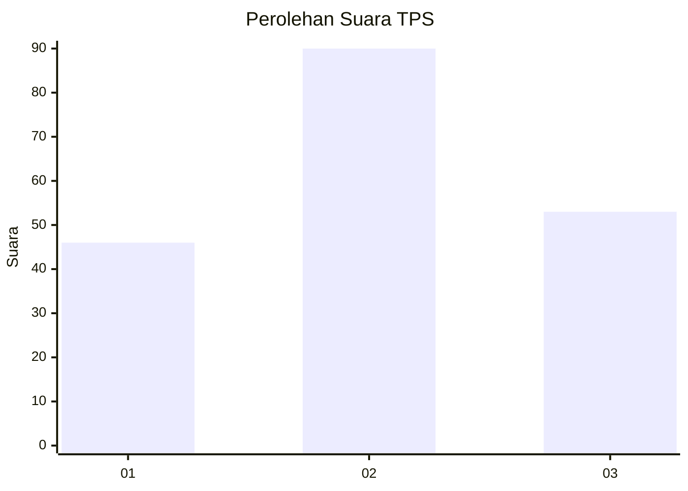
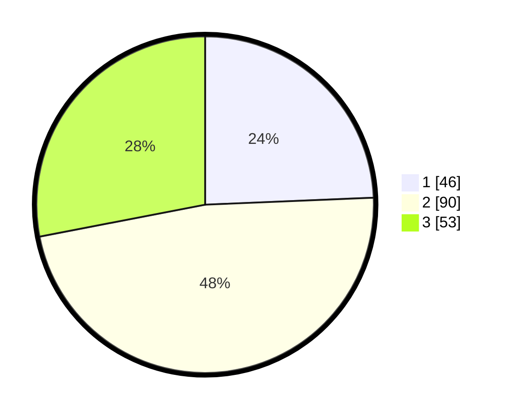

# Hasil

## Grafik

## Tabel

| No. | Nama Paslon    | Suara | Suara (raw) | Persentase |
|:--- |:-------------- | -----:| -----------:| ----------:|
| 1   | ANIES MUHAIMIN | 46    | [46][p-1]   | 24,34      |
| 2   | PRABOWO GIBRAN | 90    | [90][p-2]   | 47,62      |
| 3   | GANJAR MAHFUD  | 53    | [53][p-3]   | 28,04      |

[p-1]: https://github.com/gigit-pemilu/pemilu-2024-35-jawa-timur/blob/main/pilpres/hitung-suara/sub/35-jawa-timur/sub/78-kota-surabaya/sub/02-wonocolo/sub/1002-bendul-merisi/sub/009-tps/sub/paslon-1.txt
[p-2]: https://github.com/gigit-pemilu/pemilu-2024-35-jawa-timur/blob/main/pilpres/hitung-suara/sub/35-jawa-timur/sub/78-kota-surabaya/sub/02-wonocolo/sub/1002-bendul-merisi/sub/009-tps/sub/paslon-2.txt
[p-3]: https://github.com/gigit-pemilu/pemilu-2024-35-jawa-timur/blob/main/pilpres/hitung-suara/sub/35-jawa-timur/sub/78-kota-surabaya/sub/02-wonocolo/sub/1002-bendul-merisi/sub/009-tps/sub/paslon-3.txt

## Foto C Plano

https://sirekap-obj-formc.kpu.go.id/7642/pemilu/ppwp/35/78/02/10/02/3578021002009-20240224-104931--01de96b9-c25a-4ea1-8cd7-6763c635ad48.jpg

https://sirekap-obj-formc.kpu.go.id/7642/pemilu/ppwp/35/78/02/10/02/3578021002009-20240224-105011--699fc5eb-f469-40ec-ab41-53a07d47678b.jpg

https://sirekap-obj-formc.kpu.go.id/7642/pemilu/ppwp/35/78/02/10/02/3578021002009-20240224-104810--e13cbe8a-4849-45c7-b39c-16531156a505.jpg

## Metadata

| Key        | Value               |
| ---------- | ------------------- |
| Time Stamp | 2024-02-24 22:31:28 |

## DATA PEMILIH TETAP

Jumlah pemilih dalam DPT: **260**.
 * L: **223**.
 * P: **237**.

## DATA PENGGUNA HAK PILIH

Jumlah pengguna hak pilih dalam DPT: **173**.
 * L: **937**.
 * P: **979**.

Jumlah pengguna hak pilih dalam DPTb: **33**.
 * L: **71**.
 * P: **709**.

Jumlah pengguna hak pilih dalam DPK: **50**.
 * L: **502**.
 * P: **500**.

Jumlah pengguna hak pilih: **132**.
 * L: **555**.
 * P: **154**.

## JUMLAH SUARA SAH DAN TIDAK SAH

JUMLAH SELURUH SUARA SAH: **189**.

JUMLAH SUARA TIDAK SAH: **3**.

JUMLAH SELURUH SUARA SAH DAN SUARA TIDAK SAH: **192**.

