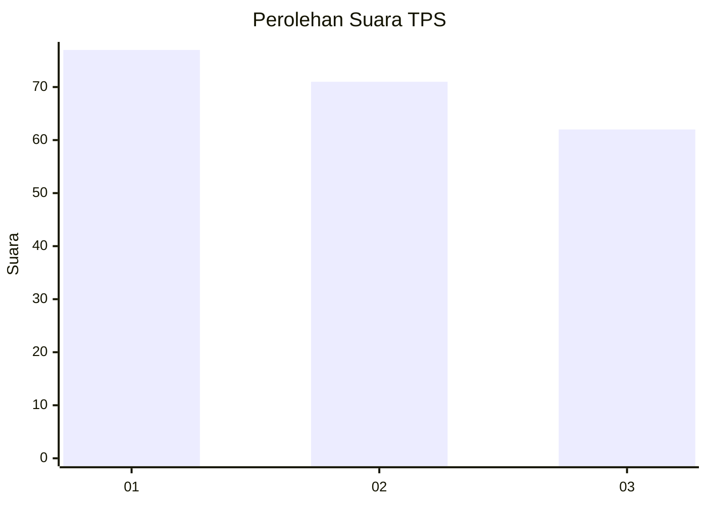
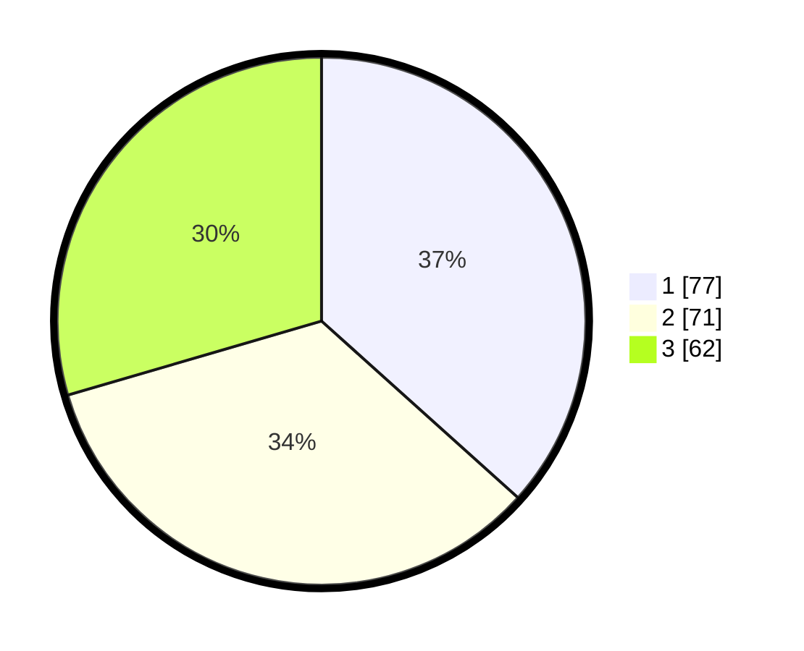

# Hasil

## Grafik

## Tabel

| No. | Nama Paslon    | Suara | Suara (raw) | Persentase |
|:--- |:-------------- | -----:| -----------:| ----------:|
| 1   | ANIES MUHAIMIN | 77    | [77][p-1]   | 36,67      |
| 2   | PRABOWO GIBRAN | 71    | [71][p-2]   | 33,81      |
| 3   | GANJAR MAHFUD  | 62    | [62][p-3]   | 29,52      |

[p-1]: https://github.com/gigit-pemilu/pemilu-2024/blob/main/pilpres/hitung-suara/sub/35-jawa-timur/sub/78-kota-surabaya/sub/02-wonocolo/sub/1002-bendul-merisi/sub/029-tps/sub/paslon-1.txt
[p-2]: https://github.com/gigit-pemilu/pemilu-2024/blob/main/pilpres/hitung-suara/sub/35-jawa-timur/sub/78-kota-surabaya/sub/02-wonocolo/sub/1002-bendul-merisi/sub/029-tps/sub/paslon-2.txt
[p-3]: https://github.com/gigit-pemilu/pemilu-2024/blob/main/pilpres/hitung-suara/sub/35-jawa-timur/sub/78-kota-surabaya/sub/02-wonocolo/sub/1002-bendul-merisi/sub/029-tps/sub/paslon-3.txt

## Foto C Plano

https://sirekap-obj-formc.kpu.go.id/482d/pemilu/ppwp/35/78/02/10/02/3578021002029-20240214-213350--f031261b-7ee0-4768-b9fe-1d096d448457.jpg

https://sirekap-obj-formc.kpu.go.id/482d/pemilu/ppwp/35/78/02/10/02/3578021002029-20240214-213251--0c46f02b-116d-4d64-8943-0c2f4fbb4b68.jpg

https://sirekap-obj-formc.kpu.go.id/482d/pemilu/ppwp/35/78/02/10/02/3578021002029-20240214-213132--3982874a-9162-4a21-a899-e12f55551df0.jpg

## Metadata

| Key        | Value               |
| ---------- | ------------------- |
| Time Stamp | 2024-02-24 22:31:28 |

