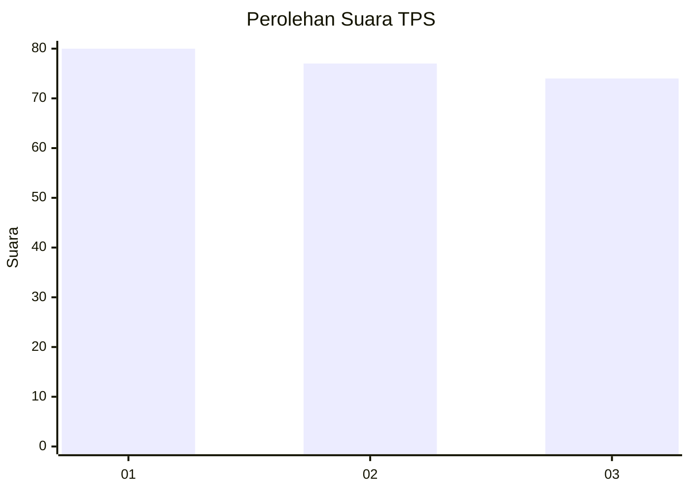
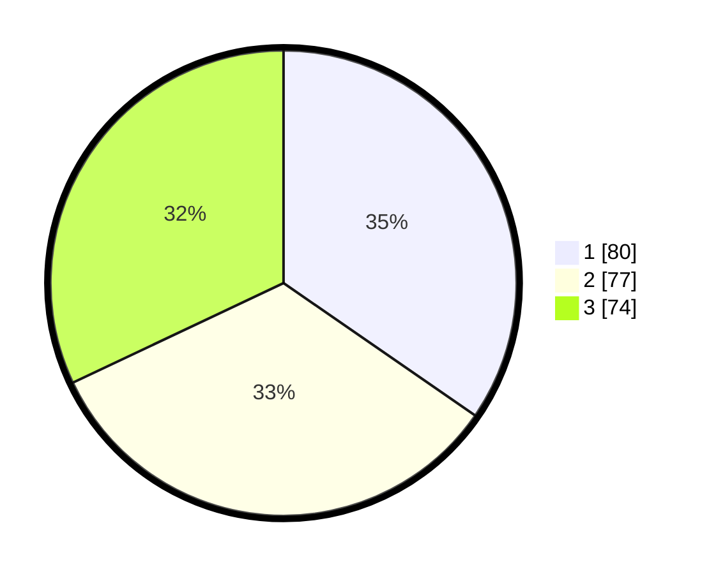

# Hasil

## Grafik

## Tabel

| No. | Nama Paslon    | Suara | Suara (raw) | Persentase |
|:--- |:-------------- | -----:| -----------:| ----------:|
| 1   | ANIES MUHAIMIN | 80    | [80][p-1]   | 34,63      |
| 2   | PRABOWO GIBRAN | 77    | [77][p-2]   | 33,33      |
| 3   | GANJAR MAHFUD  | 74    | [74][p-3]   | 32,03      |

[p-1]: https://github.com/gigit-pemilu/pemilu-2024-35-jawa-timur/blob/main/pilpres/hitung-suara/sub/35-jawa-timur/sub/78-kota-surabaya/sub/02-wonocolo/sub/1002-bendul-merisi/sub/031-tps/sub/paslon-1.txt
[p-2]: https://github.com/gigit-pemilu/pemilu-2024-35-jawa-timur/blob/main/pilpres/hitung-suara/sub/35-jawa-timur/sub/78-kota-surabaya/sub/02-wonocolo/sub/1002-bendul-merisi/sub/031-tps/sub/paslon-2.txt
[p-3]: https://github.com/gigit-pemilu/pemilu-2024-35-jawa-timur/blob/main/pilpres/hitung-suara/sub/35-jawa-timur/sub/78-kota-surabaya/sub/02-wonocolo/sub/1002-bendul-merisi/sub/031-tps/sub/paslon-3.txt

## Foto C Plano

https://sirekap-obj-formc.kpu.go.id/7572/pemilu/ppwp/35/78/02/10/02/3578021002031-20240216-095611--ae4f2dad-bfd9-4334-91b6-14c300616da7.jpg

https://sirekap-obj-formc.kpu.go.id/7572/pemilu/ppwp/35/78/02/10/02/3578021002031-20240216-095619--a33e1b99-aacb-4021-ac92-03e8ccbdeeed.jpg

https://sirekap-obj-formc.kpu.go.id/7572/pemilu/ppwp/35/78/02/10/02/3578021002031-20240216-095624--9d1436fe-265e-4f1d-9fb5-31f9706d2c6f.jpg

## Metadata

| Key        | Value               |
| ---------- | ------------------- |
| Time Stamp | 2024-02-16 16:25:10 |

