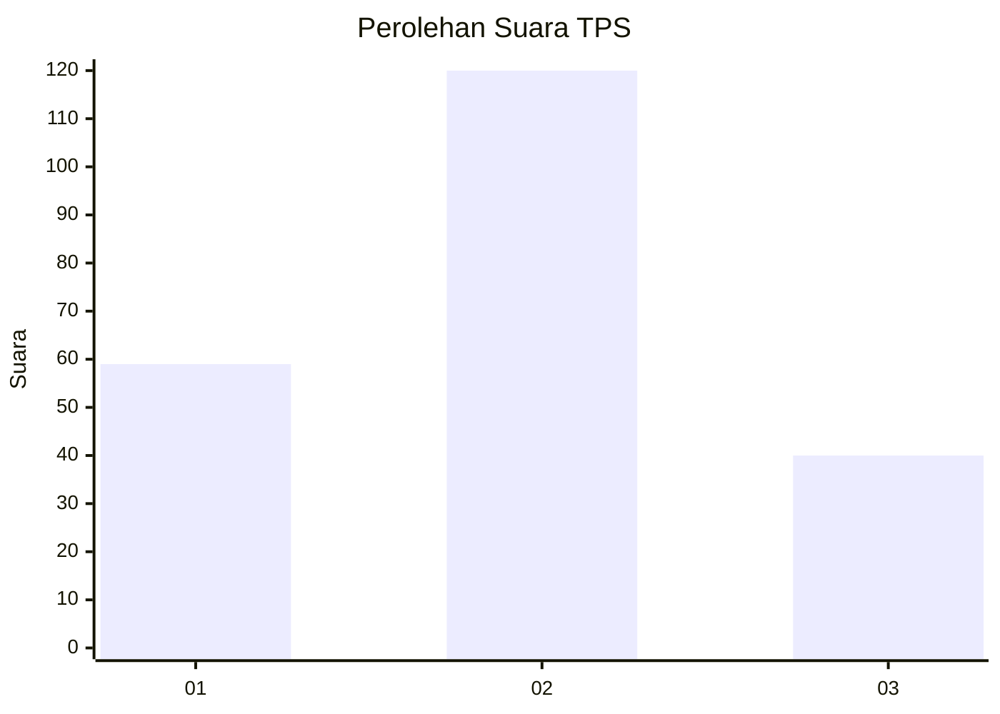
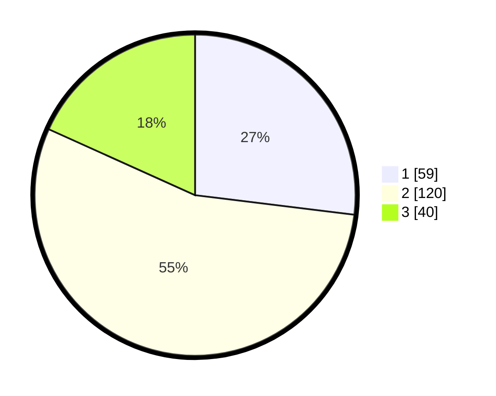

# Hasil

## Grafik

## Tabel

| No. | Nama Paslon    | Suara | Suara (raw) | Persentase |
|:--- |:-------------- | -----:| -----------:| ----------:|
| 1   | ANIES MUHAIMIN | 59    | [59][p-1]   | 26,94      |
| 2   | PRABOWO GIBRAN | 120   | [120][p-2]  | 54,79      |
| 3   | GANJAR MAHFUD  | 40    | [40][p-3]   | 18,26      |

[p-1]: https://github.com/gigit-pemilu/pemilu-2024-35-jawa-timur/blob/main/pilpres/hitung-suara/sub/35-jawa-timur/sub/78-kota-surabaya/sub/02-wonocolo/sub/1003-margorejo/sub/006-tps/sub/paslon-1.txt
[p-2]: https://github.com/gigit-pemilu/pemilu-2024-35-jawa-timur/blob/main/pilpres/hitung-suara/sub/35-jawa-timur/sub/78-kota-surabaya/sub/02-wonocolo/sub/1003-margorejo/sub/006-tps/sub/paslon-2.txt
[p-3]: https://github.com/gigit-pemilu/pemilu-2024-35-jawa-timur/blob/main/pilpres/hitung-suara/sub/35-jawa-timur/sub/78-kota-surabaya/sub/02-wonocolo/sub/1003-margorejo/sub/006-tps/sub/paslon-3.txt

## Foto C Plano

https://sirekap-obj-formc.kpu.go.id/4dde/pemilu/ppwp/35/78/02/10/03/3578021003006-20240219-110947--a446251e-6b79-42b8-b44f-883dece40469.jpg

https://sirekap-obj-formc.kpu.go.id/4dde/pemilu/ppwp/35/78/02/10/03/3578021003006-20240219-111014--8854860d-811d-422a-a021-7c4aaf676a96.jpg

https://sirekap-obj-formc.kpu.go.id/4dde/pemilu/ppwp/35/78/02/10/03/3578021003006-20240219-111041--8116820c-63e4-43a4-ab55-f0fad9b495cf.jpg

## Metadata

| Key        | Value               |
| ---------- | ------------------- |
| Time Stamp | 2024-02-20 14:00:00 |

## DATA PEMILIH TETAP

Jumlah pemilih dalam DPT: **77**.
 * L: **445**.
 * P: **772**.

## DATA PENGGUNA HAK PILIH

Jumlah pengguna hak pilih dalam DPT: **214**.
 * L: **111**.
 * P: **172**.

Jumlah pengguna hak pilih dalam DPTb: **530**.
 * L: **572**.
 * P: **702**.

Jumlah pengguna hak pilih dalam DPK: **7**.
 * L: **57**.
 * P: **2**.

Jumlah pengguna hak pilih: **202**.
 * L: **710**.
 * P: **705**.

## JUMLAH SUARA SAH DAN TIDAK SAH

JUMLAH SELURUH SUARA SAH: **219**.

JUMLAH SUARA TIDAK SAH: **4**.

JUMLAH SELURUH SUARA SAH DAN SUARA TIDAK SAH: **223**.

