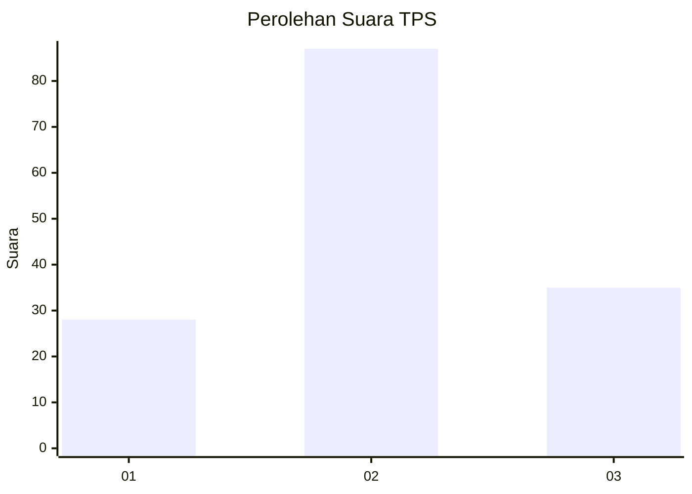
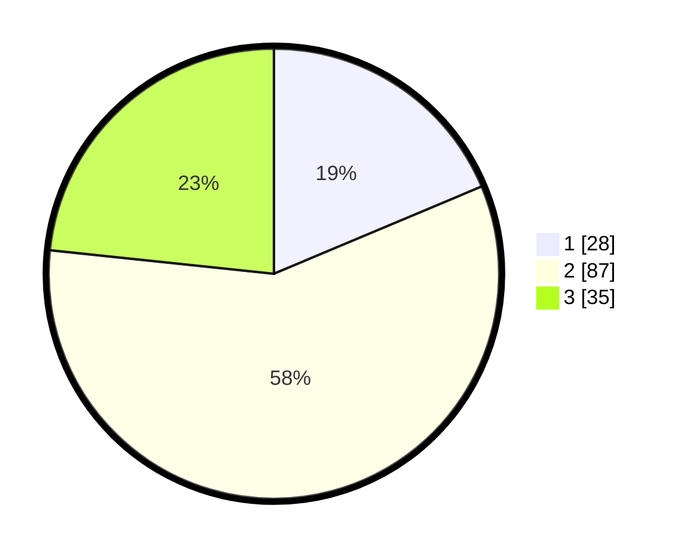

# Hasil

## Grafik

## Tabel

| No. | Nama Paslon    | Suara | Suara (raw) | Persentase |
|:--- |:-------------- | -----:| -----------:| ----------:|
| 1   | ANIES MUHAIMIN | 28    | [28][p-1]   | 18,67      |
| 2   | PRABOWO GIBRAN | 87    | [87][p-2]   | 58,00      |
| 3   | GANJAR MAHFUD  | 35    | [35][p-3]   | 23,33      |

[p-1]: https://github.com/gigit-pemilu/pemilu-2024/blob/main/pilpres/hitung-suara/sub/35-jawa-timur/sub/78-kota-surabaya/sub/02-wonocolo/sub/1003-margorejo/sub/022-tps/sub/paslon-1.txt
[p-2]: https://github.com/gigit-pemilu/pemilu-2024/blob/main/pilpres/hitung-suara/sub/35-jawa-timur/sub/78-kota-surabaya/sub/02-wonocolo/sub/1003-margorejo/sub/022-tps/sub/paslon-2.txt
[p-3]: https://github.com/gigit-pemilu/pemilu-2024/blob/main/pilpres/hitung-suara/sub/35-jawa-timur/sub/78-kota-surabaya/sub/02-wonocolo/sub/1003-margorejo/sub/022-tps/sub/paslon-3.txt

## Foto C Plano

https://sirekap-obj-formc.kpu.go.id/ac68/pemilu/ppwp/35/78/02/10/03/3578021003022-20240214-221759--744b8a1f-dd69-4eea-b877-1c4eff619d2f.jpg

https://sirekap-obj-formc.kpu.go.id/ac68/pemilu/ppwp/35/78/02/10/03/3578021003022-20240214-221948--30d4fe75-8ecc-467c-8986-ddc3898f02b8.jpg

https://sirekap-obj-formc.kpu.go.id/ac68/pemilu/ppwp/35/78/02/10/03/3578021003022-20240214-195838--5c62d892-aa74-4c1d-a68f-455bc6dfc036.jpg

## Metadata

| Key        | Value               |
| ---------- | ------------------- |
| Time Stamp | 2024-02-24 22:31:28 |

