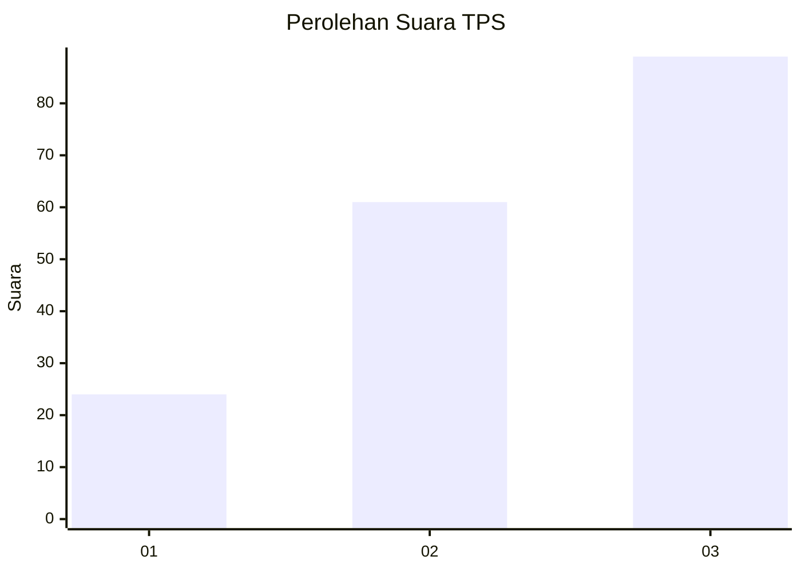
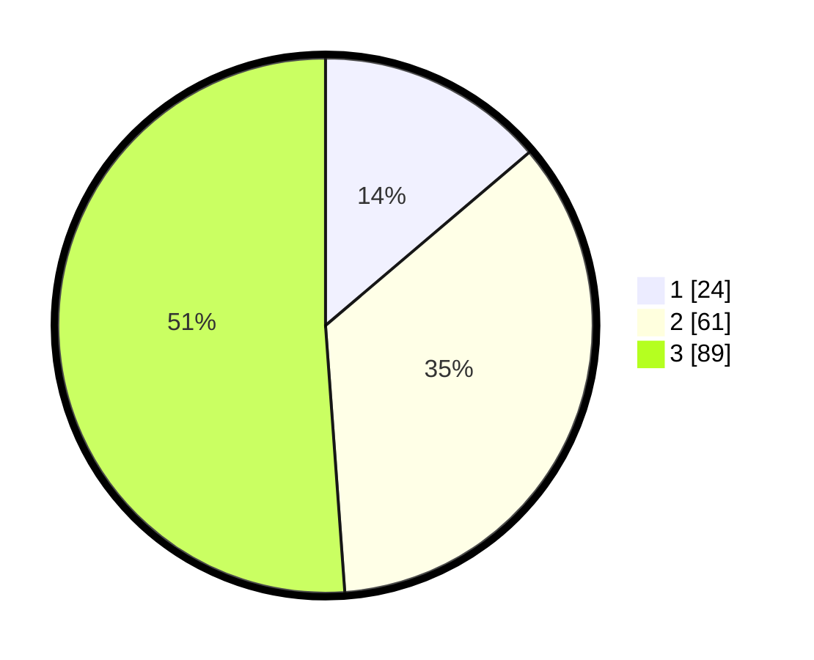

# Hasil

## Grafik

## Tabel

| No. | Nama Paslon    | Suara | Suara (raw) | Persentase |
|:--- |:-------------- | -----:| -----------:| ----------:|
| 1   | ANIES MUHAIMIN | 24    | [24][p-1]   | 13,79      |
| 2   | PRABOWO GIBRAN | 61    | [61][p-2]   | 35,06      |
| 3   | GANJAR MAHFUD  | 89    | [89][p-3]   | 51,15      |

[p-1]: https://github.com/gigit-pemilu/pemilu-2024-35-jawa-timur/blob/main/pilpres/hitung-suara/sub/35-jawa-timur/sub/78-kota-surabaya/sub/02-wonocolo/sub/1003-margorejo/sub/027-tps/sub/paslon-1.txt
[p-2]: https://github.com/gigit-pemilu/pemilu-2024-35-jawa-timur/blob/main/pilpres/hitung-suara/sub/35-jawa-timur/sub/78-kota-surabaya/sub/02-wonocolo/sub/1003-margorejo/sub/027-tps/sub/paslon-2.txt
[p-3]: https://github.com/gigit-pemilu/pemilu-2024-35-jawa-timur/blob/main/pilpres/hitung-suara/sub/35-jawa-timur/sub/78-kota-surabaya/sub/02-wonocolo/sub/1003-margorejo/sub/027-tps/sub/paslon-3.txt

## Foto C Plano

https://sirekap-obj-formc.kpu.go.id/4566/pemilu/ppwp/35/78/02/10/03/3578021003027-20240215-004906--87f2c0bc-938c-43dc-9ed1-9d70a4ee193f.jpg

https://sirekap-obj-formc.kpu.go.id/4566/pemilu/ppwp/35/78/02/10/03/3578021003027-20240215-004910--e1dc6672-e36f-4d4c-af49-d796fadaf103.jpg

https://sirekap-obj-formc.kpu.go.id/4566/pemilu/ppwp/35/78/02/10/03/3578021003027-20240215-004914--2c7c3ade-10c4-41e8-b76e-9c3c2ccb6d23.jpg

## Metadata

| Key        | Value               |
| ---------- | ------------------- |
| Time Stamp | 2024-02-15 23:29:50 |

