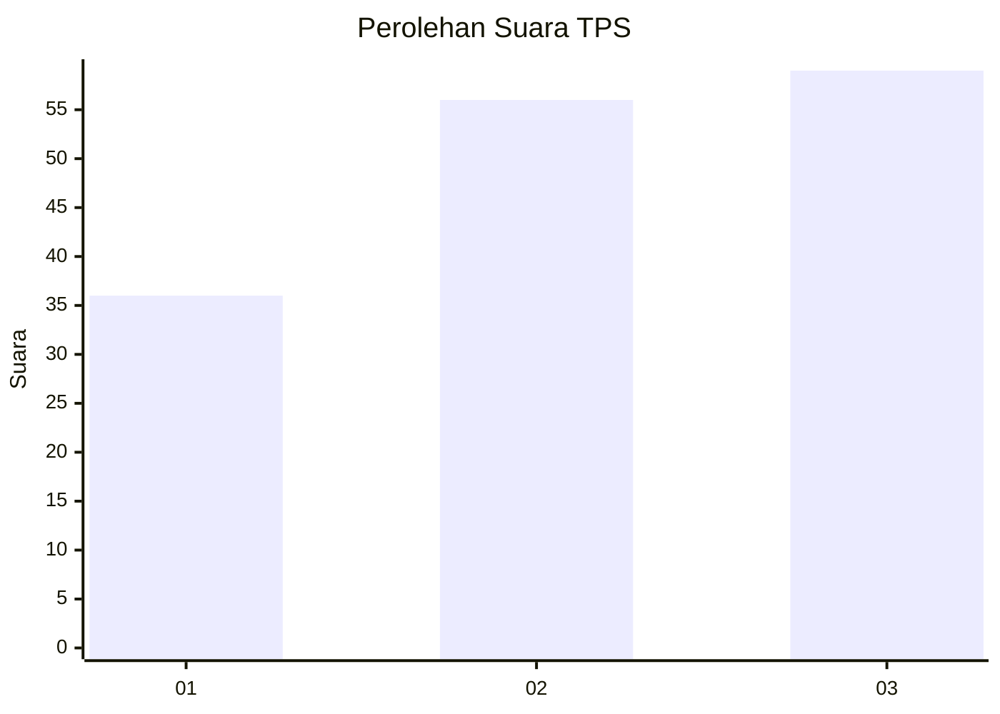
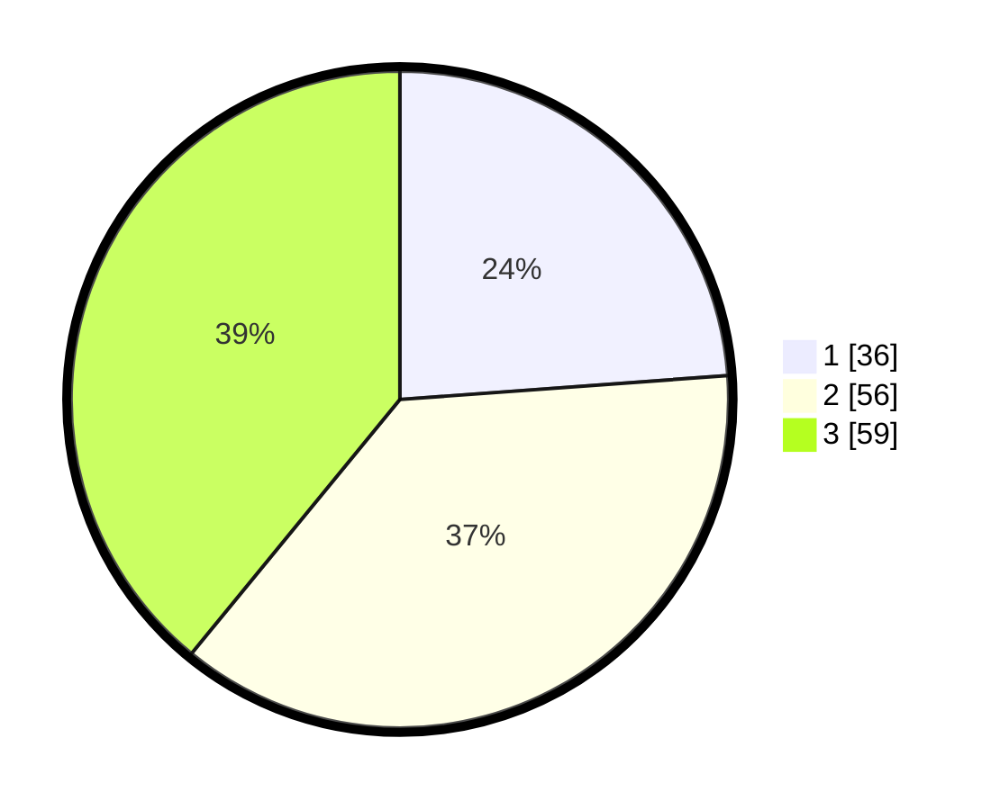

# Hasil

## Grafik

## Tabel

| No. | Nama Paslon    | Suara | Suara (raw) | Persentase |
|:--- |:-------------- | -----:| -----------:| ----------:|
| 1   | ANIES MUHAIMIN | 36    | [36][p-1]   | 23,84      |
| 2   | PRABOWO GIBRAN | 56    | [56][p-2]   | 37,09      |
| 3   | GANJAR MAHFUD  | 59    | [59][p-3]   | 39,07      |

[p-1]: https://github.com/gigit-pemilu/pemilu-2024-35-jawa-timur/blob/main/pilpres/hitung-suara/sub/35-jawa-timur/sub/78-kota-surabaya/sub/02-wonocolo/sub/1004-jemur-wonosari/sub/001-tps/sub/paslon-1.txt
[p-2]: https://github.com/gigit-pemilu/pemilu-2024-35-jawa-timur/blob/main/pilpres/hitung-suara/sub/35-jawa-timur/sub/78-kota-surabaya/sub/02-wonocolo/sub/1004-jemur-wonosari/sub/001-tps/sub/paslon-2.txt
[p-3]: https://github.com/gigit-pemilu/pemilu-2024-35-jawa-timur/blob/main/pilpres/hitung-suara/sub/35-jawa-timur/sub/78-kota-surabaya/sub/02-wonocolo/sub/1004-jemur-wonosari/sub/001-tps/sub/paslon-3.txt

## Foto C Plano

https://sirekap-obj-formc.kpu.go.id/7027/pemilu/ppwp/35/78/02/10/04/3578021004001-20240214-210453--d561dcb3-8b22-4b1f-a9a6-65c1215edae9.jpg

https://sirekap-obj-formc.kpu.go.id/7027/pemilu/ppwp/35/78/02/10/04/3578021004001-20240214-210501--3cdbf197-3916-482d-a36d-9b7c188261d9.jpg

https://sirekap-obj-formc.kpu.go.id/7027/pemilu/ppwp/35/78/02/10/04/3578021004001-20240214-210513--2a0a28d0-b8d5-4fd5-9549-7ab4d902b8fc.jpg

## Metadata

| Key        | Value               |
| ---------- | ------------------- |
| Time Stamp | 2024-02-15 23:29:50 |

