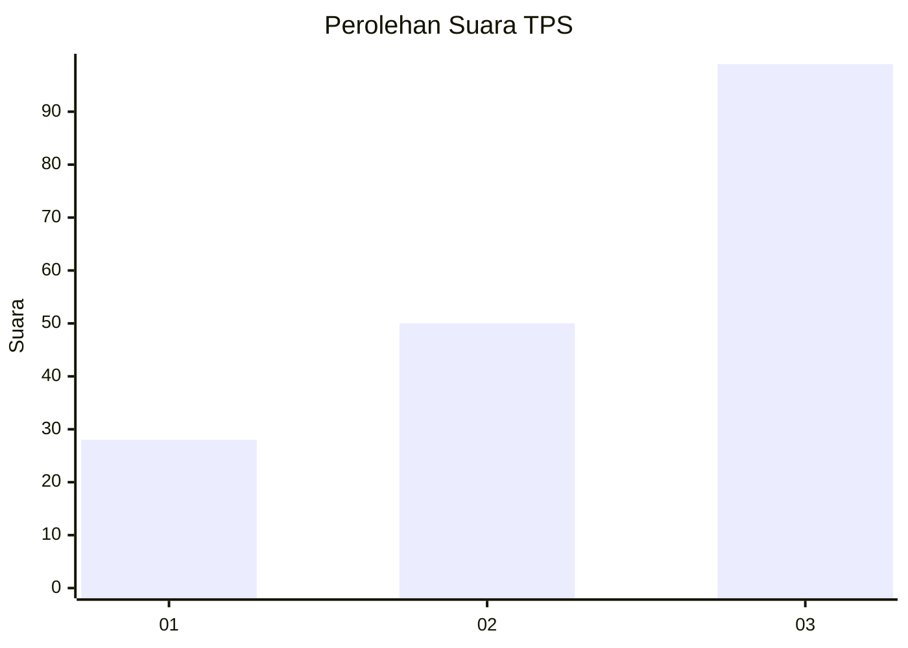
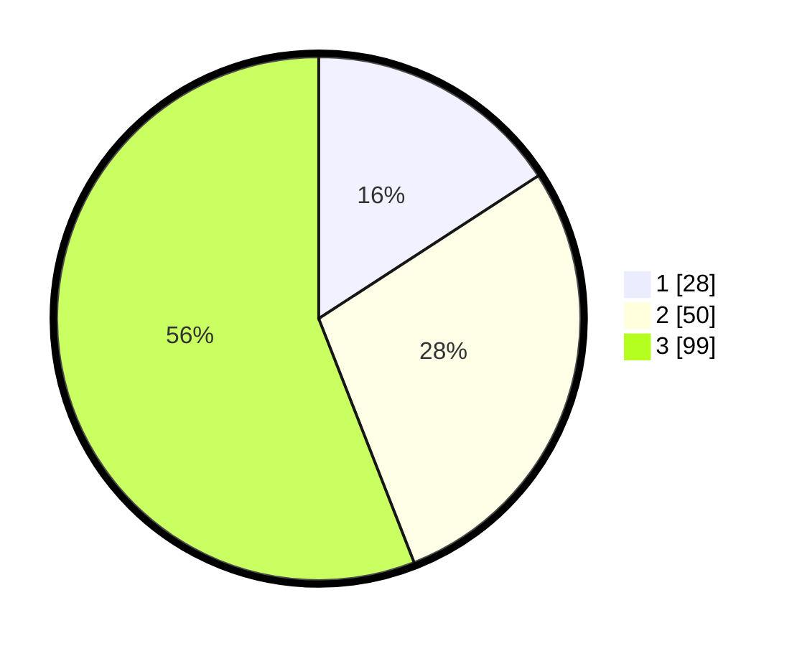

# Hasil

## Grafik

## Tabel

| No. | Nama Paslon    | Suara | Suara (raw) | Persentase |
|:--- |:-------------- | -----:| -----------:| ----------:|
| 1   | ANIES MUHAIMIN | 28    | [28][p-1]   | 15,82      |
| 2   | PRABOWO GIBRAN | 50    | [50][p-2]   | 28,25      |
| 3   | GANJAR MAHFUD  | 99    | [99][p-3]   | 55,93      |

[p-1]: https://github.com/gigit-pemilu/pemilu-2024-35-jawa-timur/blob/main/pilpres/hitung-suara/sub/35-jawa-timur/sub/78-kota-surabaya/sub/02-wonocolo/sub/1004-jemur-wonosari/sub/003-tps/sub/paslon-1.txt
[p-2]: https://github.com/gigit-pemilu/pemilu-2024-35-jawa-timur/blob/main/pilpres/hitung-suara/sub/35-jawa-timur/sub/78-kota-surabaya/sub/02-wonocolo/sub/1004-jemur-wonosari/sub/003-tps/sub/paslon-2.txt
[p-3]: https://github.com/gigit-pemilu/pemilu-2024-35-jawa-timur/blob/main/pilpres/hitung-suara/sub/35-jawa-timur/sub/78-kota-surabaya/sub/02-wonocolo/sub/1004-jemur-wonosari/sub/003-tps/sub/paslon-3.txt

## Foto C Plano

https://sirekap-obj-formc.kpu.go.id/c3b4/pemilu/ppwp/35/78/02/10/04/3578021004003-20240214-215240--89fe3444-b125-41ee-af5a-1deac5cac335.jpg

https://sirekap-obj-formc.kpu.go.id/c3b4/pemilu/ppwp/35/78/02/10/04/3578021004003-20240214-213814--0808e791-5541-4173-96a1-c9ea625eaa90.jpg

https://sirekap-obj-formc.kpu.go.id/c3b4/pemilu/ppwp/35/78/02/10/04/3578021004003-20240214-213911--0e9f1268-5538-4a64-9df8-8f3641a2fa52.jpg

## Metadata

| Key        | Value               |
| ---------- | ------------------- |
| Time Stamp | 2024-02-24 23:00:00 |

