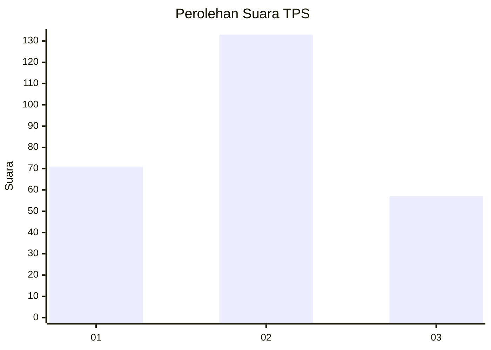
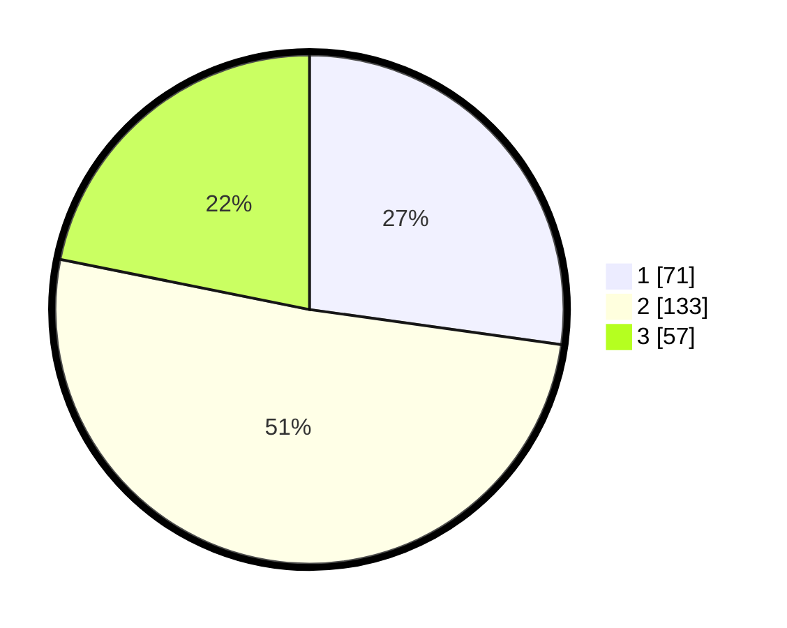

# Hasil

## Grafik

## Tabel

| No. | Nama Paslon    | Suara | Suara (raw) | Persentase |
|:--- |:-------------- | -----:| -----------:| ----------:|
| 1   | ANIES MUHAIMIN | 71    | [71][p-1]   | 27,20      |
| 2   | PRABOWO GIBRAN | 133   | [133][p-2]  | 50,96      |
| 3   | GANJAR MAHFUD  | 57    | [57][p-3]   | 21,84      |

[p-1]: https://github.com/gigit-pemilu/pemilu-2024-35-jawa-timur/blob/main/pilpres/hitung-suara/sub/35-jawa-timur/sub/78-kota-surabaya/sub/02-wonocolo/sub/1004-jemur-wonosari/sub/041-tps/sub/paslon-1.txt
[p-2]: https://github.com/gigit-pemilu/pemilu-2024-35-jawa-timur/blob/main/pilpres/hitung-suara/sub/35-jawa-timur/sub/78-kota-surabaya/sub/02-wonocolo/sub/1004-jemur-wonosari/sub/041-tps/sub/paslon-2.txt
[p-3]: https://github.com/gigit-pemilu/pemilu-2024-35-jawa-timur/blob/main/pilpres/hitung-suara/sub/35-jawa-timur/sub/78-kota-surabaya/sub/02-wonocolo/sub/1004-jemur-wonosari/sub/041-tps/sub/paslon-3.txt

## Foto C Plano

https://sirekap-obj-formc.kpu.go.id/3bf3/pemilu/ppwp/35/78/02/10/04/3578021004041-20240214-232649--dc606288-c2ca-41b5-b7e1-6df9bf999f8e.jpg

https://sirekap-obj-formc.kpu.go.id/3bf3/pemilu/ppwp/35/78/02/10/04/3578021004041-20240215-020132--4284e2ea-0b04-4855-a0e5-c5c6115136cc.jpg

https://sirekap-obj-formc.kpu.go.id/3bf3/pemilu/ppwp/35/78/02/10/04/3578021004041-20240215-045018--7b11cffb-4a0d-4c52-abf3-4dc798451fce.jpg

## Metadata

| Key        | Value               |
| ---------- | ------------------- |
| Time Stamp | 2024-02-25 16:00:00 |

