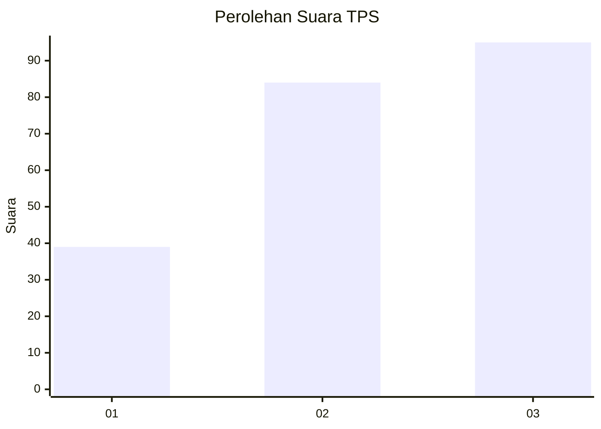
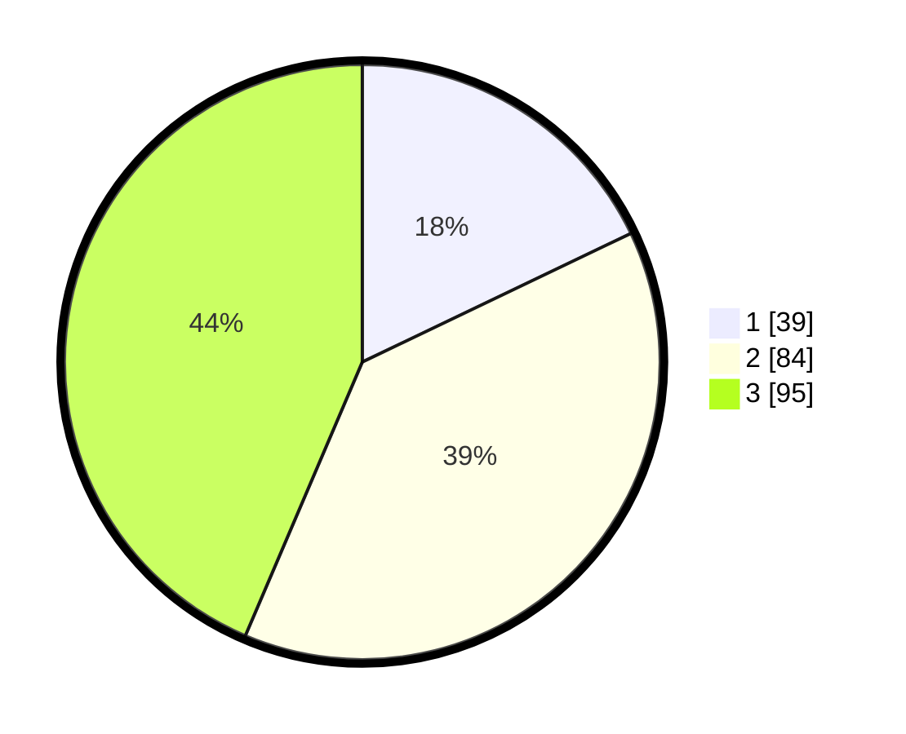

# Hasil

## Grafik

## Tabel

| No. | Nama Paslon    | Suara | Suara (raw) | Persentase |
|:--- |:-------------- | -----:| -----------:| ----------:|
| 1   | ANIES MUHAIMIN | 39    | [39][p-1]   | 17,89      |
| 2   | PRABOWO GIBRAN | 84    | [84][p-2]   | 38,53      |
| 3   | GANJAR MAHFUD  | 95    | [95][p-3]   | 43,58      |

[p-1]: https://github.com/gigit-pemilu/pemilu-2024-35-jawa-timur/blob/main/pilpres/hitung-suara/sub/35-jawa-timur/sub/78-kota-surabaya/sub/02-wonocolo/sub/1004-jemur-wonosari/sub/042-tps/sub/paslon-1.txt
[p-2]: https://github.com/gigit-pemilu/pemilu-2024-35-jawa-timur/blob/main/pilpres/hitung-suara/sub/35-jawa-timur/sub/78-kota-surabaya/sub/02-wonocolo/sub/1004-jemur-wonosari/sub/042-tps/sub/paslon-2.txt
[p-3]: https://github.com/gigit-pemilu/pemilu-2024-35-jawa-timur/blob/main/pilpres/hitung-suara/sub/35-jawa-timur/sub/78-kota-surabaya/sub/02-wonocolo/sub/1004-jemur-wonosari/sub/042-tps/sub/paslon-3.txt

## Foto C Plano

https://sirekap-obj-formc.kpu.go.id/5d90/pemilu/ppwp/35/78/02/10/04/3578021004042-20240215-015757--f7b11c1c-6705-4a9f-946c-fc78ee6ba821.jpg

https://sirekap-obj-formc.kpu.go.id/5d90/pemilu/ppwp/35/78/02/10/04/3578021004042-20240215-032328--dbc272fc-3cd9-4084-acf1-bed79e976f37.jpg

https://sirekap-obj-formc.kpu.go.id/5d90/pemilu/ppwp/35/78/02/10/04/3578021004042-20240214-190114--5ccf0aff-0047-4e0c-8e72-af07715ec302.jpg

## Metadata

| Key        | Value               |
| ---------- | ------------------- |
| Time Stamp | 2024-02-15 23:29:50 |

