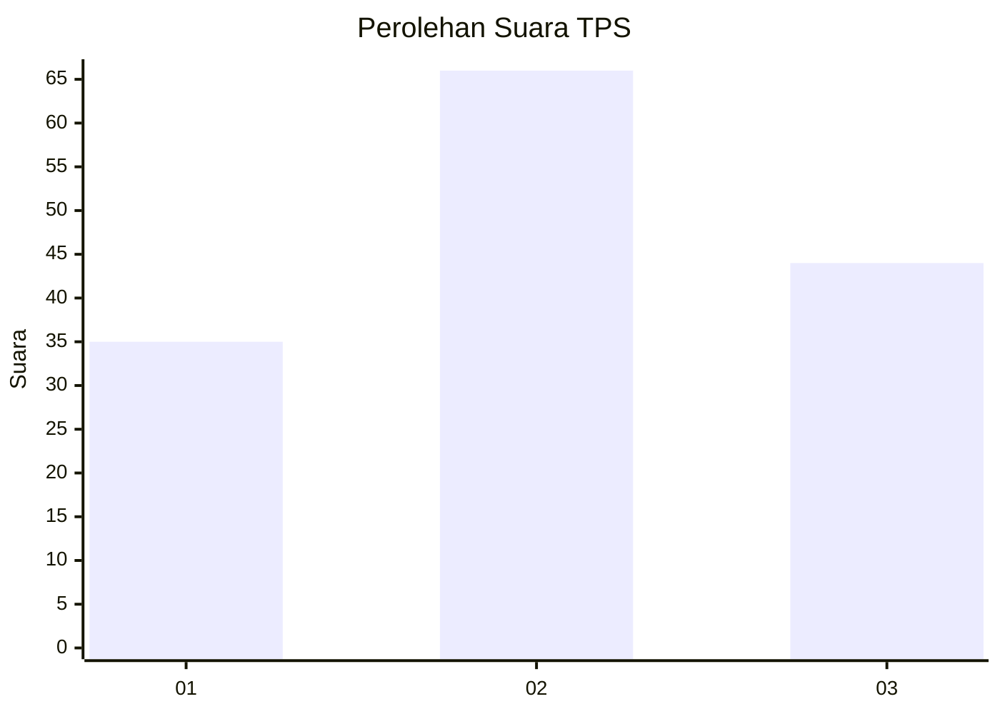
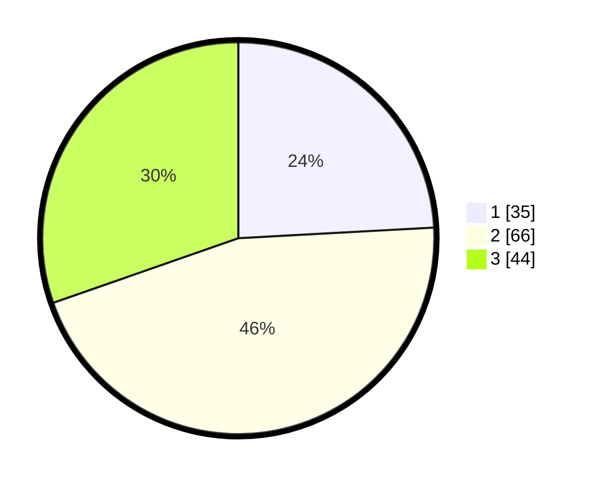

# Hasil

## Grafik

## Tabel

| No. | Nama Paslon    | Suara | Suara (raw) | Persentase |
|:--- |:-------------- | -----:| -----------:| ----------:|
| 1   | ANIES MUHAIMIN | 35    | [35][p-1]   | 24,14      |
| 2   | PRABOWO GIBRAN | 66    | [66][p-2]   | 45,52      |
| 3   | GANJAR MAHFUD  | 44    | [44][p-3]   | 30,34      |

[p-1]: https://github.com/gigit-pemilu/pemilu-2024/blob/main/pilpres/hitung-suara/sub/35-jawa-timur/sub/78-kota-surabaya/sub/02-wonocolo/sub/1004-jemur-wonosari/sub/057-tps/sub/paslon-1.txt
[p-2]: https://github.com/gigit-pemilu/pemilu-2024/blob/main/pilpres/hitung-suara/sub/35-jawa-timur/sub/78-kota-surabaya/sub/02-wonocolo/sub/1004-jemur-wonosari/sub/057-tps/sub/paslon-2.txt
[p-3]: https://github.com/gigit-pemilu/pemilu-2024/blob/main/pilpres/hitung-suara/sub/35-jawa-timur/sub/78-kota-surabaya/sub/02-wonocolo/sub/1004-jemur-wonosari/sub/057-tps/sub/paslon-3.txt

## Foto C Plano

https://sirekap-obj-formc.kpu.go.id/8d99/pemilu/ppwp/35/78/02/10/04/3578021004057-20240214-200227--08453e29-fe8d-493a-b606-59720d2e2128.jpg

https://sirekap-obj-formc.kpu.go.id/8d99/pemilu/ppwp/35/78/02/10/04/3578021004057-20240214-231237--3dcd6511-a8aa-4775-be50-52458ed8e619.jpg

https://sirekap-obj-formc.kpu.go.id/8d99/pemilu/ppwp/35/78/02/10/04/3578021004057-20240214-231258--a9a5b1ae-faac-46f3-9051-fd1a0c46f798.jpg

## Metadata

| Key        | Value               |
| ---------- | ------------------- |
| Time Stamp | 2024-02-15 23:29:50 |

