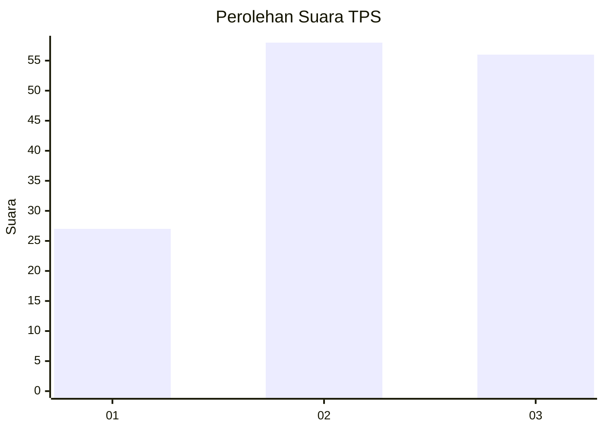
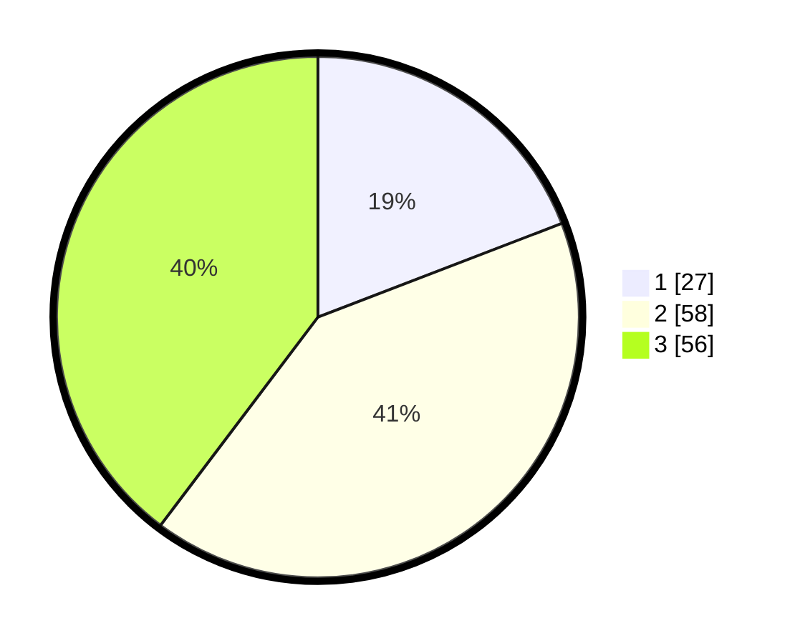

# Hasil

## Grafik

## Tabel

| No. | Nama Paslon    | Suara | Suara (raw) | Persentase |
|:--- |:-------------- | -----:| -----------:| ----------:|
| 1   | ANIES MUHAIMIN | 27    | [27][p-1]   | 19,15      |
| 2   | PRABOWO GIBRAN | 58    | [58][p-2]   | 41,13      |
| 3   | GANJAR MAHFUD  | 56    | [56][p-3]   | 39,72      |

[p-1]: https://github.com/gigit-pemilu/pemilu-2024-35-jawa-timur/blob/main/pilpres/hitung-suara/sub/35-jawa-timur/sub/78-kota-surabaya/sub/02-wonocolo/sub/1005-siwalankerto/sub/031-tps/sub/paslon-1.txt
[p-2]: https://github.com/gigit-pemilu/pemilu-2024-35-jawa-timur/blob/main/pilpres/hitung-suara/sub/35-jawa-timur/sub/78-kota-surabaya/sub/02-wonocolo/sub/1005-siwalankerto/sub/031-tps/sub/paslon-2.txt
[p-3]: https://github.com/gigit-pemilu/pemilu-2024-35-jawa-timur/blob/main/pilpres/hitung-suara/sub/35-jawa-timur/sub/78-kota-surabaya/sub/02-wonocolo/sub/1005-siwalankerto/sub/031-tps/sub/paslon-3.txt

## Foto C Plano

https://sirekap-obj-formc.kpu.go.id/4beb/pemilu/ppwp/35/78/02/10/05/3578021005031-20240214-155023--c25f38df-da2a-4df9-860a-ac007a622801.jpg

https://sirekap-obj-formc.kpu.go.id/4beb/pemilu/ppwp/35/78/02/10/05/3578021005031-20240214-155231--12f500e5-e693-4a34-9cab-eb299b687834.jpg

https://sirekap-obj-formc.kpu.go.id/4beb/pemilu/ppwp/35/78/02/10/05/3578021005031-20240214-155334--a7ca85bb-3da3-4918-ae8f-3d5c93c6aacb.jpg

## Metadata

| Key        | Value               |
| ---------- | ------------------- |
| Time Stamp | 2024-02-26 12:00:00 |

