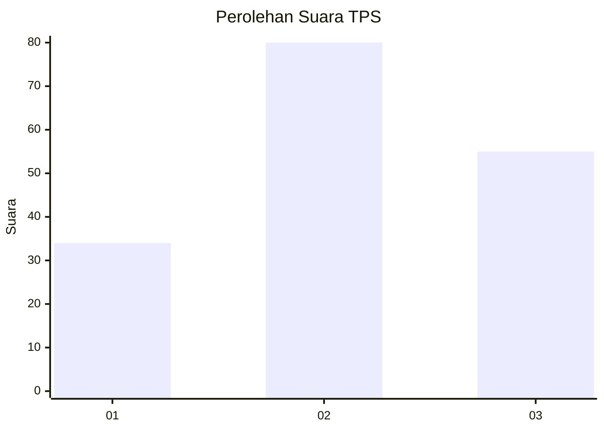
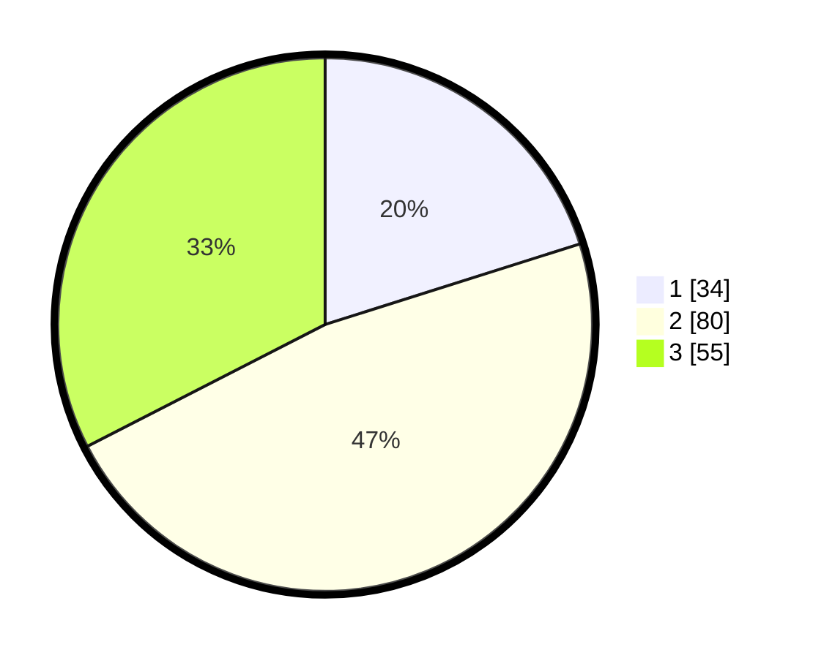

# Hasil

## Grafik

## Tabel

| No. | Nama Paslon    | Suara | Suara (raw) | Persentase |
|:--- |:-------------- | -----:| -----------:| ----------:|
| 1   | ANIES MUHAIMIN | 34    | [34][p-1]   | 20,12      |
| 2   | PRABOWO GIBRAN | 80    | [80][p-2]   | 47,34      |
| 3   | GANJAR MAHFUD  | 55    | [55][p-3]   | 32,54      |

[p-1]: https://github.com/gigit-pemilu/pemilu-2024-35-jawa-timur/blob/main/pilpres/hitung-suara/sub/35-jawa-timur/sub/78-kota-surabaya/sub/02-wonocolo/sub/1005-siwalankerto/sub/039-tps/sub/paslon-1.txt
[p-2]: https://github.com/gigit-pemilu/pemilu-2024-35-jawa-timur/blob/main/pilpres/hitung-suara/sub/35-jawa-timur/sub/78-kota-surabaya/sub/02-wonocolo/sub/1005-siwalankerto/sub/039-tps/sub/paslon-2.txt
[p-3]: https://github.com/gigit-pemilu/pemilu-2024-35-jawa-timur/blob/main/pilpres/hitung-suara/sub/35-jawa-timur/sub/78-kota-surabaya/sub/02-wonocolo/sub/1005-siwalankerto/sub/039-tps/sub/paslon-3.txt

## Foto C Plano

https://sirekap-obj-formc.kpu.go.id/e48d/pemilu/ppwp/35/78/02/10/05/3578021005039-20240214-205128--6d466fda-89ad-447f-b967-1cce48ab7d2d.jpg

https://sirekap-obj-formc.kpu.go.id/e48d/pemilu/ppwp/35/78/02/10/05/3578021005039-20240214-205141--ad3253df-603e-408b-9430-2a63aab98355.jpg

https://sirekap-obj-formc.kpu.go.id/e48d/pemilu/ppwp/35/78/02/10/05/3578021005039-20240214-205156--79c66f41-4dcb-4232-89d7-a83dc8288861.jpg

## Metadata

| Key        | Value               |
| ---------- | ------------------- |
| Time Stamp | 2024-02-15 23:29:50 |

