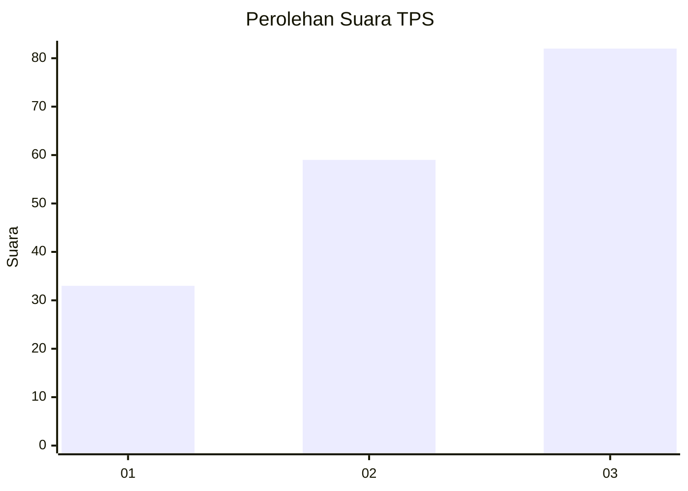
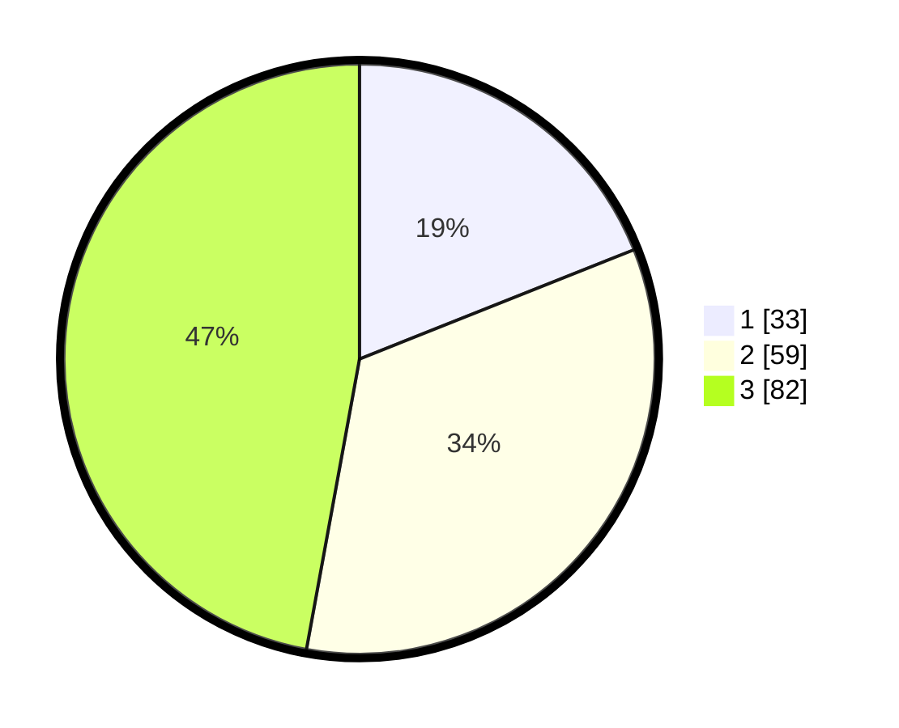

# Hasil

## Grafik

## Tabel

| No. | Nama Paslon    | Suara | Suara (raw) | Persentase |
|:--- |:-------------- | -----:| -----------:| ----------:|
| 1   | ANIES MUHAIMIN | 33    | [33][p-1]   | 18,97      |
| 2   | PRABOWO GIBRAN | 59    | [59][p-2]   | 33,91      |
| 3   | GANJAR MAHFUD  | 82    | [82][p-3]   | 47,13      |

[p-1]: https://github.com/gigit-pemilu/pemilu-2024/blob/main/pilpres/hitung-suara/sub/35-jawa-timur/sub/78-kota-surabaya/sub/03-rungkut/sub/1001-kalirungkut/sub/004-tps/sub/paslon-1.txt
[p-2]: https://github.com/gigit-pemilu/pemilu-2024/blob/main/pilpres/hitung-suara/sub/35-jawa-timur/sub/78-kota-surabaya/sub/03-rungkut/sub/1001-kalirungkut/sub/004-tps/sub/paslon-2.txt
[p-3]: https://github.com/gigit-pemilu/pemilu-2024/blob/main/pilpres/hitung-suara/sub/35-jawa-timur/sub/78-kota-surabaya/sub/03-rungkut/sub/1001-kalirungkut/sub/004-tps/sub/paslon-3.txt

## Foto C Plano

https://sirekap-obj-formc.kpu.go.id/4dfd/pemilu/ppwp/35/78/03/10/01/3578031001004-20240216-092047--48c9ec0c-abde-49c3-bb3d-73182867fe86.jpg

https://sirekap-obj-formc.kpu.go.id/4dfd/pemilu/ppwp/35/78/03/10/01/3578031001004-20240216-092052--cd99bd32-88a5-4fbe-ba3d-cfd8da1f8b1e.jpg

https://sirekap-obj-formc.kpu.go.id/4dfd/pemilu/ppwp/35/78/03/10/01/3578031001004-20240216-092049--9d73e9c6-2a06-4bed-855d-9983cb30714d.jpg

## Metadata

| Key        | Value               |
| ---------- | ------------------- |
| Time Stamp | 2024-02-19 14:00:00 |

## DATA PEMILIH TETAP

Jumlah pemilih dalam DPT: **234**.
 * L: **92**.
 * P: **142**.

## DATA PENGGUNA HAK PILIH

Jumlah pengguna hak pilih dalam DPT: **168**.
 * L: **66**.
 * P: **102**.

Jumlah pengguna hak pilih dalam DPTb: **6**.
 * L: **3**.
 * P: **3**.

Jumlah pengguna hak pilih dalam DPK: **0**.
 * L: **0**.
 * P: **0**.

Jumlah pengguna hak pilih: **0**.
 * L: **0**.
 * P: **0**.

## JUMLAH SUARA SAH DAN TIDAK SAH

JUMLAH SELURUH SUARA SAH: **174**.

JUMLAH SUARA TIDAK SAH: **3**.

JUMLAH SELURUH SUARA SAH DAN SUARA TIDAK SAH: **177**.

