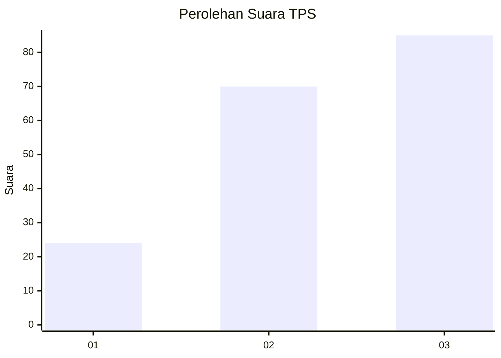
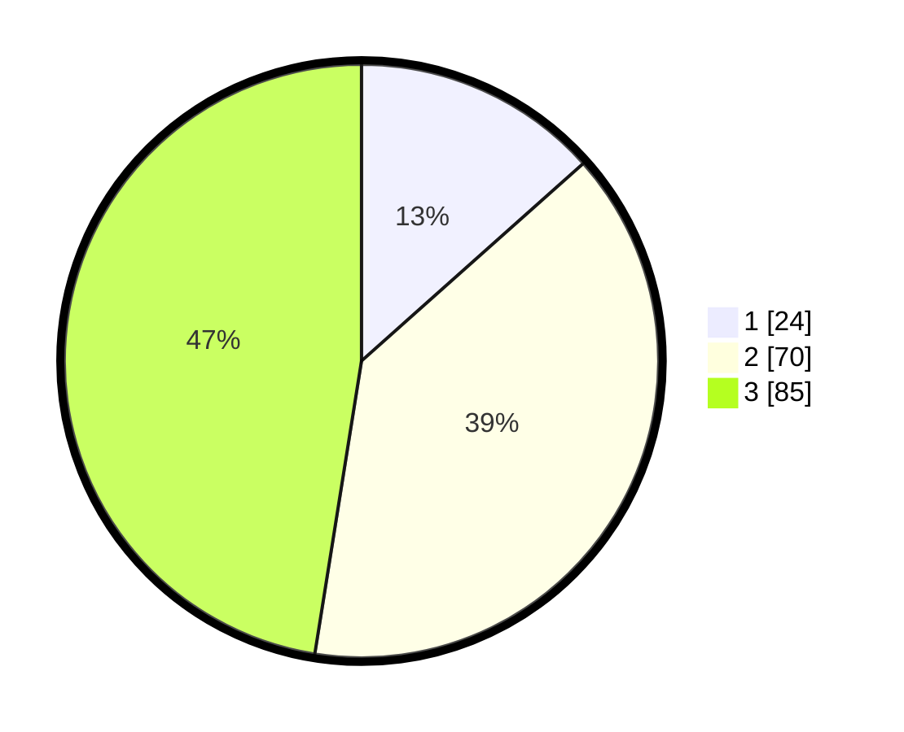

# Hasil

## Grafik

## Tabel

| No. | Nama Paslon    | Suara | Suara (raw) | Persentase |
|:--- |:-------------- | -----:| -----------:| ----------:|
| 1   | ANIES MUHAIMIN | 24    | [24][p-1]   | 13,41      |
| 2   | PRABOWO GIBRAN | 70    | [70][p-2]   | 39,11      |
| 3   | GANJAR MAHFUD  | 85    | [85][p-3]   | 47,49      |

[p-1]: https://github.com/gigit-pemilu/pemilu-2024/blob/main/pilpres/hitung-suara/sub/35-jawa-timur/sub/78-kota-surabaya/sub/03-rungkut/sub/1001-kalirungkut/sub/014-tps/sub/paslon-1.txt
[p-2]: https://github.com/gigit-pemilu/pemilu-2024/blob/main/pilpres/hitung-suara/sub/35-jawa-timur/sub/78-kota-surabaya/sub/03-rungkut/sub/1001-kalirungkut/sub/014-tps/sub/paslon-2.txt
[p-3]: https://github.com/gigit-pemilu/pemilu-2024/blob/main/pilpres/hitung-suara/sub/35-jawa-timur/sub/78-kota-surabaya/sub/03-rungkut/sub/1001-kalirungkut/sub/014-tps/sub/paslon-3.txt

## Foto C Plano

https://sirekap-obj-formc.kpu.go.id/4f0f/pemilu/ppwp/35/78/03/10/01/3578031001014-20240215-043720--962714f0-29bd-4a0d-8f29-fa4c7f7fb4d1.jpg

https://sirekap-obj-formc.kpu.go.id/4f0f/pemilu/ppwp/35/78/03/10/01/3578031001014-20240215-043815--dae4e52a-a748-4bd8-9a1d-bfd6b3f6289e.jpg

https://sirekap-obj-formc.kpu.go.id/4f0f/pemilu/ppwp/35/78/03/10/01/3578031001014-20240215-043907--87e1e0b2-895e-433d-8dc9-c19a46aec513.jpg

## Metadata

| Key        | Value               |
| ---------- | ------------------- |
| Time Stamp | 2024-02-16 00:00:26 |

