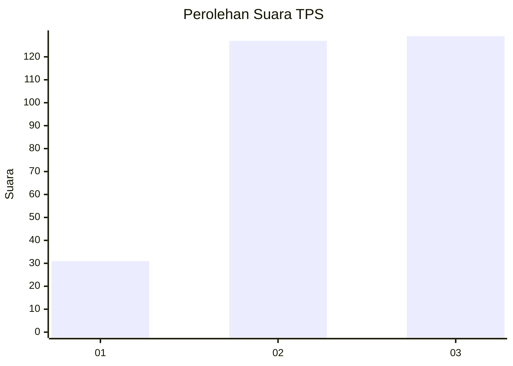
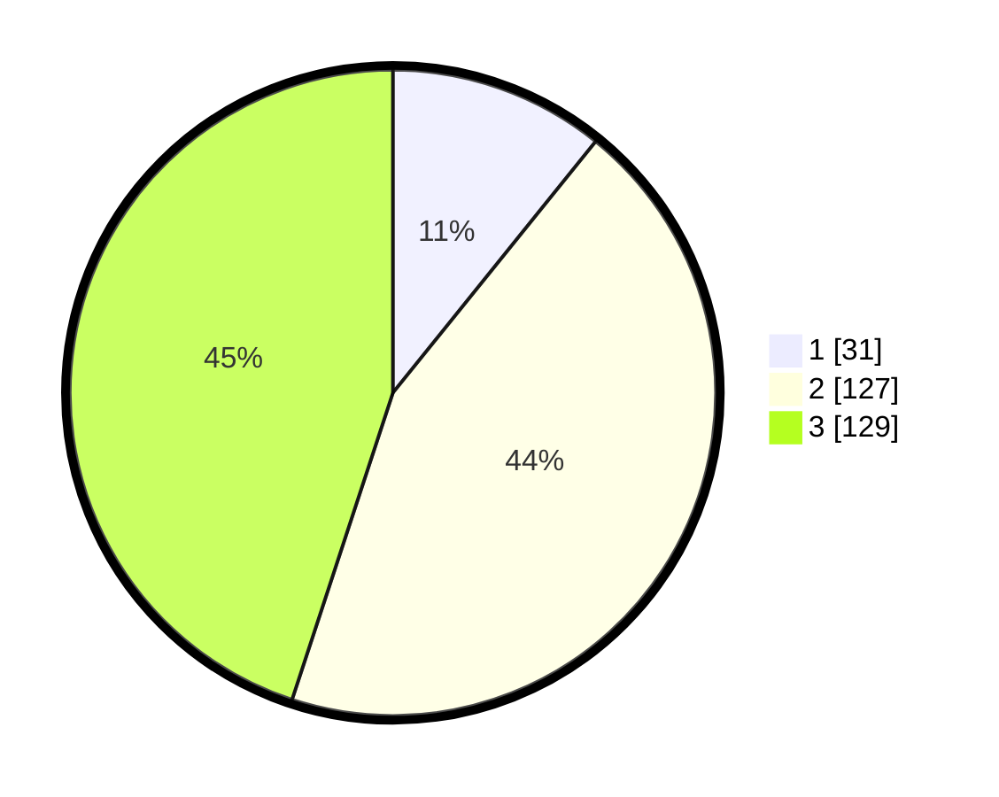

# Hasil

## Grafik

## Tabel

| No. | Nama Paslon    | Suara | Suara (raw) | Persentase |
|:--- |:-------------- | -----:| -----------:| ----------:|
| 1   | ANIES MUHAIMIN | 31    | [31][p-1]   | 10,80      |
| 2   | PRABOWO GIBRAN | 127   | [127][p-2]  | 44,25      |
| 3   | GANJAR MAHFUD  | 129   | [129][p-3]  | 44,95      |

[p-1]: https://github.com/gigit-pemilu/pemilu-2024-35-jawa-timur/blob/main/pilpres/hitung-suara/sub/35-jawa-timur/sub/78-kota-surabaya/sub/03-rungkut/sub/1001-kalirungkut/sub/026-tps/sub/paslon-1.txt
[p-2]: https://github.com/gigit-pemilu/pemilu-2024-35-jawa-timur/blob/main/pilpres/hitung-suara/sub/35-jawa-timur/sub/78-kota-surabaya/sub/03-rungkut/sub/1001-kalirungkut/sub/026-tps/sub/paslon-2.txt
[p-3]: https://github.com/gigit-pemilu/pemilu-2024-35-jawa-timur/blob/main/pilpres/hitung-suara/sub/35-jawa-timur/sub/78-kota-surabaya/sub/03-rungkut/sub/1001-kalirungkut/sub/026-tps/sub/paslon-3.txt

## Foto C Plano

https://sirekap-obj-formc.kpu.go.id/fe2f/pemilu/ppwp/35/78/03/10/01/3578031001026-20240226-142445--a588c39b-cb58-4d65-a2eb-cc82ac96b88a.jpg

https://sirekap-obj-formc.kpu.go.id/fe2f/pemilu/ppwp/35/78/03/10/01/3578031001026-20240226-142527--c341b292-1c84-406a-a9ea-333eab4b4695.jpg

https://sirekap-obj-formc.kpu.go.id/fe2f/pemilu/ppwp/35/78/03/10/01/3578031001026-20240226-142748--67e274a0-7406-4a1e-bd4a-83b5ce8f7508.jpg

## Metadata

| Key        | Value               |
| ---------- | ------------------- |
| Time Stamp | 2024-02-26 15:00:00 |

## DATA PEMILIH TETAP

Jumlah pemilih dalam DPT: **550**.
 * L: **443**.
 * P: **50**.

## DATA PENGGUNA HAK PILIH

Jumlah pengguna hak pilih dalam DPT: **0**.
 * L: **0**.
 * P: **0**.

Jumlah pengguna hak pilih dalam DPTb: **1**.
 * L: **5**.
 * P: **500**.

Jumlah pengguna hak pilih dalam DPK: **70**.
 * L: **0**.
 * P: **0**.

Jumlah pengguna hak pilih: **5**.
 * L: **0**.
 * P: **0**.

## JUMLAH SUARA SAH DAN TIDAK SAH

JUMLAH SELURUH SUARA SAH: **187**.

JUMLAH SUARA TIDAK SAH: **10**.

JUMLAH SELURUH SUARA SAH DAN SUARA TIDAK SAH: **197**.

