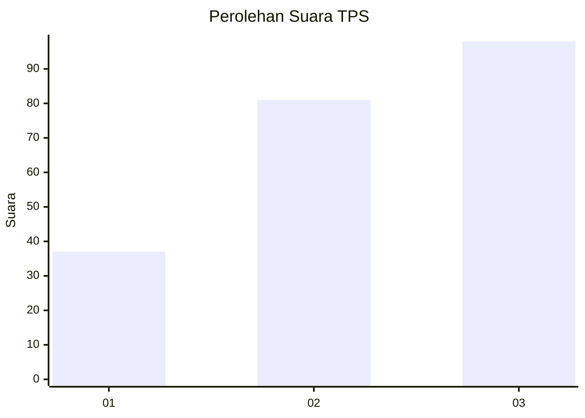
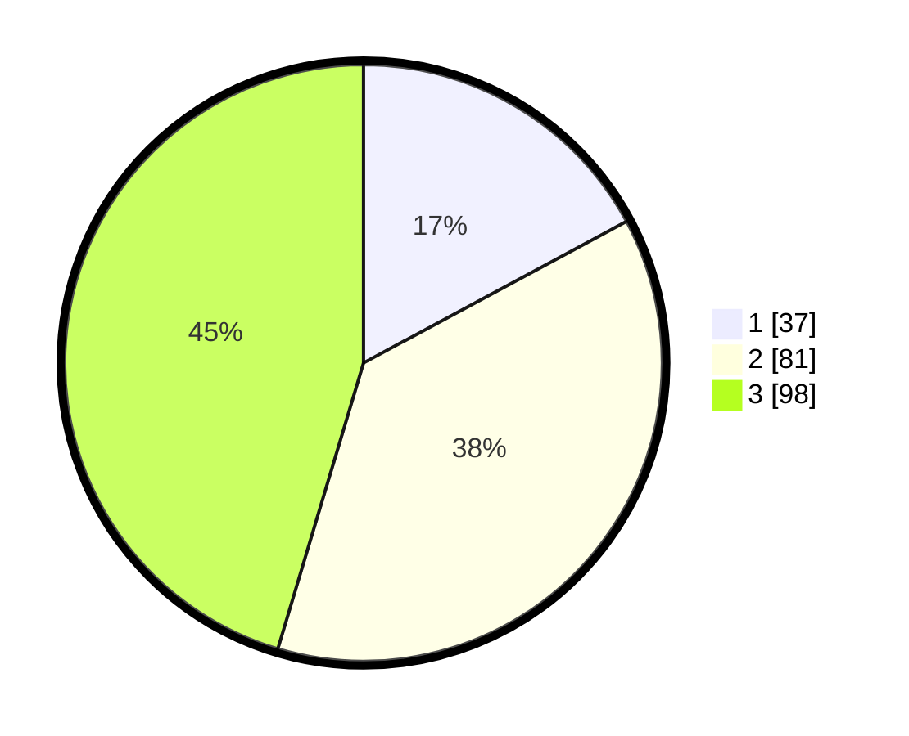

# Hasil

## Grafik

## Tabel

| No. | Nama Paslon    | Suara | Suara (raw) | Persentase |
|:--- |:-------------- | -----:| -----------:| ----------:|
| 1   | ANIES MUHAIMIN | 37    | [37][p-1]   | 17,13      |
| 2   | PRABOWO GIBRAN | 81    | [81][p-2]   | 37,50      |
| 3   | GANJAR MAHFUD  | 98    | [98][p-3]   | 45,37      |

[p-1]: https://github.com/gigit-pemilu/pemilu-2024-35-jawa-timur/blob/main/pilpres/hitung-suara/sub/35-jawa-timur/sub/78-kota-surabaya/sub/03-rungkut/sub/1001-kalirungkut/sub/041-tps/sub/paslon-1.txt
[p-2]: https://github.com/gigit-pemilu/pemilu-2024-35-jawa-timur/blob/main/pilpres/hitung-suara/sub/35-jawa-timur/sub/78-kota-surabaya/sub/03-rungkut/sub/1001-kalirungkut/sub/041-tps/sub/paslon-2.txt
[p-3]: https://github.com/gigit-pemilu/pemilu-2024-35-jawa-timur/blob/main/pilpres/hitung-suara/sub/35-jawa-timur/sub/78-kota-surabaya/sub/03-rungkut/sub/1001-kalirungkut/sub/041-tps/sub/paslon-3.txt

## Foto C Plano

https://sirekap-obj-formc.kpu.go.id/2f7c/pemilu/ppwp/35/78/03/10/01/3578031001041-20240215-000723--8db7b83e-9c06-4de4-9a9e-5d3bac91f00f.jpg

https://sirekap-obj-formc.kpu.go.id/2f7c/pemilu/ppwp/35/78/03/10/01/3578031001041-20240215-000927--ee1d03bf-2824-49c9-9658-b00bd4a5b28e.jpg

https://sirekap-obj-formc.kpu.go.id/2f7c/pemilu/ppwp/35/78/03/10/01/3578031001041-20240215-001142--c02e9618-3b1e-4932-9667-b243c2563c2b.jpg

## Metadata

| Key        | Value               |
| ---------- | ------------------- |
| Time Stamp | 2024-02-16 00:00:26 |

