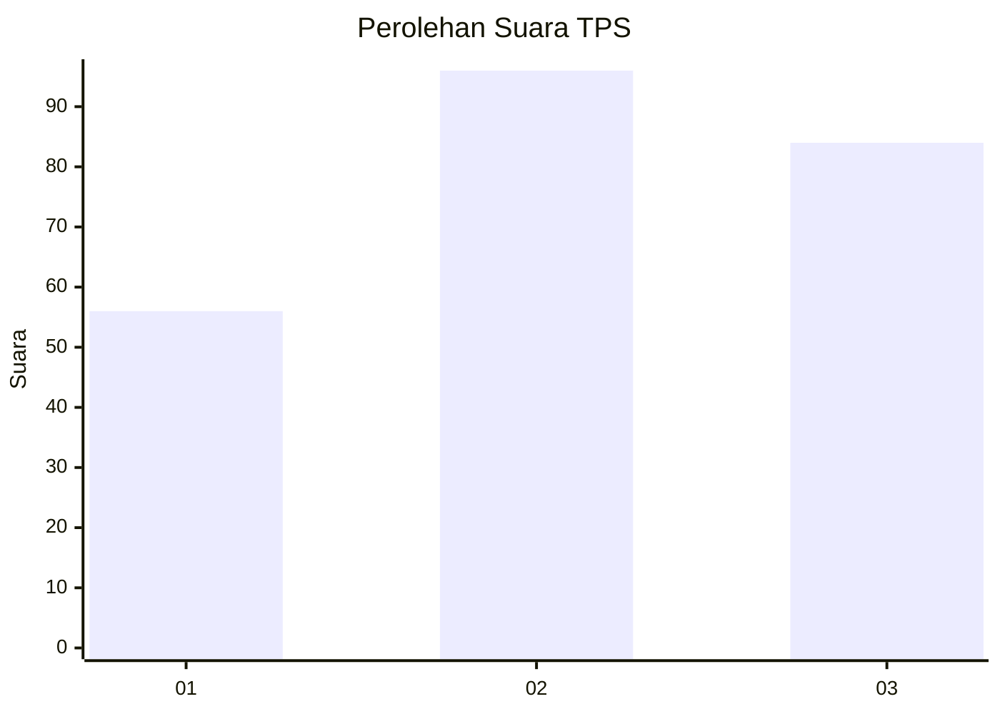
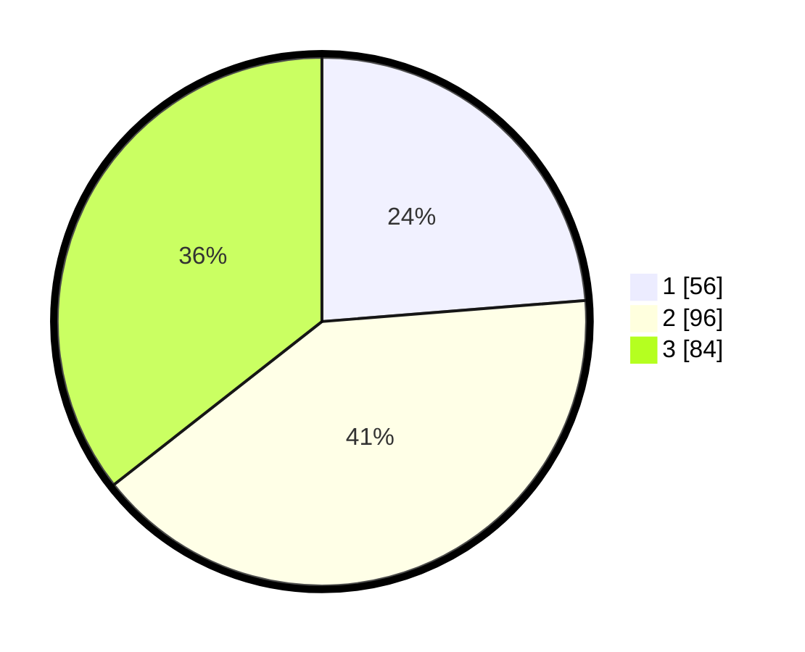

# Hasil

## Grafik

## Tabel

| No. | Nama Paslon    | Suara | Suara (raw) | Persentase |
|:--- |:-------------- | -----:| -----------:| ----------:|
| 1   | ANIES MUHAIMIN | 56    | [56][p-1]   | 23,73      |
| 2   | PRABOWO GIBRAN | 96    | [96][p-2]   | 40,68      |
| 3   | GANJAR MAHFUD  | 84    | [84][p-3]   | 35,59      |

[p-1]: https://github.com/gigit-pemilu/pemilu-2024-35-jawa-timur/blob/main/pilpres/hitung-suara/sub/35-jawa-timur/sub/78-kota-surabaya/sub/03-rungkut/sub/1001-kalirungkut/sub/043-tps/sub/paslon-1.txt
[p-2]: https://github.com/gigit-pemilu/pemilu-2024-35-jawa-timur/blob/main/pilpres/hitung-suara/sub/35-jawa-timur/sub/78-kota-surabaya/sub/03-rungkut/sub/1001-kalirungkut/sub/043-tps/sub/paslon-2.txt
[p-3]: https://github.com/gigit-pemilu/pemilu-2024-35-jawa-timur/blob/main/pilpres/hitung-suara/sub/35-jawa-timur/sub/78-kota-surabaya/sub/03-rungkut/sub/1001-kalirungkut/sub/043-tps/sub/paslon-3.txt

## Foto C Plano

https://sirekap-obj-formc.kpu.go.id/634e/pemilu/ppwp/35/78/03/10/01/3578031001043-20240215-021748--0c6d7918-138b-4d61-8743-9f50f0558bf9.jpg

https://sirekap-obj-formc.kpu.go.id/634e/pemilu/ppwp/35/78/03/10/01/3578031001043-20240215-021816--838b40cd-f788-48ea-8eac-cff3cc75efec.jpg

https://sirekap-obj-formc.kpu.go.id/634e/pemilu/ppwp/35/78/03/10/01/3578031001043-20240215-021906--31e02b5b-f17d-4cc0-8aa7-7738cefefe9f.jpg

## Metadata

| Key        | Value               |
| ---------- | ------------------- |
| Time Stamp | 2024-02-16 00:00:26 |

