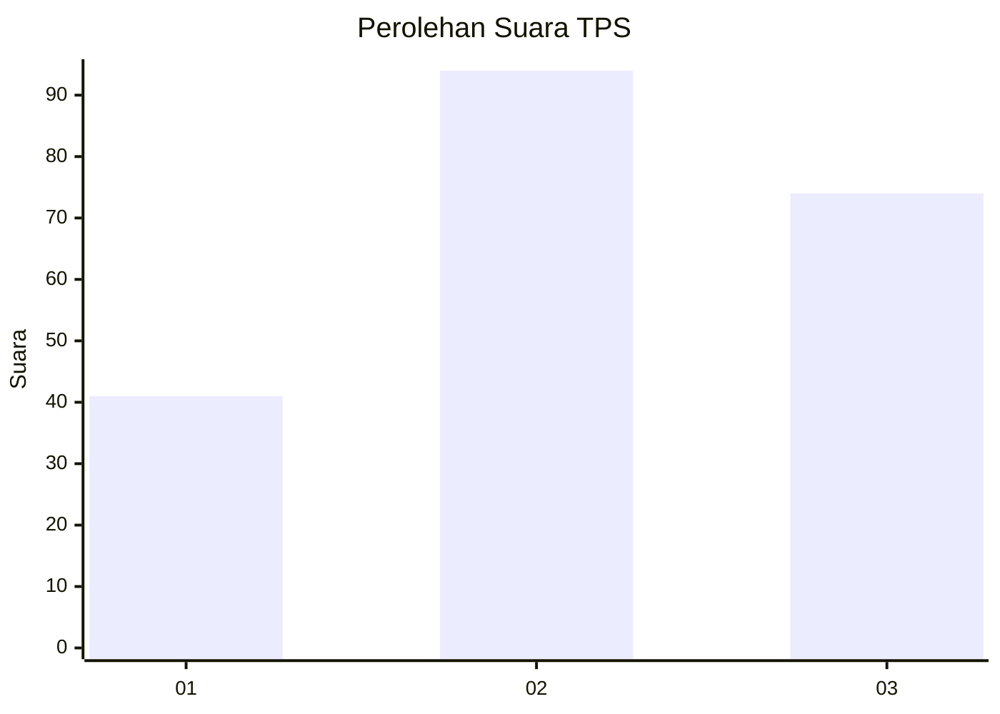
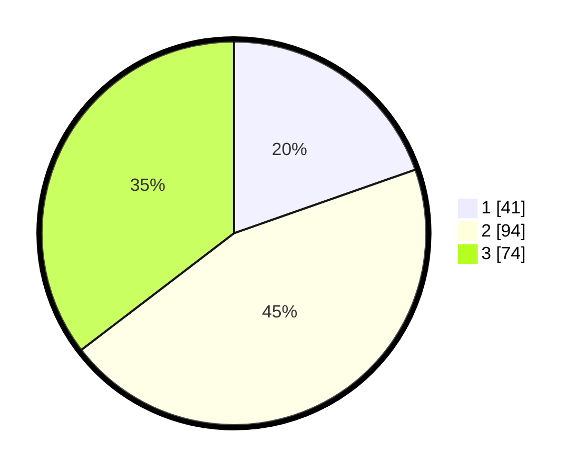

# Hasil

## Grafik

## Tabel

| No. | Nama Paslon    | Suara | Suara (raw) | Persentase |
|:--- |:-------------- | -----:| -----------:| ----------:|
| 1   | ANIES MUHAIMIN | 41    | [41][p-1]   | 19,62      |
| 2   | PRABOWO GIBRAN | 94    | [94][p-2]   | 44,98      |
| 3   | GANJAR MAHFUD  | 74    | [74][p-3]   | 35,41      |

[p-1]: https://github.com/gigit-pemilu/pemilu-2024-35-jawa-timur/blob/main/pilpres/hitung-suara/sub/35-jawa-timur/sub/78-kota-surabaya/sub/03-rungkut/sub/1001-kalirungkut/sub/046-tps/sub/paslon-1.txt
[p-2]: https://github.com/gigit-pemilu/pemilu-2024-35-jawa-timur/blob/main/pilpres/hitung-suara/sub/35-jawa-timur/sub/78-kota-surabaya/sub/03-rungkut/sub/1001-kalirungkut/sub/046-tps/sub/paslon-2.txt
[p-3]: https://github.com/gigit-pemilu/pemilu-2024-35-jawa-timur/blob/main/pilpres/hitung-suara/sub/35-jawa-timur/sub/78-kota-surabaya/sub/03-rungkut/sub/1001-kalirungkut/sub/046-tps/sub/paslon-3.txt

## Foto C Plano

https://sirekap-obj-formc.kpu.go.id/9e95/pemilu/ppwp/35/78/03/10/01/3578031001046-20240221-230159--e0bf002b-c7b8-4174-9064-5e339d05bb94.jpg

https://sirekap-obj-formc.kpu.go.id/9e95/pemilu/ppwp/35/78/03/10/01/3578031001046-20240221-230257--de440d02-0651-481f-9519-b8e935ba2a39.jpg

https://sirekap-obj-formc.kpu.go.id/9e95/pemilu/ppwp/35/78/03/10/01/3578031001046-20240221-230851--3300eab7-b207-4c5b-9e13-1d75230c1b58.jpg

## Metadata

| Key        | Value               |
| ---------- | ------------------- |
| Time Stamp | 2024-02-22 00:00:00 |

## DATA PEMILIH TETAP

Jumlah pemilih dalam DPT: **0**.
 * L: **498**.
 * P: **400**.

## DATA PENGGUNA HAK PILIH

Jumlah pengguna hak pilih dalam DPT: **100**.
 * L: **594**.
 * P: **462**.

Jumlah pengguna hak pilih dalam DPTb: **50**.
 * L: **505**.
 * P: **422**.

Jumlah pengguna hak pilih dalam DPK: **0**.
 * L: **550**.
 * P: **1**.

Jumlah pengguna hak pilih: **509**.
 * L: **0**.
 * P: **76**.

## JUMLAH SUARA SAH DAN TIDAK SAH

JUMLAH SELURUH SUARA SAH: **78**.

JUMLAH SUARA TIDAK SAH: **5**.

JUMLAH SELURUH SUARA SAH DAN SUARA TIDAK SAH: **0**.

