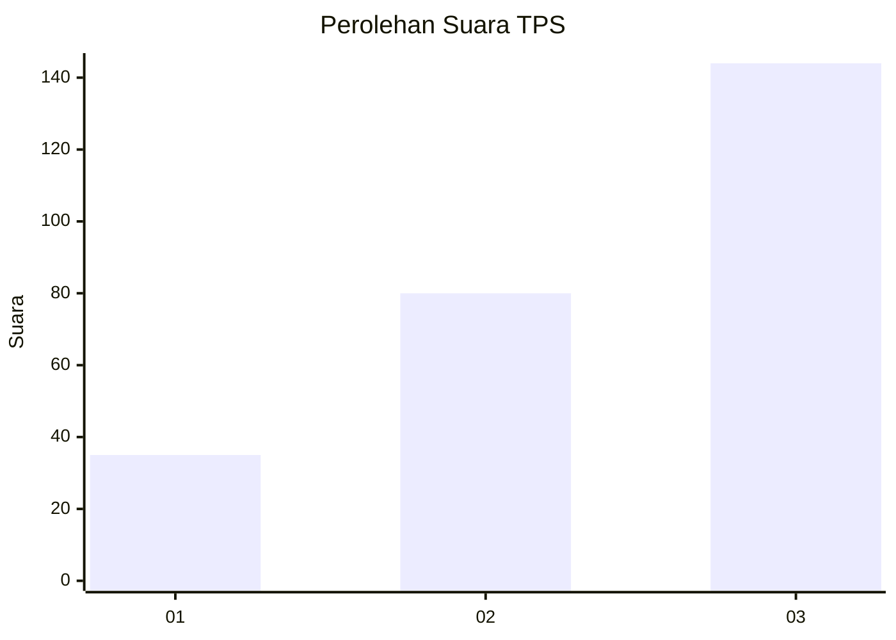
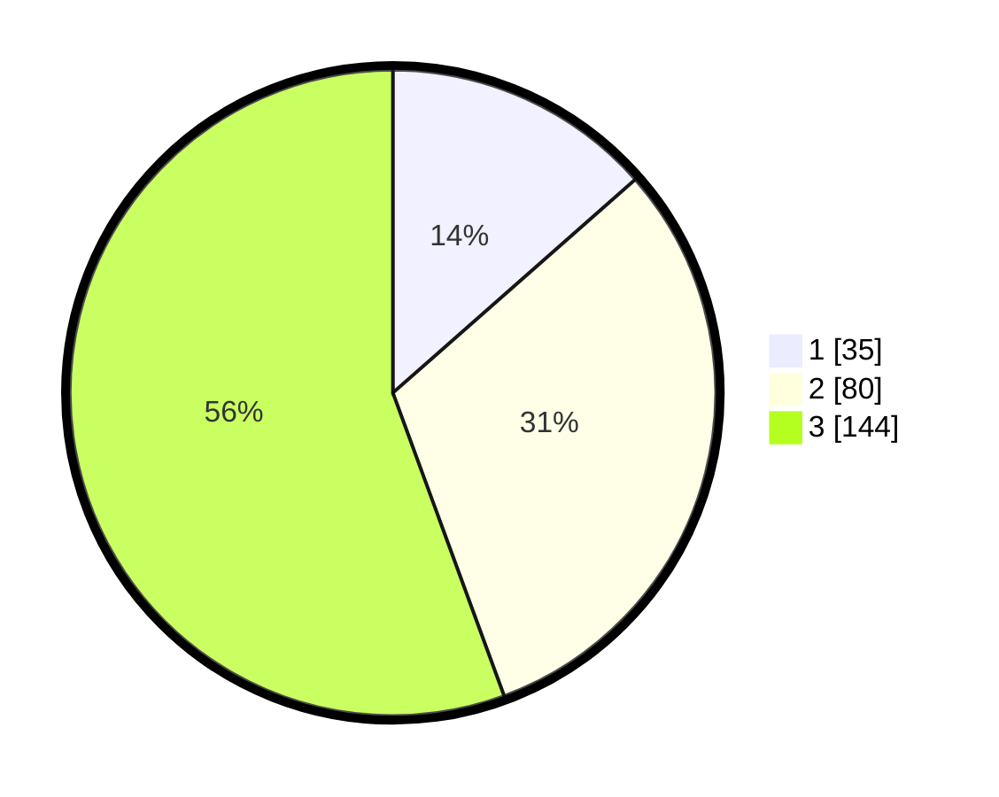

# Hasil

## Grafik

## Tabel

| No. | Nama Paslon    | Suara | Suara (raw) | Persentase |
|:--- |:-------------- | -----:| -----------:| ----------:|
| 1   | ANIES MUHAIMIN | 35    | [35][p-1]   | 13,51      |
| 2   | PRABOWO GIBRAN | 80    | [80][p-2]   | 30,89      |
| 3   | GANJAR MAHFUD  | 144   | [144][p-3]  | 55,60      |

[p-1]: https://github.com/gigit-pemilu/pemilu-2024/blob/main/pilpres/hitung-suara/sub/35-jawa-timur/sub/78-kota-surabaya/sub/03-rungkut/sub/1001-kalirungkut/sub/062-tps/sub/paslon-1.txt
[p-2]: https://github.com/gigit-pemilu/pemilu-2024/blob/main/pilpres/hitung-suara/sub/35-jawa-timur/sub/78-kota-surabaya/sub/03-rungkut/sub/1001-kalirungkut/sub/062-tps/sub/paslon-2.txt
[p-3]: https://github.com/gigit-pemilu/pemilu-2024/blob/main/pilpres/hitung-suara/sub/35-jawa-timur/sub/78-kota-surabaya/sub/03-rungkut/sub/1001-kalirungkut/sub/062-tps/sub/paslon-3.txt

## Foto C Plano

https://sirekap-obj-formc.kpu.go.id/1f83/pemilu/ppwp/35/78/03/10/01/3578031001062-20240221-234222--99595726-e019-4bd8-b34c-229cb94f233f.jpg

https://sirekap-obj-formc.kpu.go.id/1f83/pemilu/ppwp/35/78/03/10/01/3578031001062-20240221-234258--565ed4b3-1a7a-4f9a-bbf9-5a0e3fac01c6.jpg

https://sirekap-obj-formc.kpu.go.id/1f83/pemilu/ppwp/35/78/03/10/01/3578031001062-20240221-234337--081ca43c-976e-4881-bd3a-1b3ffdff3cdb.jpg

## Metadata

| Key        | Value               |
| ---------- | ------------------- |
| Time Stamp | 2024-02-22 00:00:00 |

## DATA PEMILIH TETAP

Jumlah pemilih dalam DPT: **557**.
 * L: **0**.
 * P: **5**.

## DATA PENGGUNA HAK PILIH

Jumlah pengguna hak pilih dalam DPT: **777**.
 * L: **0**.
 * P: **77**.

Jumlah pengguna hak pilih dalam DPTb: **0**.
 * L: **700**.
 * P: **0**.

Jumlah pengguna hak pilih dalam DPK: **0**.
 * L: **0**.
 * P: **0**.

Jumlah pengguna hak pilih: **343**.
 * L: **171**.
 * P: **172**.

## JUMLAH SUARA SAH DAN TIDAK SAH

JUMLAH SELURUH SUARA SAH: **774**.

JUMLAH SUARA TIDAK SAH: **5**.

JUMLAH SELURUH SUARA SAH DAN SUARA TIDAK SAH: **243**.

