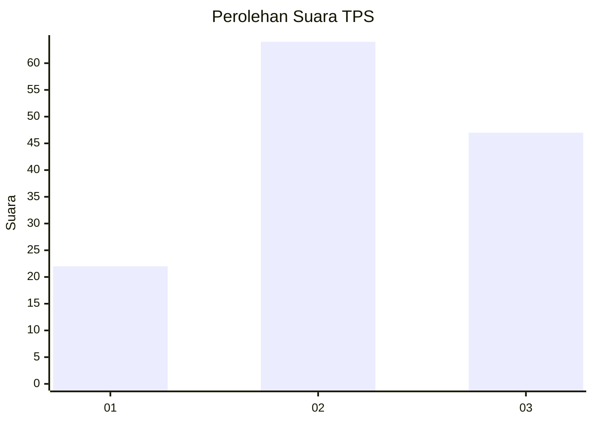
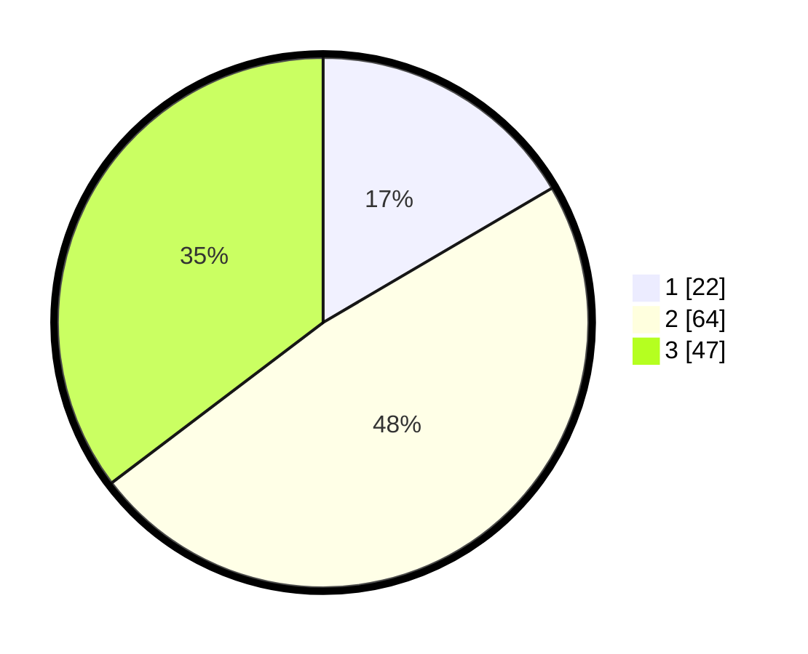

# Hasil

## Grafik

## Tabel

| No. | Nama Paslon    | Suara | Suara (raw) | Persentase |
|:--- |:-------------- | -----:| -----------:| ----------:|
| 1   | ANIES MUHAIMIN | 22    | [22][p-1]   | 16,54      |
| 2   | PRABOWO GIBRAN | 64    | [64][p-2]   | 48,12      |
| 3   | GANJAR MAHFUD  | 47    | [47][p-3]   | 35,34      |

[p-1]: https://github.com/gigit-pemilu/pemilu-2024-35-jawa-timur/blob/main/pilpres/hitung-suara/sub/35-jawa-timur/sub/78-kota-surabaya/sub/03-rungkut/sub/1001-kalirungkut/sub/063-tps/sub/paslon-1.txt
[p-2]: https://github.com/gigit-pemilu/pemilu-2024-35-jawa-timur/blob/main/pilpres/hitung-suara/sub/35-jawa-timur/sub/78-kota-surabaya/sub/03-rungkut/sub/1001-kalirungkut/sub/063-tps/sub/paslon-2.txt
[p-3]: https://github.com/gigit-pemilu/pemilu-2024-35-jawa-timur/blob/main/pilpres/hitung-suara/sub/35-jawa-timur/sub/78-kota-surabaya/sub/03-rungkut/sub/1001-kalirungkut/sub/063-tps/sub/paslon-3.txt

## Foto C Plano

https://sirekap-obj-formc.kpu.go.id/e46a/pemilu/ppwp/35/78/03/10/01/3578031001063-20240221-234628--333cef1b-d4b4-4afe-9209-d36c06bb4c5f.jpg

https://sirekap-obj-formc.kpu.go.id/e46a/pemilu/ppwp/35/78/03/10/01/3578031001063-20240221-234704--1d12c3e1-0ab1-4963-9341-e97774dce0d5.jpg

https://sirekap-obj-formc.kpu.go.id/e46a/pemilu/ppwp/35/78/03/10/01/3578031001063-20240221-234744--4b10dc8d-f2ef-464b-8345-8d2a8741bf49.jpg

## Metadata

| Key        | Value               |
| ---------- | ------------------- |
| Time Stamp | 2024-02-22 00:00:00 |

## DATA PEMILIH TETAP

Jumlah pemilih dalam DPT: **200**.
 * L: **222**.
 * P: **222**.

## DATA PENGGUNA HAK PILIH

Jumlah pengguna hak pilih dalam DPT: **255**.
 * L: **222**.
 * P: **222**.

Jumlah pengguna hak pilih dalam DPTb: **754**.
 * L: **222**.
 * P: **202**.

Jumlah pengguna hak pilih dalam DPK: **2**.
 * L: **401**.
 * P: **1**.

Jumlah pengguna hak pilih: **224**.
 * L: **114**.
 * P: **110**.

## JUMLAH SUARA SAH DAN TIDAK SAH

JUMLAH SELURUH SUARA SAH: **219**.

JUMLAH SUARA TIDAK SAH: **5**.

JUMLAH SELURUH SUARA SAH DAN SUARA TIDAK SAH: **224**.

