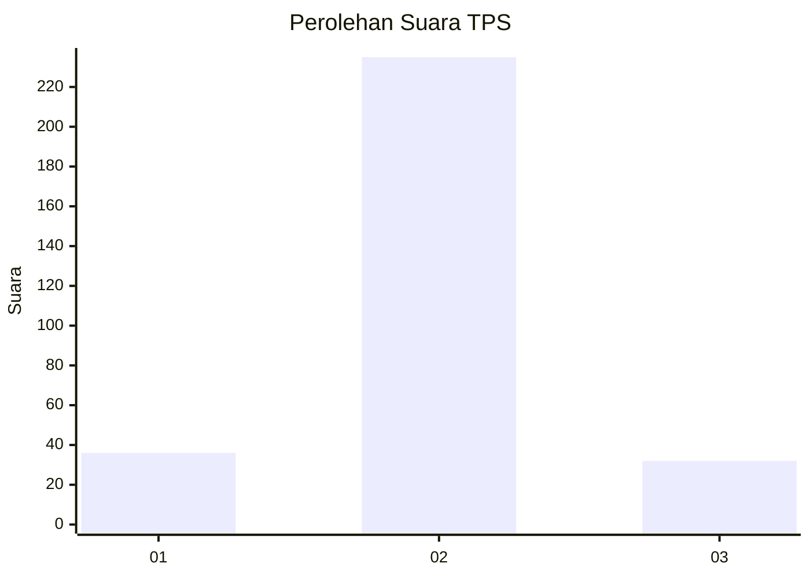
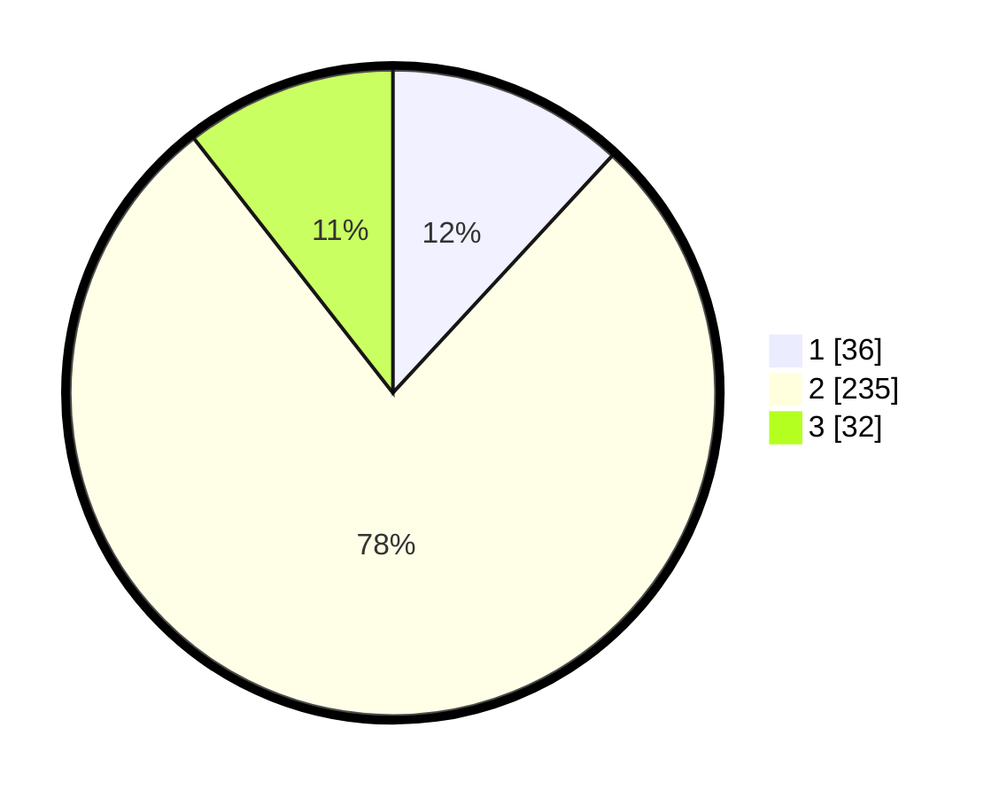

# Hasil

## Grafik

## Tabel

| No. | Nama Paslon    | Suara | Suara (raw) | Persentase |
|:--- |:-------------- | -----:| -----------:| ----------:|
| 1   | ANIES MUHAIMIN | 36    | [36][p-1]   | 11,88      |
| 2   | PRABOWO GIBRAN | 235   | [235][p-2]  | 77,56      |
| 3   | GANJAR MAHFUD  | 32    | [32][p-3]   | 10,56      |

[p-1]: https://github.com/gigit-pemilu/pemilu-2024/blob/main/pilpres/hitung-suara/sub/35-jawa-timur/sub/78-kota-surabaya/sub/03-rungkut/sub/1002-rungkut-kidul/sub/001-tps/sub/paslon-1.txt
[p-2]: https://github.com/gigit-pemilu/pemilu-2024/blob/main/pilpres/hitung-suara/sub/35-jawa-timur/sub/78-kota-surabaya/sub/03-rungkut/sub/1002-rungkut-kidul/sub/001-tps/sub/paslon-2.txt
[p-3]: https://github.com/gigit-pemilu/pemilu-2024/blob/main/pilpres/hitung-suara/sub/35-jawa-timur/sub/78-kota-surabaya/sub/03-rungkut/sub/1002-rungkut-kidul/sub/001-tps/sub/paslon-3.txt

## Foto C Plano

https://sirekap-obj-formc.kpu.go.id/5623/pemilu/ppwp/35/78/03/10/02/3578031002001-20240221-174307--6490e9de-b731-48c3-9714-980bb15bfae6.jpg

https://sirekap-obj-formc.kpu.go.id/5623/pemilu/ppwp/35/78/03/10/02/3578031002001-20240221-174331--176ece1f-c8cd-4180-8d8e-6e8d5552180d.jpg

https://sirekap-obj-formc.kpu.go.id/5623/pemilu/ppwp/35/78/03/10/02/3578031002001-20240221-174346--95f0c430-fb5e-4022-bcbd-bf63bb24d776.jpg

## Metadata

| Key        | Value               |
| ---------- | ------------------- |
| Time Stamp | 2024-02-21 18:00:00 |

## DATA PEMILIH TETAP

Jumlah pemilih dalam DPT: **243**.
 * L: **119**.
 * P: **424**.

## DATA PENGGUNA HAK PILIH

Jumlah pengguna hak pilih dalam DPT: **205**.
 * L: **95**.
 * P: **710**.

Jumlah pengguna hak pilih dalam DPTb: **772**.
 * L: **555**.
 * P: **581**.

Jumlah pengguna hak pilih dalam DPK: **0**.
 * L: **0**.
 * P: **0**.

Jumlah pengguna hak pilih: **206**.
 * L: **95**.
 * P: **112**.

## JUMLAH SUARA SAH DAN TIDAK SAH

JUMLAH SELURUH SUARA SAH: **203**.

JUMLAH SUARA TIDAK SAH: **3**.

JUMLAH SELURUH SUARA SAH DAN SUARA TIDAK SAH: **206**.

