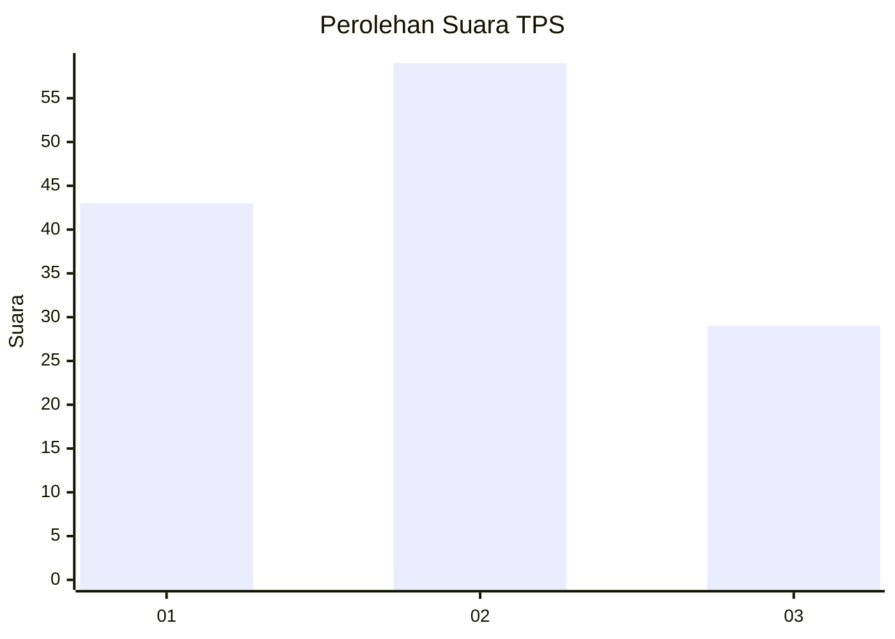
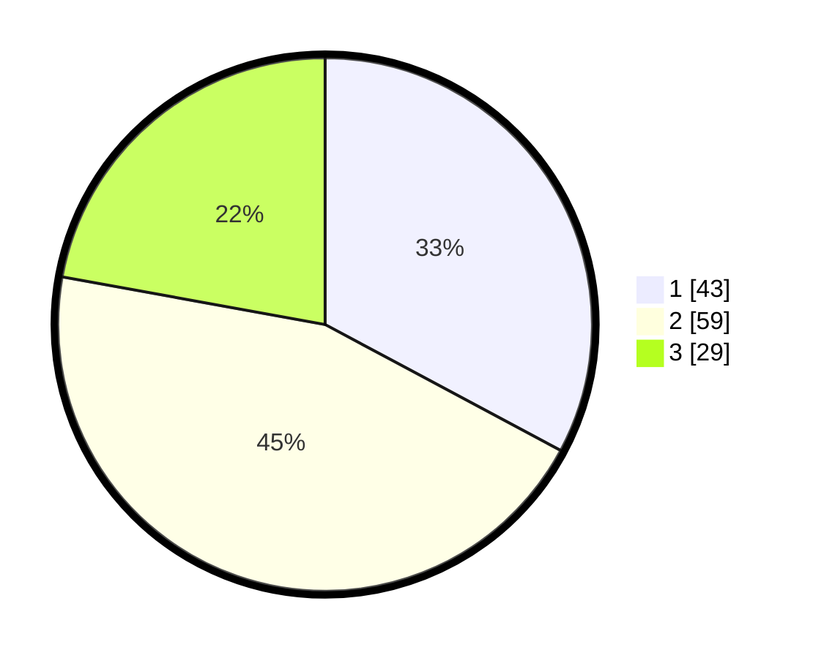

# Hasil

## Grafik

## Tabel

| No. | Nama Paslon    | Suara | Suara (raw) | Persentase |
|:--- |:-------------- | -----:| -----------:| ----------:|
| 1   | ANIES MUHAIMIN | 43    | [43][p-1]   | 32,82      |
| 2   | PRABOWO GIBRAN | 59    | [59][p-2]   | 45,04      |
| 3   | GANJAR MAHFUD  | 29    | [29][p-3]   | 22,14      |

[p-1]: https://github.com/gigit-pemilu/pemilu-2024-35-jawa-timur/blob/main/pilpres/hitung-suara/sub/35-jawa-timur/sub/78-kota-surabaya/sub/03-rungkut/sub/1002-rungkut-kidul/sub/007-tps/sub/paslon-1.txt
[p-2]: https://github.com/gigit-pemilu/pemilu-2024-35-jawa-timur/blob/main/pilpres/hitung-suara/sub/35-jawa-timur/sub/78-kota-surabaya/sub/03-rungkut/sub/1002-rungkut-kidul/sub/007-tps/sub/paslon-2.txt
[p-3]: https://github.com/gigit-pemilu/pemilu-2024-35-jawa-timur/blob/main/pilpres/hitung-suara/sub/35-jawa-timur/sub/78-kota-surabaya/sub/03-rungkut/sub/1002-rungkut-kidul/sub/007-tps/sub/paslon-3.txt

## Foto C Plano

https://sirekap-obj-formc.kpu.go.id/3036/pemilu/ppwp/35/78/03/10/02/3578031002007-20240221-174840--e9f5df13-9a4c-4d92-8f3c-1e6c16f00dab.jpg

https://sirekap-obj-formc.kpu.go.id/3036/pemilu/ppwp/35/78/03/10/02/3578031002007-20240221-174856--a1b8e089-c0df-4d9e-b5f1-5826e41dfac2.jpg

https://sirekap-obj-formc.kpu.go.id/3036/pemilu/ppwp/35/78/03/10/02/3578031002007-20240221-174912--997043c0-1c8f-4cb2-b3ff-3a8ec7a399cb.jpg

## Metadata

| Key        | Value               |
| ---------- | ------------------- |
| Time Stamp | 2024-02-21 18:00:00 |

## DATA PEMILIH TETAP

Jumlah pemilih dalam DPT: **278**.
 * L: **137**.
 * P: **141**.

## DATA PENGGUNA HAK PILIH

Jumlah pengguna hak pilih dalam DPT: **236**.
 * L: **119**.
 * P: **117**.

Jumlah pengguna hak pilih dalam DPTb: **778**.
 * L: **28**.
 * P: **207**.

Jumlah pengguna hak pilih dalam DPK: **888**.
 * L: **0**.
 * P: **0**.

Jumlah pengguna hak pilih: **236**.
 * L: **419**.
 * P: **117**.

## JUMLAH SUARA SAH DAN TIDAK SAH

JUMLAH SELURUH SUARA SAH: **230**.

JUMLAH SUARA TIDAK SAH: **775**.

JUMLAH SELURUH SUARA SAH DAN SUARA TIDAK SAH: **777**.

