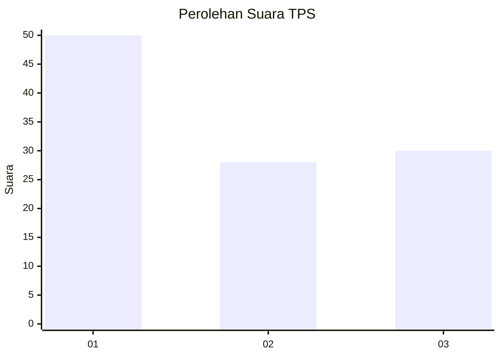
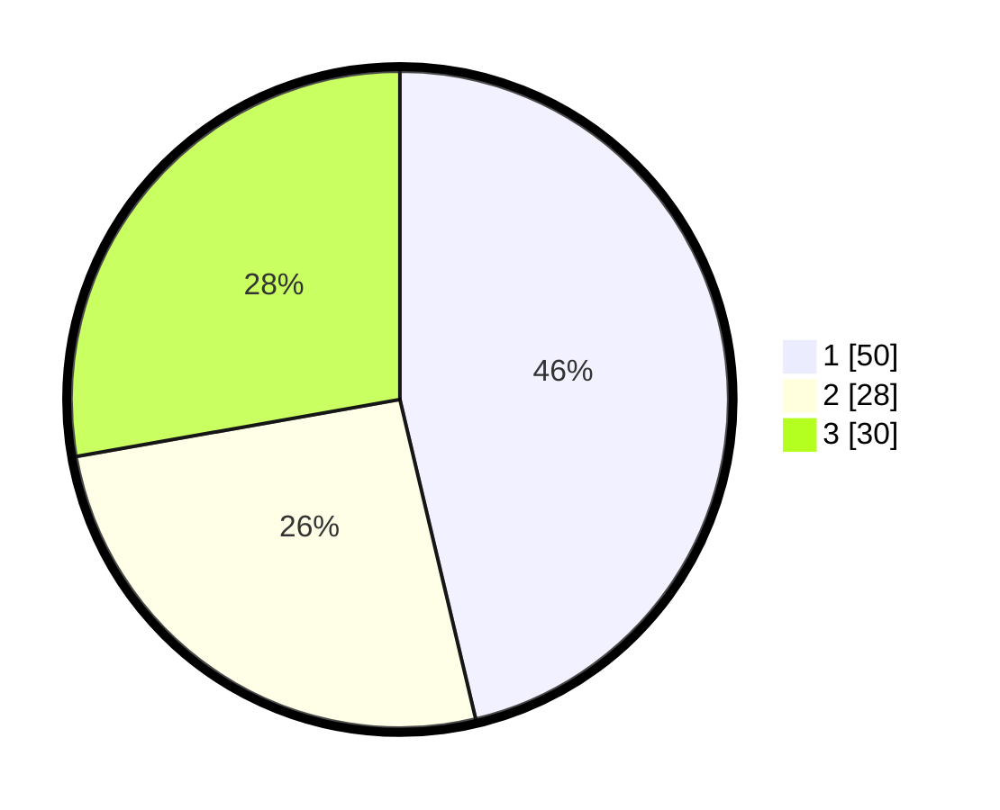

# Hasil

## Grafik

## Tabel

| No. | Nama Paslon    | Suara | Suara (raw) | Persentase |
|:--- |:-------------- | -----:| -----------:| ----------:|
| 1   | ANIES MUHAIMIN | 50    | [50][p-1]   | 46,30      |
| 2   | PRABOWO GIBRAN | 28    | [28][p-2]   | 25,93      |
| 3   | GANJAR MAHFUD  | 30    | [30][p-3]   | 27,78      |

[p-1]: https://github.com/gigit-pemilu/pemilu-2024/blob/main/pilpres/hitung-suara/sub/35-jawa-timur/sub/78-kota-surabaya/sub/03-rungkut/sub/1002-rungkut-kidul/sub/010-tps/sub/paslon-1.txt
[p-2]: https://github.com/gigit-pemilu/pemilu-2024/blob/main/pilpres/hitung-suara/sub/35-jawa-timur/sub/78-kota-surabaya/sub/03-rungkut/sub/1002-rungkut-kidul/sub/010-tps/sub/paslon-2.txt
[p-3]: https://github.com/gigit-pemilu/pemilu-2024/blob/main/pilpres/hitung-suara/sub/35-jawa-timur/sub/78-kota-surabaya/sub/03-rungkut/sub/1002-rungkut-kidul/sub/010-tps/sub/paslon-3.txt

## Foto C Plano

https://sirekap-obj-formc.kpu.go.id/6344/pemilu/ppwp/35/78/03/10/02/3578031002010-20240221-172252--9abb972e-d112-4778-9ce8-de01db15e7ca.jpg

https://sirekap-obj-formc.kpu.go.id/6344/pemilu/ppwp/35/78/03/10/02/3578031002010-20240221-172309--15e975c3-3aca-4469-960d-44ca3e9f3aa4.jpg

https://sirekap-obj-formc.kpu.go.id/6344/pemilu/ppwp/35/78/03/10/02/3578031002010-20240221-172324--2269b369-42aa-4004-a328-594c3f41c96c.jpg

## Metadata

| Key        | Value               |
| ---------- | ------------------- |
| Time Stamp | 2024-02-21 18:00:00 |

## DATA PEMILIH TETAP

Jumlah pemilih dalam DPT: **279**.
 * L: **135**.
 * P: **144**.

## DATA PENGGUNA HAK PILIH

Jumlah pengguna hak pilih dalam DPT: **215**.
 * L: **708**.
 * P: **507**.

Jumlah pengguna hak pilih dalam DPTb: **777**.
 * L: **528**.
 * P: **577**.

Jumlah pengguna hak pilih dalam DPK: **4**.
 * L: **1**.
 * P: **200**.

Jumlah pengguna hak pilih: **216**.
 * L: **409**.
 * P: **107**.

## JUMLAH SUARA SAH DAN TIDAK SAH

JUMLAH SELURUH SUARA SAH: **208**.

JUMLAH SUARA TIDAK SAH: **8**.

JUMLAH SELURUH SUARA SAH DAN SUARA TIDAK SAH: **216**.

