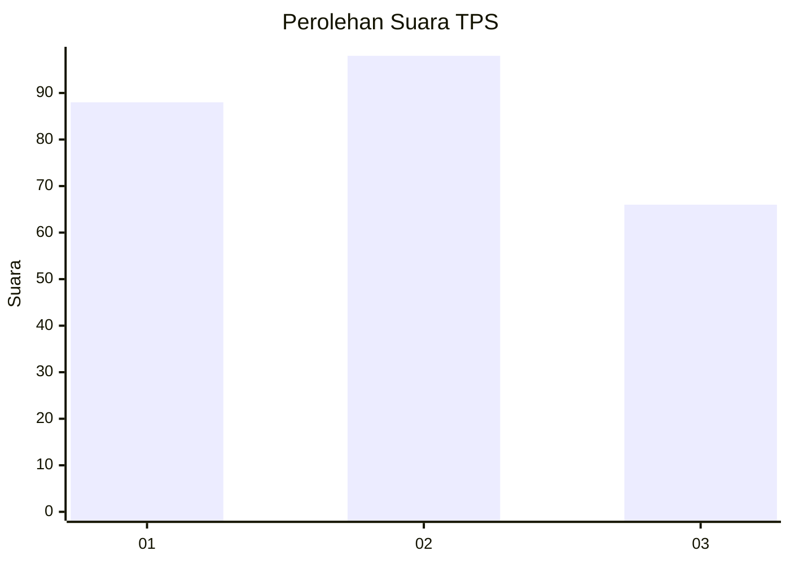
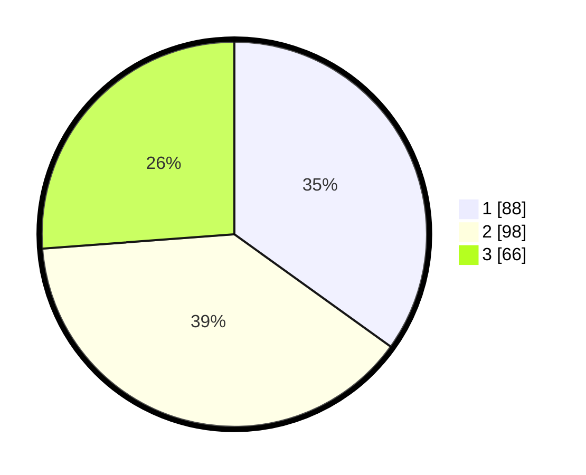

# Hasil

## Grafik

## Tabel

| No. | Nama Paslon    | Suara | Suara (raw) | Persentase |
|:--- |:-------------- | -----:| -----------:| ----------:|
| 1   | ANIES MUHAIMIN | 88    | [88][p-1]   | 34,92      |
| 2   | PRABOWO GIBRAN | 98    | [98][p-2]   | 38,89      |
| 3   | GANJAR MAHFUD  | 66    | [66][p-3]   | 26,19      |

[p-1]: https://github.com/gigit-pemilu/pemilu-2024-35-jawa-timur/blob/main/pilpres/hitung-suara/sub/35-jawa-timur/sub/78-kota-surabaya/sub/03-rungkut/sub/1002-rungkut-kidul/sub/028-tps/sub/paslon-1.txt
[p-2]: https://github.com/gigit-pemilu/pemilu-2024-35-jawa-timur/blob/main/pilpres/hitung-suara/sub/35-jawa-timur/sub/78-kota-surabaya/sub/03-rungkut/sub/1002-rungkut-kidul/sub/028-tps/sub/paslon-2.txt
[p-3]: https://github.com/gigit-pemilu/pemilu-2024-35-jawa-timur/blob/main/pilpres/hitung-suara/sub/35-jawa-timur/sub/78-kota-surabaya/sub/03-rungkut/sub/1002-rungkut-kidul/sub/028-tps/sub/paslon-3.txt

## Foto C Plano

https://sirekap-obj-formc.kpu.go.id/9cc7/pemilu/ppwp/35/78/03/10/02/3578031002028-20240214-211324--0493ed2e-4d40-450d-9576-5c48958b0060.jpg

https://sirekap-obj-formc.kpu.go.id/9cc7/pemilu/ppwp/35/78/03/10/02/3578031002028-20240214-211429--b417b4f8-e4bb-4a9e-a81f-faad1a169a28.jpg

https://sirekap-obj-formc.kpu.go.id/9cc7/pemilu/ppwp/35/78/03/10/02/3578031002028-20240214-211542--1278afb8-0dcb-4428-a751-dce2ed0c96ab.jpg

## Metadata

| Key        | Value               |
| ---------- | ------------------- |
| Time Stamp | 2024-02-16 12:51:22 |

