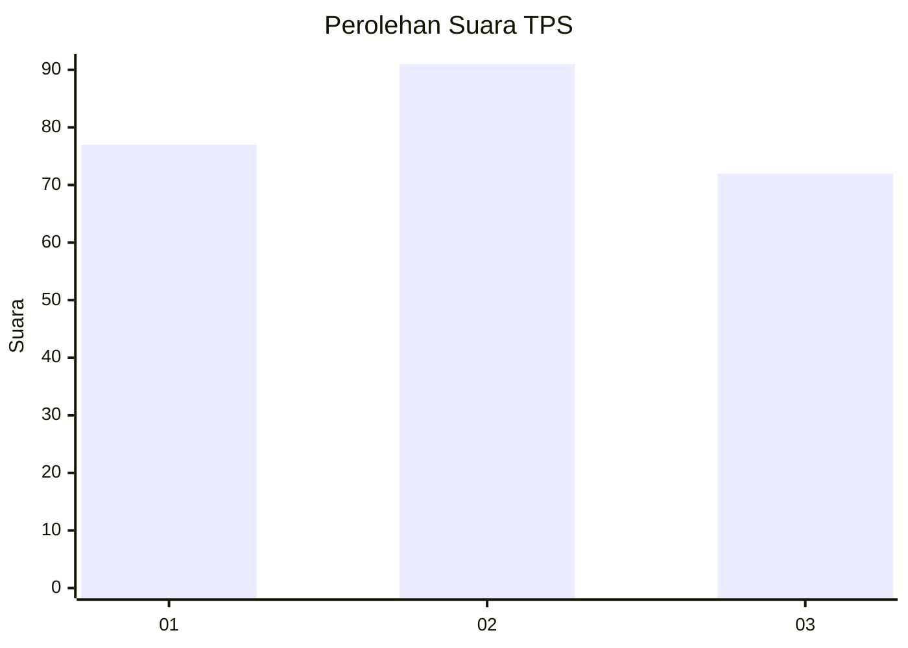
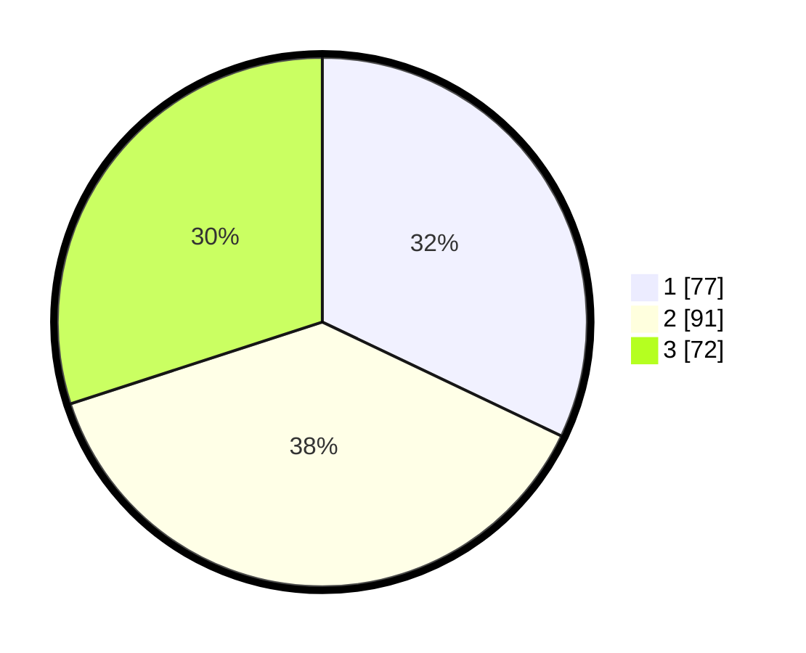

# Hasil

## Grafik

## Tabel

| No. | Nama Paslon    | Suara | Suara (raw) | Persentase |
|:--- |:-------------- | -----:| -----------:| ----------:|
| 1   | ANIES MUHAIMIN | 77    | [77][p-1]   | 32,08      |
| 2   | PRABOWO GIBRAN | 91    | [91][p-2]   | 37,92      |
| 3   | GANJAR MAHFUD  | 72    | [72][p-3]   | 30,00      |

[p-1]: https://github.com/gigit-pemilu/pemilu-2024-35-jawa-timur/blob/main/pilpres/hitung-suara/sub/35-jawa-timur/sub/78-kota-surabaya/sub/03-rungkut/sub/1002-rungkut-kidul/sub/029-tps/sub/paslon-1.txt
[p-2]: https://github.com/gigit-pemilu/pemilu-2024-35-jawa-timur/blob/main/pilpres/hitung-suara/sub/35-jawa-timur/sub/78-kota-surabaya/sub/03-rungkut/sub/1002-rungkut-kidul/sub/029-tps/sub/paslon-2.txt
[p-3]: https://github.com/gigit-pemilu/pemilu-2024-35-jawa-timur/blob/main/pilpres/hitung-suara/sub/35-jawa-timur/sub/78-kota-surabaya/sub/03-rungkut/sub/1002-rungkut-kidul/sub/029-tps/sub/paslon-3.txt

## Foto C Plano

https://sirekap-obj-formc.kpu.go.id/71ca/pemilu/ppwp/35/78/03/10/02/3578031002029-20240214-220031--4ef7bbf1-5c89-4866-916c-87c046820008.jpg

https://sirekap-obj-formc.kpu.go.id/71ca/pemilu/ppwp/35/78/03/10/02/3578031002029-20240214-220303--61fbfe95-e9f5-444a-b397-2d6779ac4e7b.jpg

https://sirekap-obj-formc.kpu.go.id/71ca/pemilu/ppwp/35/78/03/10/02/3578031002029-20240214-220430--3d957804-53c2-48a4-9a29-d78dbd750747.jpg

## Metadata

| Key        | Value               |
| ---------- | ------------------- |
| Time Stamp | 2024-02-16 12:51:22 |

