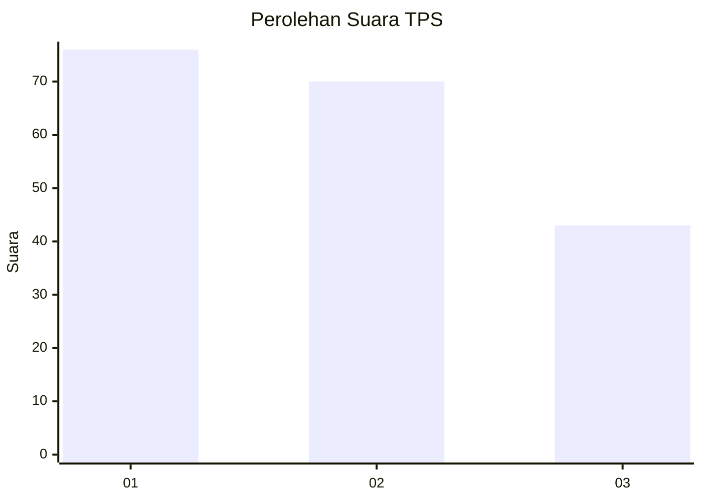
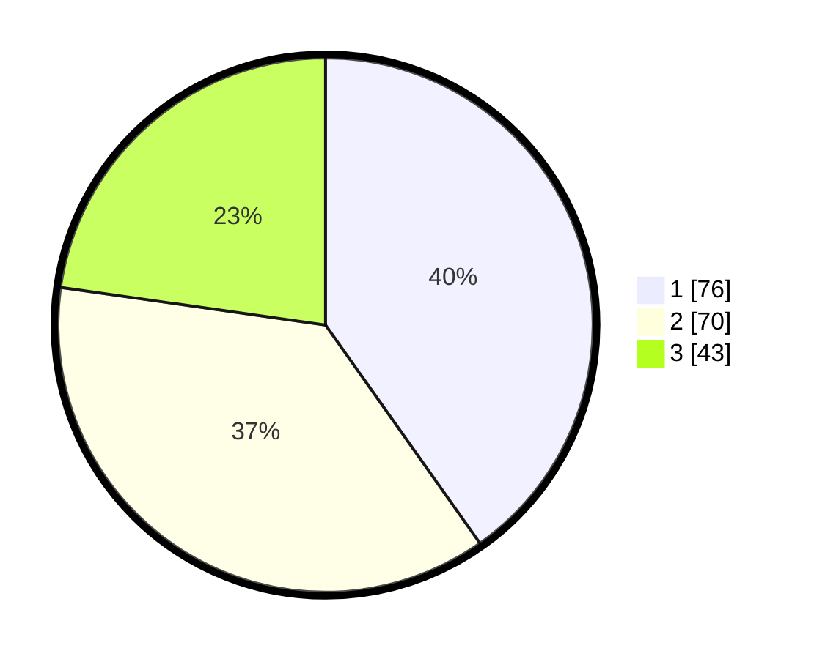

# Hasil

## Grafik

## Tabel

| No. | Nama Paslon    | Suara | Suara (raw) | Persentase |
|:--- |:-------------- | -----:| -----------:| ----------:|
| 1   | ANIES MUHAIMIN | 76    | [76][p-1]   | 40,21      |
| 2   | PRABOWO GIBRAN | 70    | [70][p-2]   | 37,04      |
| 3   | GANJAR MAHFUD  | 43    | [43][p-3]   | 22,75      |

[p-1]: https://github.com/gigit-pemilu/pemilu-2024-35-jawa-timur/blob/main/pilpres/hitung-suara/sub/35-jawa-timur/sub/78-kota-surabaya/sub/03-rungkut/sub/1002-rungkut-kidul/sub/030-tps/sub/paslon-1.txt
[p-2]: https://github.com/gigit-pemilu/pemilu-2024-35-jawa-timur/blob/main/pilpres/hitung-suara/sub/35-jawa-timur/sub/78-kota-surabaya/sub/03-rungkut/sub/1002-rungkut-kidul/sub/030-tps/sub/paslon-2.txt
[p-3]: https://github.com/gigit-pemilu/pemilu-2024-35-jawa-timur/blob/main/pilpres/hitung-suara/sub/35-jawa-timur/sub/78-kota-surabaya/sub/03-rungkut/sub/1002-rungkut-kidul/sub/030-tps/sub/paslon-3.txt

## Foto C Plano

https://sirekap-obj-formc.kpu.go.id/2d10/pemilu/ppwp/35/78/03/10/02/3578031002030-20240216-114300--f7c88ff9-4e4f-4b19-b717-f9370e2849a9.jpg

https://sirekap-obj-formc.kpu.go.id/2d10/pemilu/ppwp/35/78/03/10/02/3578031002030-20240214-155119--f80f6234-8d6e-40f4-9aa9-03e80e5deb00.jpg

https://sirekap-obj-formc.kpu.go.id/2d10/pemilu/ppwp/35/78/03/10/02/3578031002030-20240214-155721--0a9aa717-183f-4f31-b5ec-02ad3baf3543.jpg

## Metadata

| Key        | Value               |
| ---------- | ------------------- |
| Time Stamp | 2024-02-16 12:51:22 |

