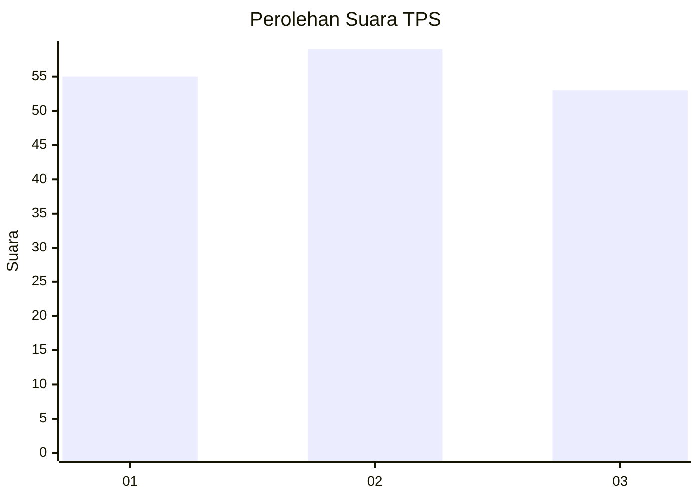
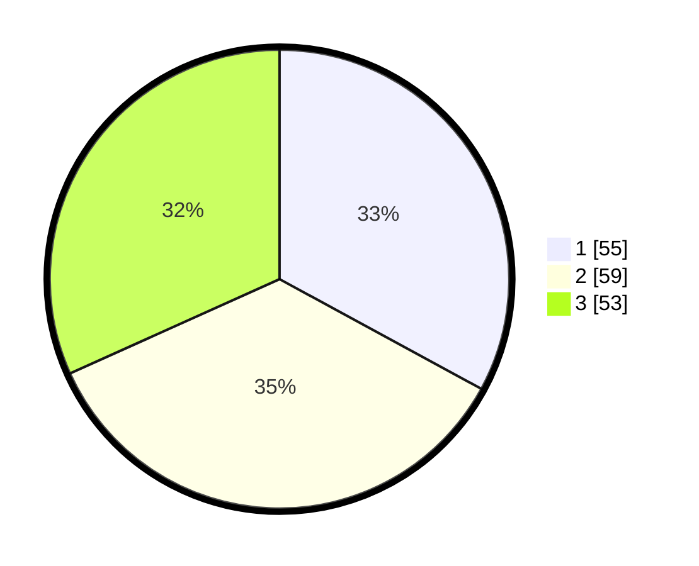

# Hasil

## Grafik

## Tabel

| No. | Nama Paslon    | Suara | Suara (raw) | Persentase |
|:--- |:-------------- | -----:| -----------:| ----------:|
| 1   | ANIES MUHAIMIN | 55    | [55][p-1]   | 32,93      |
| 2   | PRABOWO GIBRAN | 59    | [59][p-2]   | 35,33      |
| 3   | GANJAR MAHFUD  | 53    | [53][p-3]   | 31,74      |

[p-1]: https://github.com/gigit-pemilu/pemilu-2024/blob/main/pilpres/hitung-suara/sub/35-jawa-timur/sub/78-kota-surabaya/sub/03-rungkut/sub/1002-rungkut-kidul/sub/031-tps/sub/paslon-1.txt
[p-2]: https://github.com/gigit-pemilu/pemilu-2024/blob/main/pilpres/hitung-suara/sub/35-jawa-timur/sub/78-kota-surabaya/sub/03-rungkut/sub/1002-rungkut-kidul/sub/031-tps/sub/paslon-2.txt
[p-3]: https://github.com/gigit-pemilu/pemilu-2024/blob/main/pilpres/hitung-suara/sub/35-jawa-timur/sub/78-kota-surabaya/sub/03-rungkut/sub/1002-rungkut-kidul/sub/031-tps/sub/paslon-3.txt

## Foto C Plano

https://sirekap-obj-formc.kpu.go.id/507c/pemilu/ppwp/35/78/03/10/02/3578031002031-20240215-034654--e4ebefee-f9fb-4858-9b6b-1449e3cf5fa7.jpg

https://sirekap-obj-formc.kpu.go.id/507c/pemilu/ppwp/35/78/03/10/02/3578031002031-20240215-034751--a65505f8-473a-4e95-afa4-1d55eae6a655.jpg

https://sirekap-obj-formc.kpu.go.id/507c/pemilu/ppwp/35/78/03/10/02/3578031002031-20240215-034453--f583b2f4-9c54-49be-af16-4558aa6b7084.jpg

## Metadata

| Key        | Value               |
| ---------- | ------------------- |
| Time Stamp | 2024-02-16 12:51:22 |

