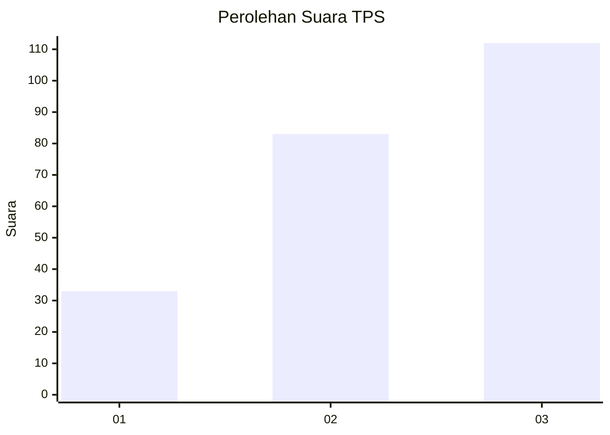
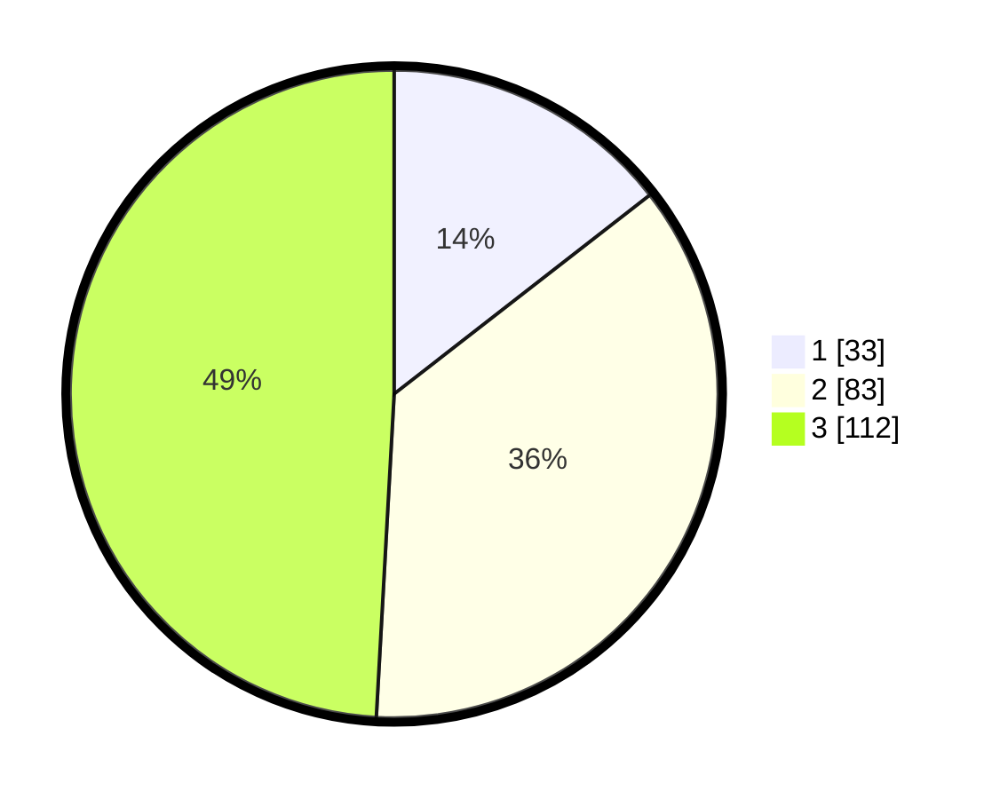

# Hasil

## Grafik

## Tabel

| No. | Nama Paslon    | Suara | Suara (raw) | Persentase |
|:--- |:-------------- | -----:| -----------:| ----------:|
| 1   | ANIES MUHAIMIN | 33    | [33][p-1]   | 14,47      |
| 2   | PRABOWO GIBRAN | 83    | [83][p-2]   | 36,40      |
| 3   | GANJAR MAHFUD  | 112   | [112][p-3]  | 49,12      |

[p-1]: https://github.com/gigit-pemilu/pemilu-2024/blob/main/pilpres/hitung-suara/sub/35-jawa-timur/sub/78-kota-surabaya/sub/03-rungkut/sub/1002-rungkut-kidul/sub/035-tps/sub/paslon-1.txt
[p-2]: https://github.com/gigit-pemilu/pemilu-2024/blob/main/pilpres/hitung-suara/sub/35-jawa-timur/sub/78-kota-surabaya/sub/03-rungkut/sub/1002-rungkut-kidul/sub/035-tps/sub/paslon-2.txt
[p-3]: https://github.com/gigit-pemilu/pemilu-2024/blob/main/pilpres/hitung-suara/sub/35-jawa-timur/sub/78-kota-surabaya/sub/03-rungkut/sub/1002-rungkut-kidul/sub/035-tps/sub/paslon-3.txt

## Foto C Plano

https://sirekap-obj-formc.kpu.go.id/bfc2/pemilu/ppwp/35/78/03/10/02/3578031002035-20240225-193724--6b957ea6-a574-4b9c-8c71-066a9b200c5b.jpg

https://sirekap-obj-formc.kpu.go.id/bfc2/pemilu/ppwp/35/78/03/10/02/3578031002035-20240225-193748--0c2b6c4a-666a-4362-a846-187f0b2b8cbd.jpg

https://sirekap-obj-formc.kpu.go.id/bfc2/pemilu/ppwp/35/78/03/10/02/3578031002035-20240225-193844--ae7e5cd3-54d4-462f-a69e-d70ffae7690a.jpg

## Metadata

| Key        | Value               |
| ---------- | ------------------- |
| Time Stamp | 2024-02-26 12:00:00 |

## DATA PEMILIH TETAP

Jumlah pemilih dalam DPT: **777**.
 * L: **7**.
 * P: **7**.

## DATA PENGGUNA HAK PILIH

Jumlah pengguna hak pilih dalam DPT: **5**.
 * L: **0**.
 * P: **0**.

Jumlah pengguna hak pilih dalam DPTb: **555**.
 * L: **355**.
 * P: **505**.

Jumlah pengguna hak pilih dalam DPK: **777**.
 * L: **0**.
 * P: **775**.

Jumlah pengguna hak pilih: **777**.
 * L: **55**.
 * P: **777**.

## JUMLAH SUARA SAH DAN TIDAK SAH

JUMLAH SELURUH SUARA SAH: **228**.

JUMLAH SUARA TIDAK SAH: **2**.

JUMLAH SELURUH SUARA SAH DAN SUARA TIDAK SAH: **230**.

