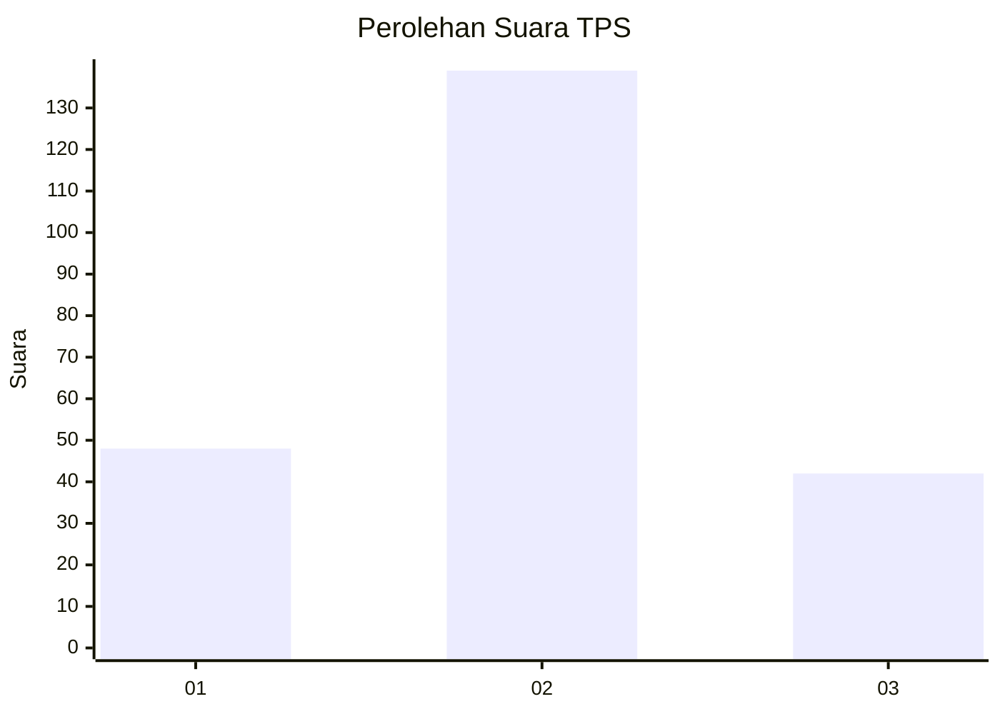
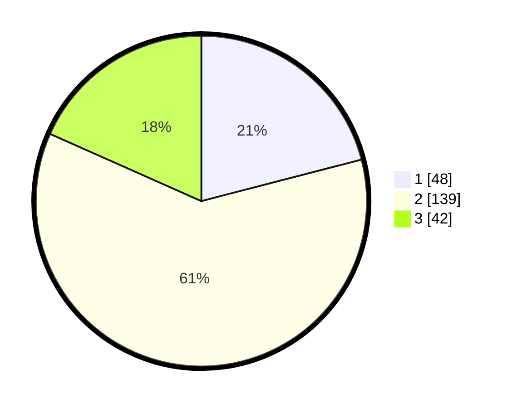

# Hasil

## Grafik

## Tabel

| No. | Nama Paslon    | Suara | Suara (raw) | Persentase |
|:--- |:-------------- | -----:| -----------:| ----------:|
| 1   | ANIES MUHAIMIN | 48    | [48][p-1]   | 20,96      |
| 2   | PRABOWO GIBRAN | 139   | [139][p-2]  | 60,70      |
| 3   | GANJAR MAHFUD  | 42    | [42][p-3]   | 18,34      |

[p-1]: https://github.com/gigit-pemilu/pemilu-2024/blob/main/pilpres/hitung-suara/sub/35-jawa-timur/sub/78-kota-surabaya/sub/03-rungkut/sub/1003-kedung-baruk/sub/001-tps/sub/paslon-1.txt
[p-2]: https://github.com/gigit-pemilu/pemilu-2024/blob/main/pilpres/hitung-suara/sub/35-jawa-timur/sub/78-kota-surabaya/sub/03-rungkut/sub/1003-kedung-baruk/sub/001-tps/sub/paslon-2.txt
[p-3]: https://github.com/gigit-pemilu/pemilu-2024/blob/main/pilpres/hitung-suara/sub/35-jawa-timur/sub/78-kota-surabaya/sub/03-rungkut/sub/1003-kedung-baruk/sub/001-tps/sub/paslon-3.txt

## Foto C Plano

https://sirekap-obj-formc.kpu.go.id/e926/pemilu/ppwp/35/78/03/10/03/3578031003001-20240227-121946--98d80bb5-daa4-448f-b72d-72b3b7f661b5.jpg

https://sirekap-obj-formc.kpu.go.id/e926/pemilu/ppwp/35/78/03/10/03/3578031003001-20240227-122027--1e3c229f-d66a-4cc4-8e23-b4a8cd2d5d69.jpg

https://sirekap-obj-formc.kpu.go.id/e926/pemilu/ppwp/35/78/03/10/03/3578031003001-20240227-122111--fc1c51e1-f5ad-4c02-a17d-37d1ab944534.jpg

## Metadata

| Key        | Value               |
| ---------- | ------------------- |
| Time Stamp | 2024-02-27 22:00:00 |

## DATA PEMILIH TETAP

Jumlah pemilih dalam DPT: **577**.
 * L: **53**.
 * P: **775**.

## DATA PENGGUNA HAK PILIH

Jumlah pengguna hak pilih dalam DPT: **555**.
 * L: **555**.
 * P: **555**.

Jumlah pengguna hak pilih dalam DPTb: **666**.
 * L: **226**.
 * P: **666**.

Jumlah pengguna hak pilih dalam DPK: **20**.
 * L: **2**.
 * P: **322**.

Jumlah pengguna hak pilih: **234**.
 * L: **109**.
 * P: **622**.

## JUMLAH SUARA SAH DAN TIDAK SAH

JUMLAH SELURUH SUARA SAH: **229**.

JUMLAH SUARA TIDAK SAH: **2**.

JUMLAH SELURUH SUARA SAH DAN SUARA TIDAK SAH: **231**.

