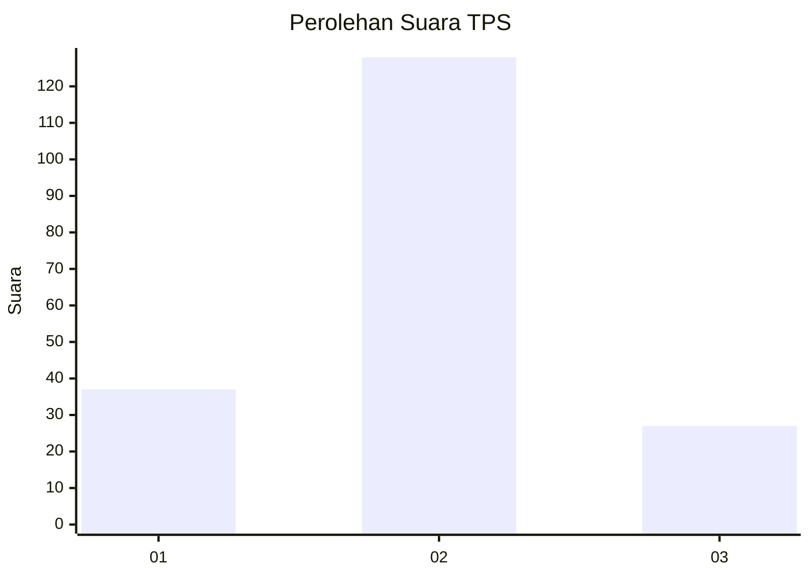
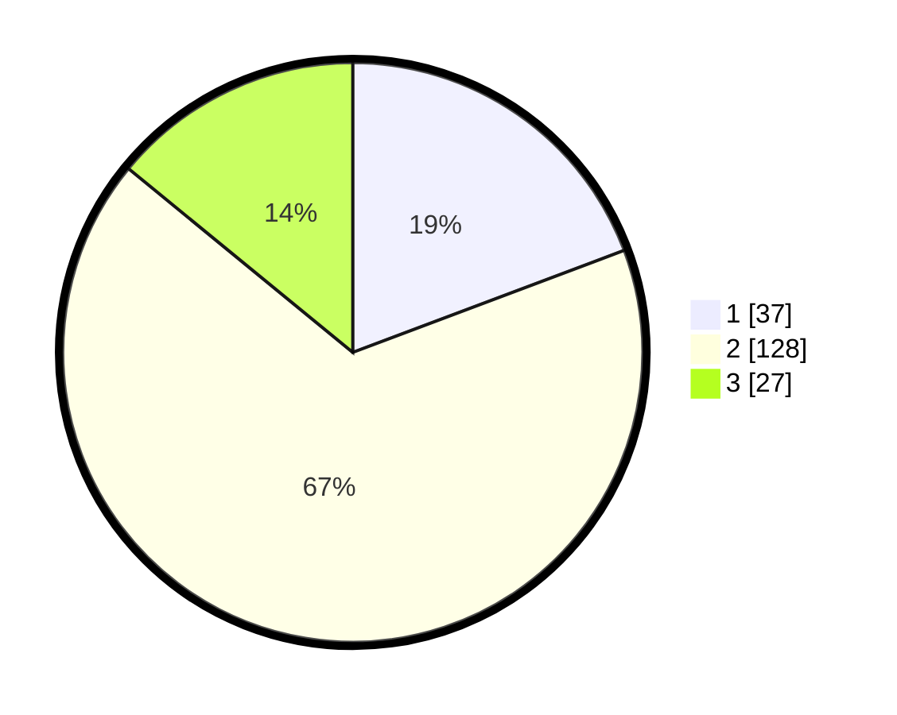

# Hasil

## Grafik

## Tabel

| No. | Nama Paslon    | Suara | Suara (raw) | Persentase |
|:--- |:-------------- | -----:| -----------:| ----------:|
| 1   | ANIES MUHAIMIN | 37    | [37][p-1]   | 19,27      |
| 2   | PRABOWO GIBRAN | 128   | [128][p-2]  | 66,67      |
| 3   | GANJAR MAHFUD  | 27    | [27][p-3]   | 14,06      |

[p-1]: https://github.com/gigit-pemilu/pemilu-2024/blob/main/pilpres/hitung-suara/sub/35-jawa-timur/sub/78-kota-surabaya/sub/03-rungkut/sub/1003-kedung-baruk/sub/010-tps/sub/paslon-1.txt
[p-2]: https://github.com/gigit-pemilu/pemilu-2024/blob/main/pilpres/hitung-suara/sub/35-jawa-timur/sub/78-kota-surabaya/sub/03-rungkut/sub/1003-kedung-baruk/sub/010-tps/sub/paslon-2.txt
[p-3]: https://github.com/gigit-pemilu/pemilu-2024/blob/main/pilpres/hitung-suara/sub/35-jawa-timur/sub/78-kota-surabaya/sub/03-rungkut/sub/1003-kedung-baruk/sub/010-tps/sub/paslon-3.txt

## Foto C Plano

https://sirekap-obj-formc.kpu.go.id/3731/pemilu/ppwp/35/78/03/10/03/3578031003010-20240227-122521--73d82088-79e4-446b-82ee-b47f64f625f3.jpg

https://sirekap-obj-formc.kpu.go.id/3731/pemilu/ppwp/35/78/03/10/03/3578031003010-20240227-122718--d21ee131-7278-4e31-ba7c-5cc699f6a9bb.jpg

https://sirekap-obj-formc.kpu.go.id/3731/pemilu/ppwp/35/78/03/10/03/3578031003010-20240227-122809--733e46c2-aa7f-4f80-826f-99a3b0667ac9.jpg

## Metadata

| Key        | Value               |
| ---------- | ------------------- |
| Time Stamp | 2024-02-27 13:00:00 |

## DATA PEMILIH TETAP

Jumlah pemilih dalam DPT: **239**.
 * L: **175**.
 * P: **124**.

## DATA PENGGUNA HAK PILIH

Jumlah pengguna hak pilih dalam DPT: **165**.
 * L: **896**.
 * P: **64**.

Jumlah pengguna hak pilih dalam DPTb: **666**.
 * L: **255**.
 * P: **566**.

Jumlah pengguna hak pilih dalam DPK: **221**.
 * L: **260**.
 * P: **21**.

Jumlah pengguna hak pilih: **198**.
 * L: **796**.
 * P: **103**.

## JUMLAH SUARA SAH DAN TIDAK SAH

JUMLAH SELURUH SUARA SAH: **792**.

JUMLAH SUARA TIDAK SAH: **5**.

JUMLAH SELURUH SUARA SAH DAN SUARA TIDAK SAH: **298**.

