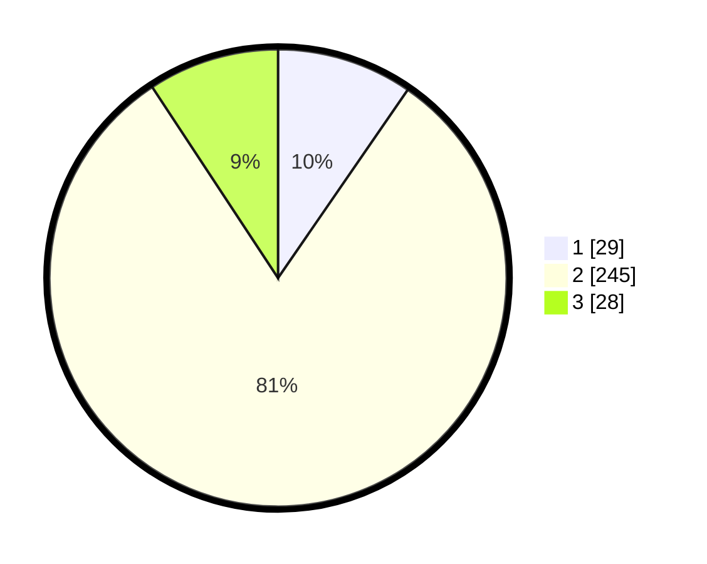

# Hasil

## Grafik

## Tabel

| No. | Nama Paslon    | Suara | Suara (raw) | Persentase |
|:--- |:-------------- | -----:| -----------:| ----------:|
| 1   | ANIES MUHAIMIN | 29    | [29][p-1]   | 9,60       |
| 2   | PRABOWO GIBRAN | 245   | [245][p-2]  | 81,13      |
| 3   | GANJAR MAHFUD  | 28    | [28][p-3]   | 9,27       |

[p-1]: https://github.com/gigit-pemilu/pemilu-2024/blob/main/pilpres/hitung-suara/sub/35-jawa-timur/sub/78-kota-surabaya/sub/03-rungkut/sub/1003-kedung-baruk/sub/019-tps/sub/paslon-1.txt
[p-2]: https://github.com/gigit-pemilu/pemilu-2024/blob/main/pilpres/hitung-suara/sub/35-jawa-timur/sub/78-kota-surabaya/sub/03-rungkut/sub/1003-kedung-baruk/sub/019-tps/sub/paslon-2.txt
[p-3]: https://github.com/gigit-pemilu/pemilu-2024/blob/main/pilpres/hitung-suara/sub/35-jawa-timur/sub/78-kota-surabaya/sub/03-rungkut/sub/1003-kedung-baruk/sub/019-tps/sub/paslon-3.txt

## Foto C Plano

https://sirekap-obj-formc.kpu.go.id/1a68/pemilu/ppwp/35/78/03/10/03/3578031003019-20240227-113542--7b4427a1-5b48-4d1a-b7b3-2b9024f28b93.jpg

https://sirekap-obj-formc.kpu.go.id/1a68/pemilu/ppwp/35/78/03/10/03/3578031003019-20240227-113619--bcb0f6eb-fa34-40cd-a57d-ad7412c312a8.jpg

https://sirekap-obj-formc.kpu.go.id/1a68/pemilu/ppwp/35/78/03/10/03/3578031003019-20240227-113656--541961b4-7e81-438f-82cc-1dc09031b893.jpg

## Metadata

| Key        | Value               |
| ---------- | ------------------- |
| Time Stamp | 2024-02-27 12:00:00 |

## DATA PEMILIH TETAP

Jumlah pemilih dalam DPT: **146**.
 * L: **118**.
 * P: **788**.

## DATA PENGGUNA HAK PILIH

Jumlah pengguna hak pilih dalam DPT: **535**.
 * L: **88**.
 * P: **469**.

Jumlah pengguna hak pilih dalam DPTb: **644**.
 * L: **248**.
 * P: **688**.

Jumlah pengguna hak pilih dalam DPK: **0**.
 * L: **0**.
 * P: **0**.

Jumlah pengguna hak pilih: **189**.
 * L: **88**.
 * P: **101**.

## JUMLAH SUARA SAH DAN TIDAK SAH

JUMLAH SELURUH SUARA SAH: **182**.

JUMLAH SUARA TIDAK SAH: **7**.

JUMLAH SELURUH SUARA SAH DAN SUARA TIDAK SAH: **189**.

