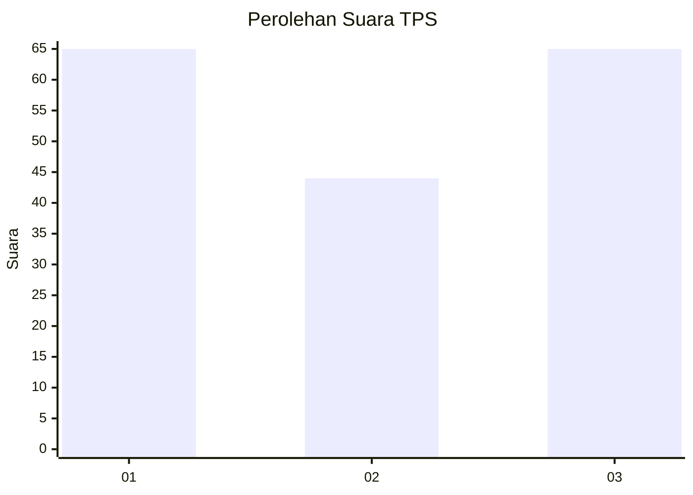
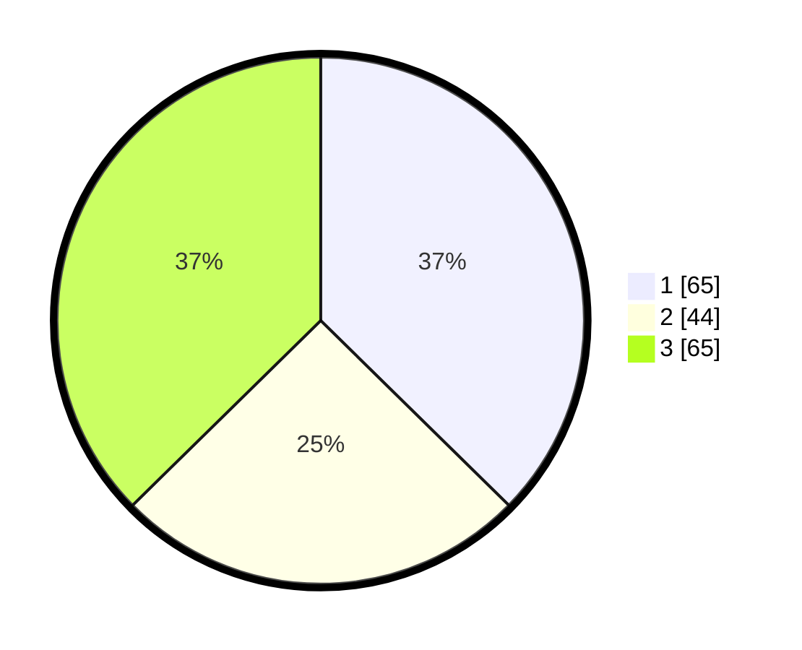

# Hasil

## Grafik

## Tabel

| No. | Nama Paslon    | Suara | Suara (raw) | Persentase |
|:--- |:-------------- | -----:| -----------:| ----------:|
| 1   | ANIES MUHAIMIN | 65    | [65][p-1]   | 37,36      |
| 2   | PRABOWO GIBRAN | 44    | [44][p-2]   | 25,29      |
| 3   | GANJAR MAHFUD  | 65    | [65][p-3]   | 37,36      |

[p-1]: https://github.com/gigit-pemilu/pemilu-2024-35-jawa-timur/blob/main/pilpres/hitung-suara/sub/35-jawa-timur/sub/78-kota-surabaya/sub/03-rungkut/sub/1003-kedung-baruk/sub/032-tps/sub/paslon-1.txt
[p-2]: https://github.com/gigit-pemilu/pemilu-2024-35-jawa-timur/blob/main/pilpres/hitung-suara/sub/35-jawa-timur/sub/78-kota-surabaya/sub/03-rungkut/sub/1003-kedung-baruk/sub/032-tps/sub/paslon-2.txt
[p-3]: https://github.com/gigit-pemilu/pemilu-2024-35-jawa-timur/blob/main/pilpres/hitung-suara/sub/35-jawa-timur/sub/78-kota-surabaya/sub/03-rungkut/sub/1003-kedung-baruk/sub/032-tps/sub/paslon-3.txt

## Foto C Plano

https://sirekap-obj-formc.kpu.go.id/be93/pemilu/ppwp/35/78/03/10/03/3578031003032-20240227-115038--23d6edc0-7810-42d2-bb36-a268b8f1f84b.jpg

https://sirekap-obj-formc.kpu.go.id/be93/pemilu/ppwp/35/78/03/10/03/3578031003032-20240227-115203--1f2db942-98e5-4d74-a2f5-a530be1e04c8.jpg

https://sirekap-obj-formc.kpu.go.id/be93/pemilu/ppwp/35/78/03/10/03/3578031003032-20240227-115243--eec29330-6510-4e65-8d4a-3371dfc76b3e.jpg

## Metadata

| Key        | Value               |
| ---------- | ------------------- |
| Time Stamp | 2024-02-27 12:00:00 |

## DATA PEMILIH TETAP

Jumlah pemilih dalam DPT: **295**.
 * L: **138**.
 * P: **157**.

## DATA PENGGUNA HAK PILIH

Jumlah pengguna hak pilih dalam DPT: **45**.
 * L: **203**.
 * P: **20**.

Jumlah pengguna hak pilih dalam DPTb: **200**.
 * L: **6**.
 * P: **62**.

Jumlah pengguna hak pilih dalam DPK: **2**.
 * L: **1**.
 * P: **1**.

Jumlah pengguna hak pilih: **225**.
 * L: **104**.
 * P: **121**.

## JUMLAH SUARA SAH DAN TIDAK SAH

JUMLAH SELURUH SUARA SAH: **223**.

JUMLAH SUARA TIDAK SAH: **2**.

JUMLAH SELURUH SUARA SAH DAN SUARA TIDAK SAH: **225**.

