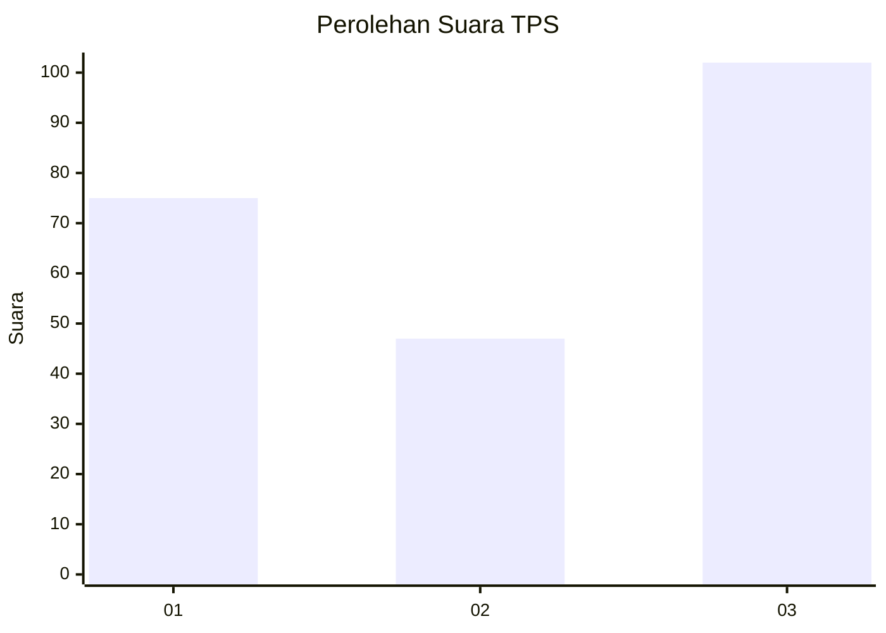
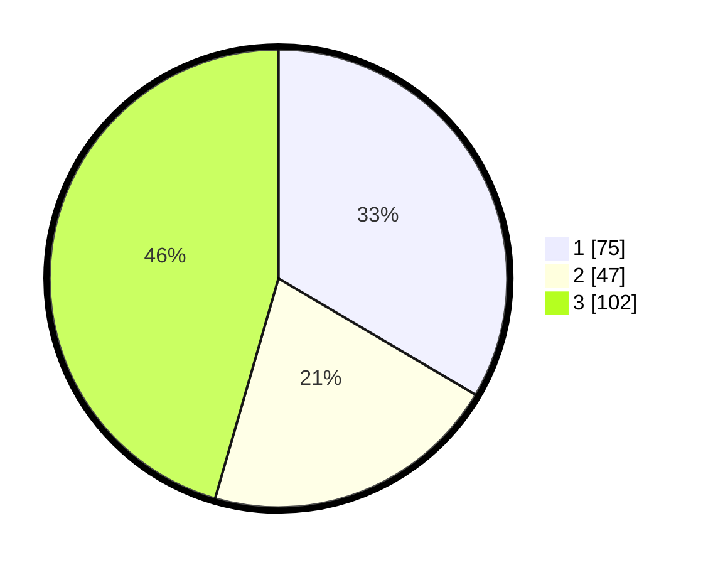

# Hasil

## Grafik

## Tabel

| No. | Nama Paslon    | Suara | Suara (raw) | Persentase |
|:--- |:-------------- | -----:| -----------:| ----------:|
| 1   | ANIES MUHAIMIN | 75    | [75][p-1]   | 33,48      |
| 2   | PRABOWO GIBRAN | 47    | [47][p-2]   | 20,98      |
| 3   | GANJAR MAHFUD  | 102   | [102][p-3]  | 45,54      |

[p-1]: https://github.com/gigit-pemilu/pemilu-2024-35-jawa-timur/blob/main/pilpres/hitung-suara/sub/35-jawa-timur/sub/78-kota-surabaya/sub/03-rungkut/sub/1003-kedung-baruk/sub/037-tps/sub/paslon-1.txt
[p-2]: https://github.com/gigit-pemilu/pemilu-2024-35-jawa-timur/blob/main/pilpres/hitung-suara/sub/35-jawa-timur/sub/78-kota-surabaya/sub/03-rungkut/sub/1003-kedung-baruk/sub/037-tps/sub/paslon-2.txt
[p-3]: https://github.com/gigit-pemilu/pemilu-2024-35-jawa-timur/blob/main/pilpres/hitung-suara/sub/35-jawa-timur/sub/78-kota-surabaya/sub/03-rungkut/sub/1003-kedung-baruk/sub/037-tps/sub/paslon-3.txt

## Foto C Plano

https://sirekap-obj-formc.kpu.go.id/a16a/pemilu/ppwp/35/78/03/10/03/3578031003037-20240227-120322--814b3766-c1fe-4bac-99c9-0ffe0689f0dc.jpg

https://sirekap-obj-formc.kpu.go.id/a16a/pemilu/ppwp/35/78/03/10/03/3578031003037-20240227-120443--6b5b7dbf-f48a-42ec-aafa-01dbd5257293.jpg

https://sirekap-obj-formc.kpu.go.id/a16a/pemilu/ppwp/35/78/03/10/03/3578031003037-20240227-120521--934d9f97-25f2-4bbb-98e2-351f11b0c683.jpg

## Metadata

| Key        | Value               |
| ---------- | ------------------- |
| Time Stamp | 2024-02-27 13:00:00 |

## DATA PEMILIH TETAP

Jumlah pemilih dalam DPT: **557**.
 * L: **174**.
 * P: **577**.

## DATA PENGGUNA HAK PILIH

Jumlah pengguna hak pilih dalam DPT: **575**.
 * L: **133**.
 * P: **775**.

Jumlah pengguna hak pilih dalam DPTb: **666**.
 * L: **222**.
 * P: **605**.

Jumlah pengguna hak pilih dalam DPK: **202**.
 * L: **0**.
 * P: **0**.

Jumlah pengguna hak pilih: **225**.
 * L: **105**.
 * P: **114**.

## JUMLAH SUARA SAH DAN TIDAK SAH

JUMLAH SELURUH SUARA SAH: **0**.

JUMLAH SUARA TIDAK SAH: **5**.

JUMLAH SELURUH SUARA SAH DAN SUARA TIDAK SAH: **225**.

