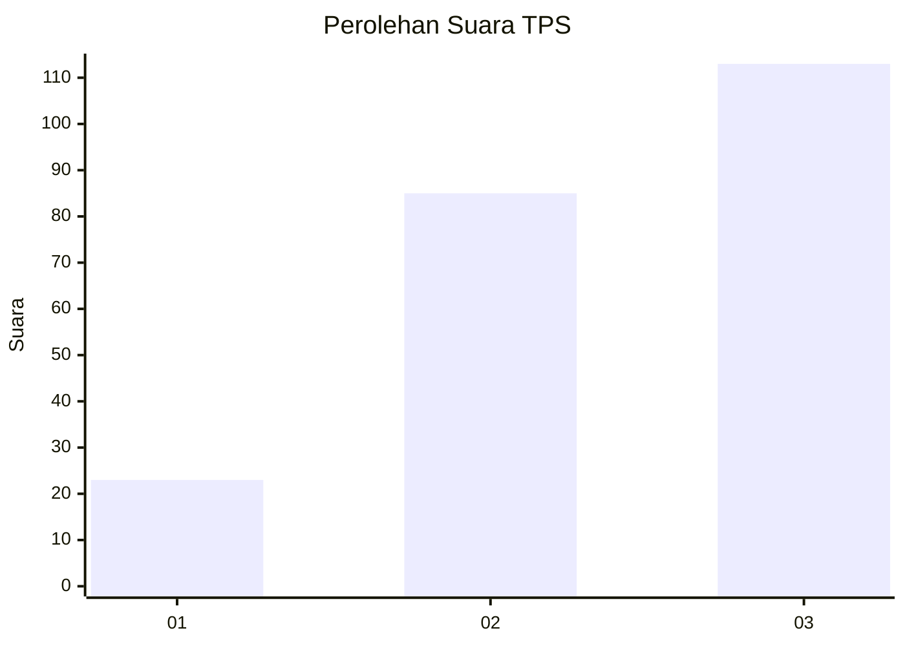
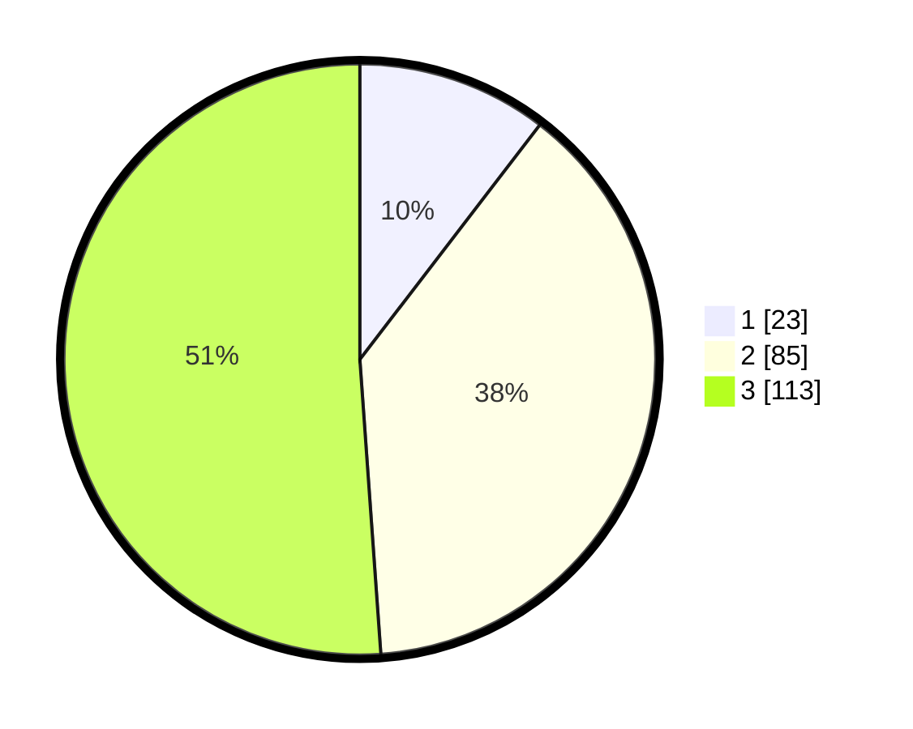

# Hasil

## Grafik

## Tabel

| No. | Nama Paslon    | Suara | Suara (raw) | Persentase |
|:--- |:-------------- | -----:| -----------:| ----------:|
| 1   | ANIES MUHAIMIN | 23    | [23][p-1]   | 10,41      |
| 2   | PRABOWO GIBRAN | 85    | [85][p-2]   | 38,46      |
| 3   | GANJAR MAHFUD  | 113   | [113][p-3]  | 51,13      |

[p-1]: https://github.com/gigit-pemilu/pemilu-2024/blob/main/pilpres/hitung-suara/sub/35-jawa-timur/sub/78-kota-surabaya/sub/03-rungkut/sub/1003-kedung-baruk/sub/038-tps/sub/paslon-1.txt
[p-2]: https://github.com/gigit-pemilu/pemilu-2024/blob/main/pilpres/hitung-suara/sub/35-jawa-timur/sub/78-kota-surabaya/sub/03-rungkut/sub/1003-kedung-baruk/sub/038-tps/sub/paslon-2.txt
[p-3]: https://github.com/gigit-pemilu/pemilu-2024/blob/main/pilpres/hitung-suara/sub/35-jawa-timur/sub/78-kota-surabaya/sub/03-rungkut/sub/1003-kedung-baruk/sub/038-tps/sub/paslon-3.txt

## Foto C Plano

https://sirekap-obj-formc.kpu.go.id/932d/pemilu/ppwp/35/78/03/10/03/3578031003038-20240215-004943--7487da66-56fa-4019-a7fc-d89ccddfc5b4.jpg

https://sirekap-obj-formc.kpu.go.id/932d/pemilu/ppwp/35/78/03/10/03/3578031003038-20240215-005043--4b4cdbbf-5dc4-4ce8-ab04-16d78aac508d.jpg

https://sirekap-obj-formc.kpu.go.id/932d/pemilu/ppwp/35/78/03/10/03/3578031003038-20240215-005129--1c0bbd71-e60f-40ce-8d4e-f92c63bd5826.jpg

## Metadata

| Key        | Value               |
| ---------- | ------------------- |
| Time Stamp | 2024-02-16 12:51:22 |

