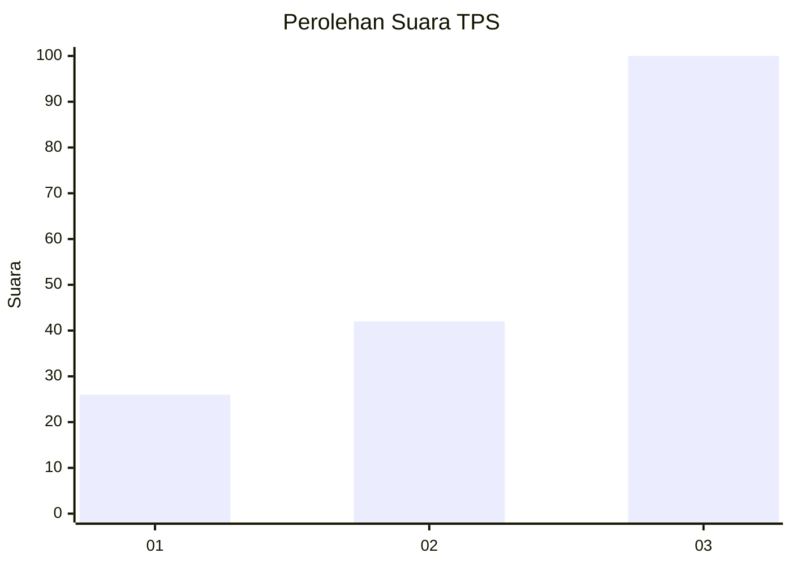
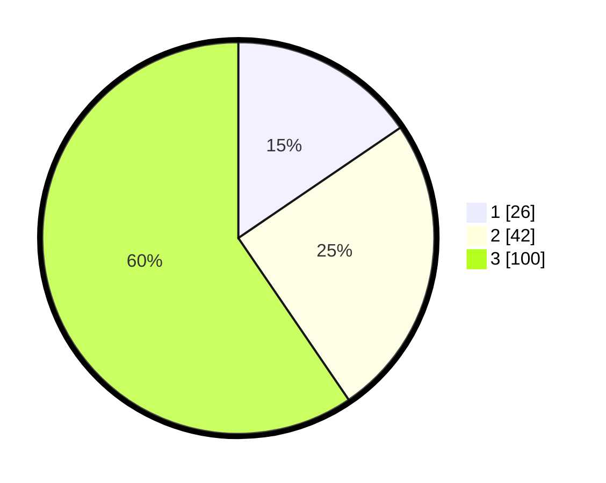

# Hasil

## Grafik

## Tabel

| No. | Nama Paslon    | Suara | Suara (raw) | Persentase |
|:--- |:-------------- | -----:| -----------:| ----------:|
| 1   | ANIES MUHAIMIN | 26    | [26][p-1]   | 15,48      |
| 2   | PRABOWO GIBRAN | 42    | [42][p-2]   | 25,00      |
| 3   | GANJAR MAHFUD  | 100   | [100][p-3]  | 59,52      |

[p-1]: https://github.com/gigit-pemilu/pemilu-2024/blob/main/pilpres/hitung-suara/sub/35-jawa-timur/sub/78-kota-surabaya/sub/03-rungkut/sub/1003-kedung-baruk/sub/043-tps/sub/paslon-1.txt
[p-2]: https://github.com/gigit-pemilu/pemilu-2024/blob/main/pilpres/hitung-suara/sub/35-jawa-timur/sub/78-kota-surabaya/sub/03-rungkut/sub/1003-kedung-baruk/sub/043-tps/sub/paslon-2.txt
[p-3]: https://github.com/gigit-pemilu/pemilu-2024/blob/main/pilpres/hitung-suara/sub/35-jawa-timur/sub/78-kota-surabaya/sub/03-rungkut/sub/1003-kedung-baruk/sub/043-tps/sub/paslon-3.txt

## Foto C Plano

https://sirekap-obj-formc.kpu.go.id/14cb/pemilu/ppwp/35/78/03/10/03/3578031003043-20240227-120958--2130ef75-76f5-4281-a17b-dd3713d4a2c6.jpg

https://sirekap-obj-formc.kpu.go.id/14cb/pemilu/ppwp/35/78/03/10/03/3578031003043-20240227-121111--2c22b32c-3c12-4ff7-9bc9-b286bde65008.jpg

https://sirekap-obj-formc.kpu.go.id/14cb/pemilu/ppwp/35/78/03/10/03/3578031003043-20240227-121246--c75c01f1-4cab-4a8e-9017-8119789a55ae.jpg

## Metadata

| Key        | Value               |
| ---------- | ------------------- |
| Time Stamp | 2024-02-27 13:00:00 |

## DATA PEMILIH TETAP

Jumlah pemilih dalam DPT: **290**.
 * L: **141**.
 * P: **149**.

## DATA PENGGUNA HAK PILIH

Jumlah pengguna hak pilih dalam DPT: **421**.
 * L: **6**.
 * P: **194**.

Jumlah pengguna hak pilih dalam DPTb: **192**.
 * L: **1**.
 * P: **647**.

Jumlah pengguna hak pilih dalam DPK: **649**.
 * L: **0**.
 * P: **662**.

Jumlah pengguna hak pilih: **224**.
 * L: **107**.
 * P: **116**.

## JUMLAH SUARA SAH DAN TIDAK SAH

JUMLAH SELURUH SUARA SAH: **218**.

JUMLAH SUARA TIDAK SAH: **5**.

JUMLAH SELURUH SUARA SAH DAN SUARA TIDAK SAH: **223**.

