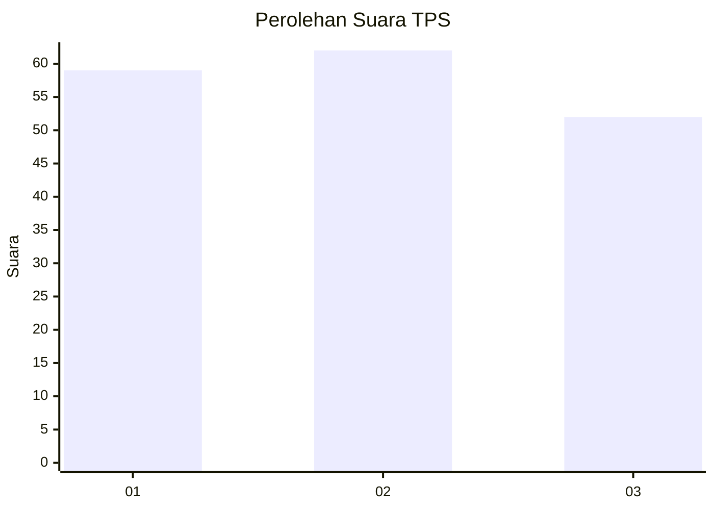
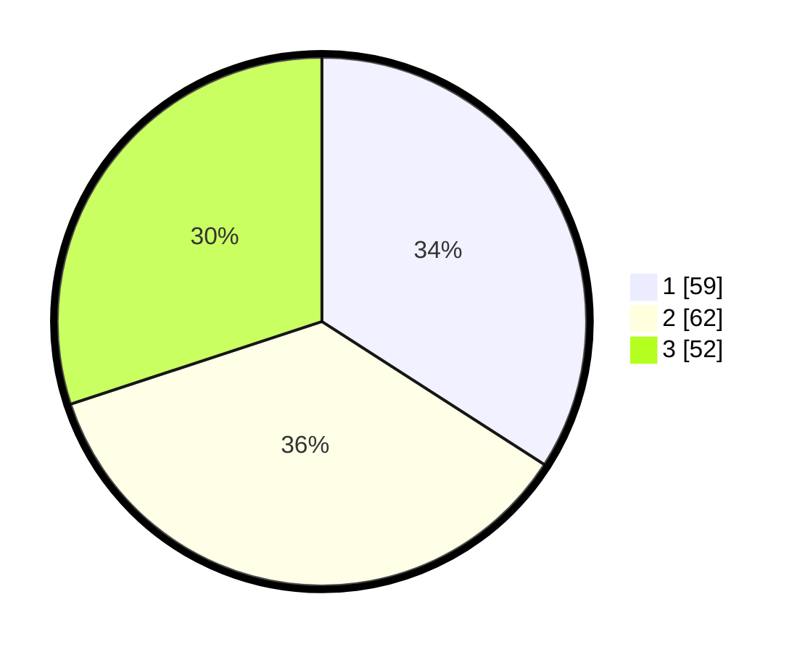

# Hasil

## Grafik

## Tabel

| No. | Nama Paslon    | Suara | Suara (raw) | Persentase |
|:--- |:-------------- | -----:| -----------:| ----------:|
| 1   | ANIES MUHAIMIN | 59    | [59][p-1]   | 34,10      |
| 2   | PRABOWO GIBRAN | 62    | [62][p-2]   | 35,84      |
| 3   | GANJAR MAHFUD  | 52    | [52][p-3]   | 30,06      |

[p-1]: https://github.com/gigit-pemilu/pemilu-2024/blob/main/pilpres/hitung-suara/sub/35-jawa-timur/sub/78-kota-surabaya/sub/03-rungkut/sub/1004-penjaringansari/sub/021-tps/sub/paslon-1.txt
[p-2]: https://github.com/gigit-pemilu/pemilu-2024/blob/main/pilpres/hitung-suara/sub/35-jawa-timur/sub/78-kota-surabaya/sub/03-rungkut/sub/1004-penjaringansari/sub/021-tps/sub/paslon-2.txt
[p-3]: https://github.com/gigit-pemilu/pemilu-2024/blob/main/pilpres/hitung-suara/sub/35-jawa-timur/sub/78-kota-surabaya/sub/03-rungkut/sub/1004-penjaringansari/sub/021-tps/sub/paslon-3.txt

## Foto C Plano

https://sirekap-obj-formc.kpu.go.id/c04c/pemilu/ppwp/35/78/03/10/04/3578031004021-20240214-223707--1bc0bd2c-7b46-4e08-a39a-59789415aea1.jpg

https://sirekap-obj-formc.kpu.go.id/c04c/pemilu/ppwp/35/78/03/10/04/3578031004021-20240214-223743--44cfdd8f-9289-4e4d-8e2c-15f26f740f92.jpg

https://sirekap-obj-formc.kpu.go.id/c04c/pemilu/ppwp/35/78/03/10/04/3578031004021-20240214-223827--a3ca31b5-03e0-4c48-83e1-7ec9603429e5.jpg

## Metadata

| Key        | Value               |
| ---------- | ------------------- |
| Time Stamp | 2024-02-16 12:51:22 |

