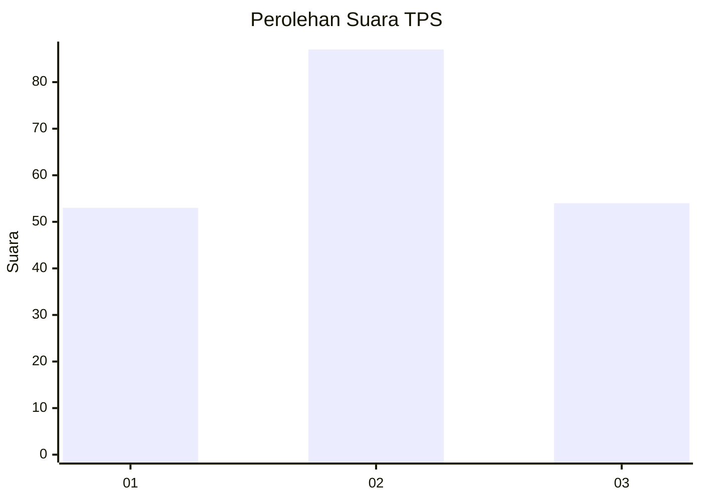
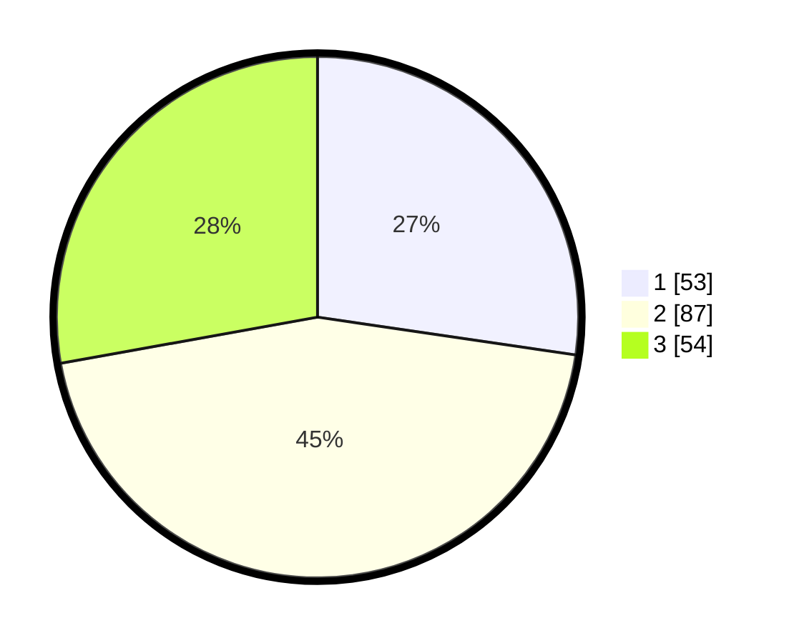

# Hasil

## Grafik

## Tabel

| No. | Nama Paslon    | Suara | Suara (raw) | Persentase |
|:--- |:-------------- | -----:| -----------:| ----------:|
| 1   | ANIES MUHAIMIN | 53    | [53][p-1]   | 27,32      |
| 2   | PRABOWO GIBRAN | 87    | [87][p-2]   | 44,85      |
| 3   | GANJAR MAHFUD  | 54    | [54][p-3]   | 27,84      |

[p-1]: https://github.com/gigit-pemilu/pemilu-2024/blob/main/pilpres/hitung-suara/sub/35-jawa-timur/sub/78-kota-surabaya/sub/03-rungkut/sub/1004-penjaringansari/sub/028-tps/sub/paslon-1.txt
[p-2]: https://github.com/gigit-pemilu/pemilu-2024/blob/main/pilpres/hitung-suara/sub/35-jawa-timur/sub/78-kota-surabaya/sub/03-rungkut/sub/1004-penjaringansari/sub/028-tps/sub/paslon-2.txt
[p-3]: https://github.com/gigit-pemilu/pemilu-2024/blob/main/pilpres/hitung-suara/sub/35-jawa-timur/sub/78-kota-surabaya/sub/03-rungkut/sub/1004-penjaringansari/sub/028-tps/sub/paslon-3.txt

## Foto C Plano

https://sirekap-obj-formc.kpu.go.id/9331/pemilu/ppwp/35/78/03/10/04/3578031004028-20240226-223204--6ac07f6b-eca1-4329-9563-0a8703b452be.jpg

https://sirekap-obj-formc.kpu.go.id/9331/pemilu/ppwp/35/78/03/10/04/3578031004028-20240226-223255--b85c6a9a-5506-4668-8ff8-06a9117a59b1.jpg

https://sirekap-obj-formc.kpu.go.id/9331/pemilu/ppwp/35/78/03/10/04/3578031004028-20240226-223426--cfa675dd-34f8-4f21-ae31-7203fef12718.jpg

## Metadata

| Key        | Value               |
| ---------- | ------------------- |
| Time Stamp | 2024-02-26 23:00:00 |

## DATA PEMILIH TETAP

Jumlah pemilih dalam DPT: **268**.
 * L: **99**.
 * P: **739**.

## DATA PENGGUNA HAK PILIH

Jumlah pengguna hak pilih dalam DPT: **202**.
 * L: **74**.
 * P: **708**.

Jumlah pengguna hak pilih dalam DPTb: **775**.
 * L: **552**.
 * P: **777**.

Jumlah pengguna hak pilih dalam DPK: **2**.
 * L: **2**.
 * P: **7**.

Jumlah pengguna hak pilih: **270**.
 * L: **98**.
 * P: **712**.

## JUMLAH SUARA SAH DAN TIDAK SAH

JUMLAH SELURUH SUARA SAH: **44**.

JUMLAH SUARA TIDAK SAH: **1**.

JUMLAH SELURUH SUARA SAH DAN SUARA TIDAK SAH: **10**.

