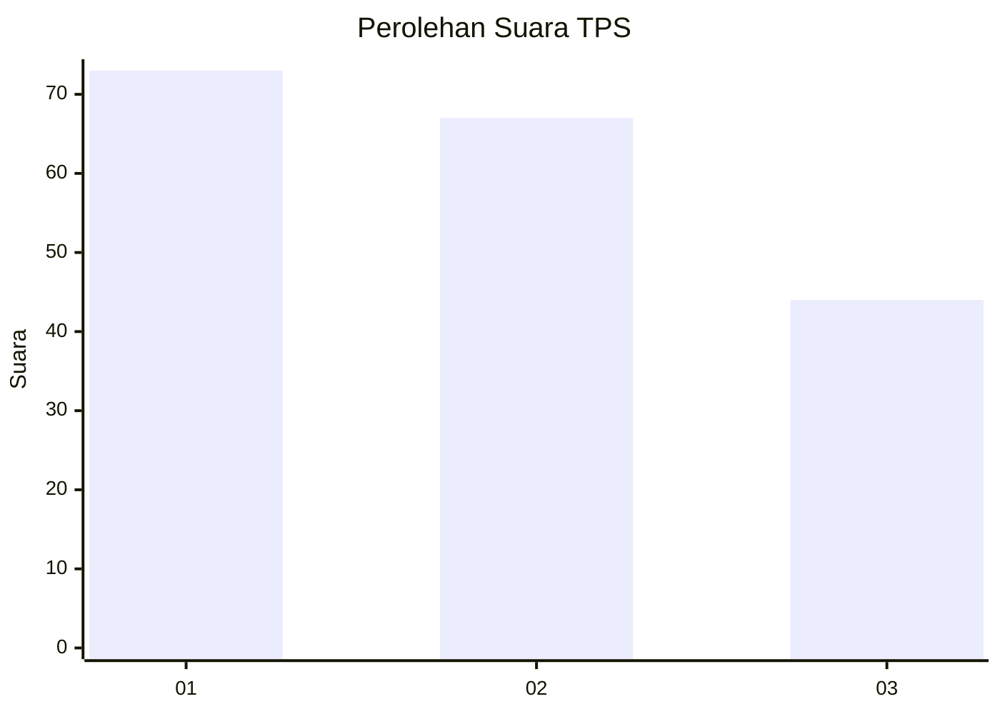
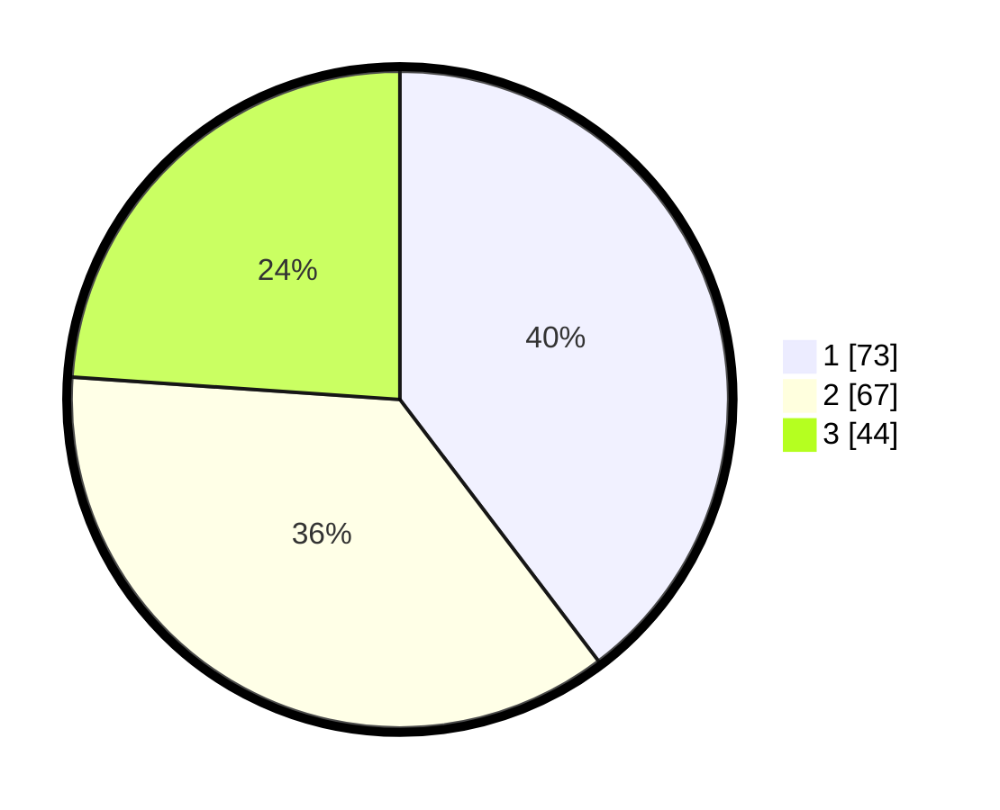

# Hasil

## Grafik

## Tabel

| No. | Nama Paslon    | Suara | Suara (raw) | Persentase |
|:--- |:-------------- | -----:| -----------:| ----------:|
| 1   | ANIES MUHAIMIN | 73    | [73][p-1]   | 39,67      |
| 2   | PRABOWO GIBRAN | 67    | [67][p-2]   | 36,41      |
| 3   | GANJAR MAHFUD  | 44    | [44][p-3]   | 23,91      |

[p-1]: https://github.com/gigit-pemilu/pemilu-2024/blob/main/pilpres/hitung-suara/sub/35-jawa-timur/sub/78-kota-surabaya/sub/03-rungkut/sub/1004-penjaringansari/sub/040-tps/sub/paslon-1.txt
[p-2]: https://github.com/gigit-pemilu/pemilu-2024/blob/main/pilpres/hitung-suara/sub/35-jawa-timur/sub/78-kota-surabaya/sub/03-rungkut/sub/1004-penjaringansari/sub/040-tps/sub/paslon-2.txt
[p-3]: https://github.com/gigit-pemilu/pemilu-2024/blob/main/pilpres/hitung-suara/sub/35-jawa-timur/sub/78-kota-surabaya/sub/03-rungkut/sub/1004-penjaringansari/sub/040-tps/sub/paslon-3.txt

## Foto C Plano

https://sirekap-obj-formc.kpu.go.id/364b/pemilu/ppwp/35/78/03/10/04/3578031004040-20240215-003104--9c1da419-c64b-4077-8769-28ba3beface7.jpg

https://sirekap-obj-formc.kpu.go.id/364b/pemilu/ppwp/35/78/03/10/04/3578031004040-20240215-003236--47ffccea-e0cf-45ef-93a6-162765cc4011.jpg

https://sirekap-obj-formc.kpu.go.id/364b/pemilu/ppwp/35/78/03/10/04/3578031004040-20240215-003407--0b42f4e2-3724-4023-bae6-a27d7123364a.jpg

## Metadata

| Key        | Value               |
| ---------- | ------------------- |
| Time Stamp | 2024-02-24 22:31:28 |

