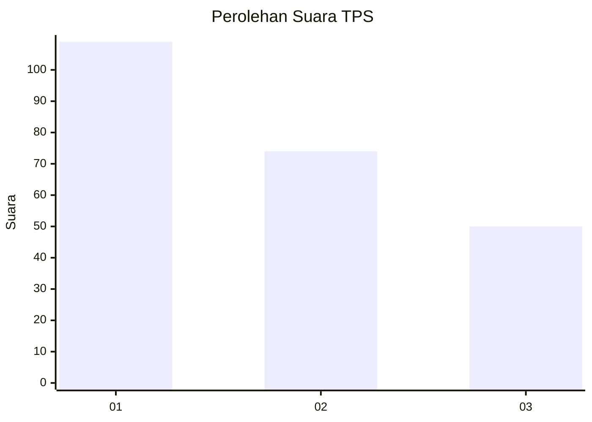
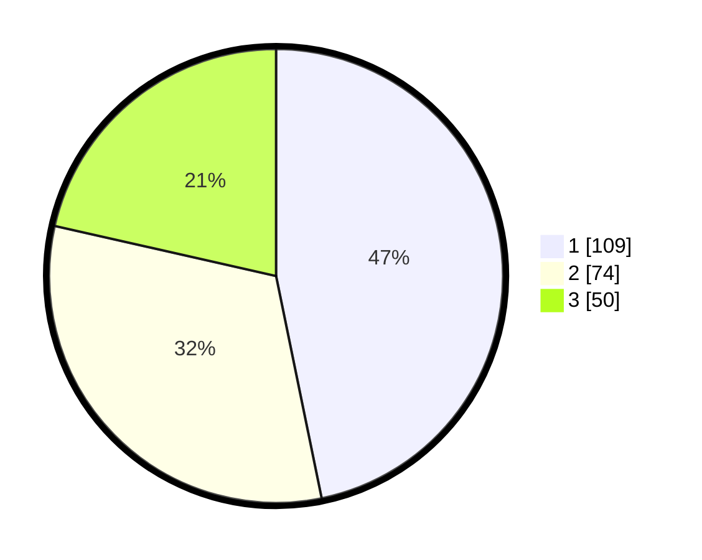

# Hasil

## Grafik

## Tabel

| No. | Nama Paslon    | Suara | Suara (raw) | Persentase |
|:--- |:-------------- | -----:| -----------:| ----------:|
| 1   | ANIES MUHAIMIN | 109   | [109][p-1]  | 46,78      |
| 2   | PRABOWO GIBRAN | 74    | [74][p-2]   | 31,76      |
| 3   | GANJAR MAHFUD  | 50    | [50][p-3]   | 21,46      |

[p-1]: https://github.com/gigit-pemilu/pemilu-2024-35-jawa-timur/blob/main/pilpres/hitung-suara/sub/35-jawa-timur/sub/78-kota-surabaya/sub/03-rungkut/sub/1004-penjaringansari/sub/046-tps/sub/paslon-1.txt
[p-2]: https://github.com/gigit-pemilu/pemilu-2024-35-jawa-timur/blob/main/pilpres/hitung-suara/sub/35-jawa-timur/sub/78-kota-surabaya/sub/03-rungkut/sub/1004-penjaringansari/sub/046-tps/sub/paslon-2.txt
[p-3]: https://github.com/gigit-pemilu/pemilu-2024-35-jawa-timur/blob/main/pilpres/hitung-suara/sub/35-jawa-timur/sub/78-kota-surabaya/sub/03-rungkut/sub/1004-penjaringansari/sub/046-tps/sub/paslon-3.txt

## Foto C Plano

https://sirekap-obj-formc.kpu.go.id/a502/pemilu/ppwp/35/78/03/10/04/3578031004046-20240215-070950--b77e338d-d744-40b8-8c67-a8a73c195347.jpg

https://sirekap-obj-formc.kpu.go.id/a502/pemilu/ppwp/35/78/03/10/04/3578031004046-20240215-074334--970cbdcb-b70d-4a20-bfb9-e09a684cab44.jpg

https://sirekap-obj-formc.kpu.go.id/a502/pemilu/ppwp/35/78/03/10/04/3578031004046-20240215-071004--c42b92ce-36a8-41d4-ab2a-a8e0e3d6194d.jpg

## Metadata

| Key        | Value               |
| ---------- | ------------------- |
| Time Stamp | 2024-02-25 18:00:00 |

