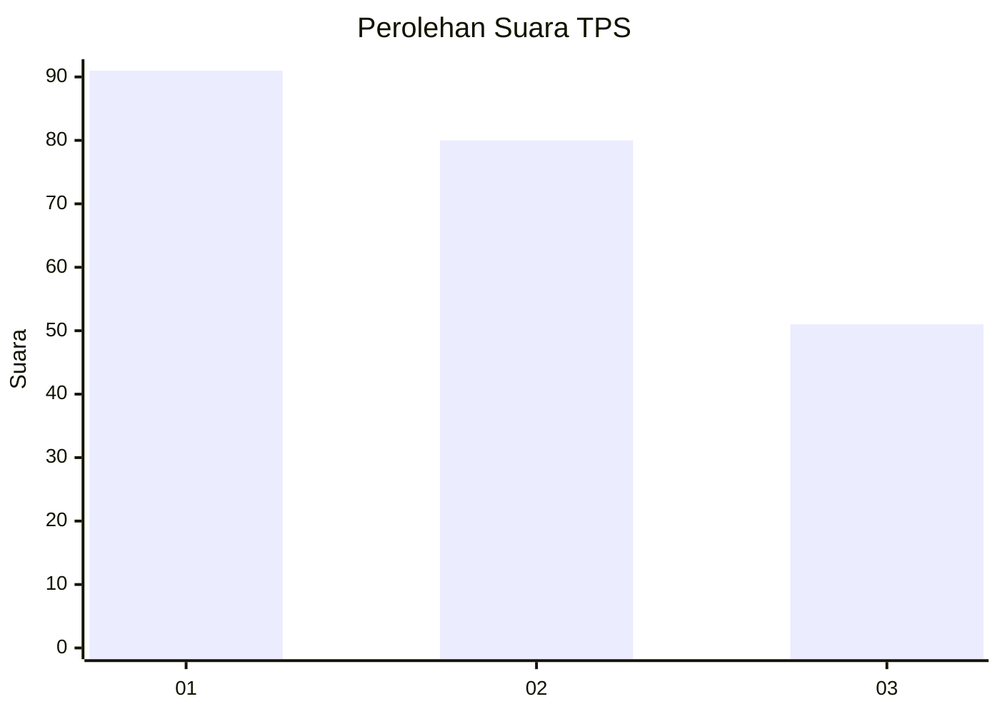
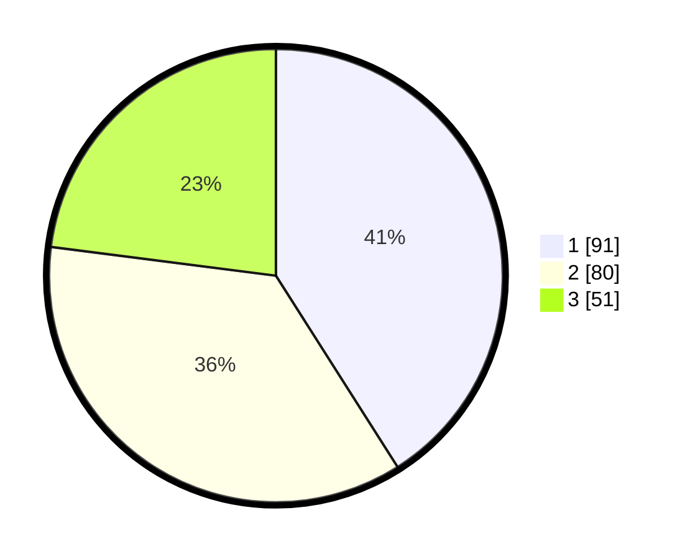

# Hasil

## Grafik

## Tabel

| No. | Nama Paslon    | Suara | Suara (raw) | Persentase |
|:--- |:-------------- | -----:| -----------:| ----------:|
| 1   | ANIES MUHAIMIN | 91    | [91][p-1]   | 40,99      |
| 2   | PRABOWO GIBRAN | 80    | [80][p-2]   | 36,04      |
| 3   | GANJAR MAHFUD  | 51    | [51][p-3]   | 22,97      |

[p-1]: https://github.com/gigit-pemilu/pemilu-2024-35-jawa-timur/blob/main/pilpres/hitung-suara/sub/35-jawa-timur/sub/78-kota-surabaya/sub/03-rungkut/sub/1005-wonorejo/sub/009-tps/sub/paslon-1.txt
[p-2]: https://github.com/gigit-pemilu/pemilu-2024-35-jawa-timur/blob/main/pilpres/hitung-suara/sub/35-jawa-timur/sub/78-kota-surabaya/sub/03-rungkut/sub/1005-wonorejo/sub/009-tps/sub/paslon-2.txt
[p-3]: https://github.com/gigit-pemilu/pemilu-2024-35-jawa-timur/blob/main/pilpres/hitung-suara/sub/35-jawa-timur/sub/78-kota-surabaya/sub/03-rungkut/sub/1005-wonorejo/sub/009-tps/sub/paslon-3.txt

## Foto C Plano

https://sirekap-obj-formc.kpu.go.id/19ef/pemilu/ppwp/35/78/03/10/05/3578031005009-20240214-215719--27933108-f5f6-4990-8008-78b785c57994.jpg

https://sirekap-obj-formc.kpu.go.id/19ef/pemilu/ppwp/35/78/03/10/05/3578031005009-20240214-215912--fdc43f10-a97e-4d1a-9a65-11dc2a8a15e3.jpg

https://sirekap-obj-formc.kpu.go.id/19ef/pemilu/ppwp/35/78/03/10/05/3578031005009-20240214-220107--a6269e9b-c81f-4e08-8410-4bebbfe282ec.jpg

## Metadata

| Key        | Value               |
| ---------- | ------------------- |
| Time Stamp | 2024-02-15 21:01:18 |

