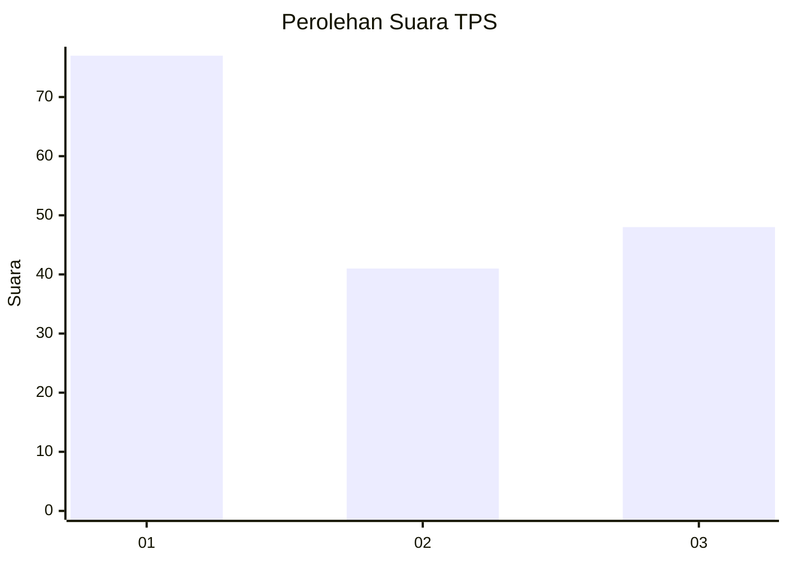
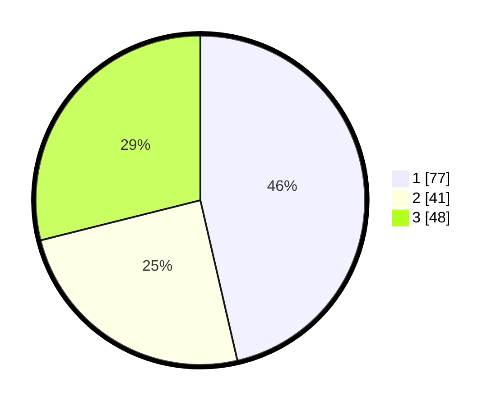

# Hasil

## Grafik

## Tabel

| No. | Nama Paslon    | Suara | Suara (raw) | Persentase |
|:--- |:-------------- | -----:| -----------:| ----------:|
| 1   | ANIES MUHAIMIN | 77    | [77][p-1]   | 46,39      |
| 2   | PRABOWO GIBRAN | 41    | [41][p-2]   | 24,70      |
| 3   | GANJAR MAHFUD  | 48    | [48][p-3]   | 28,92      |

[p-1]: https://github.com/gigit-pemilu/pemilu-2024-35-jawa-timur/blob/main/pilpres/hitung-suara/sub/35-jawa-timur/sub/78-kota-surabaya/sub/03-rungkut/sub/1005-wonorejo/sub/013-tps/sub/paslon-1.txt
[p-2]: https://github.com/gigit-pemilu/pemilu-2024-35-jawa-timur/blob/main/pilpres/hitung-suara/sub/35-jawa-timur/sub/78-kota-surabaya/sub/03-rungkut/sub/1005-wonorejo/sub/013-tps/sub/paslon-2.txt
[p-3]: https://github.com/gigit-pemilu/pemilu-2024-35-jawa-timur/blob/main/pilpres/hitung-suara/sub/35-jawa-timur/sub/78-kota-surabaya/sub/03-rungkut/sub/1005-wonorejo/sub/013-tps/sub/paslon-3.txt

## Foto C Plano

https://sirekap-obj-formc.kpu.go.id/05cc/pemilu/ppwp/35/78/03/10/05/3578031005013-20240215-053720--f2721a81-f418-495c-aef4-fd502da173e8.jpg

https://sirekap-obj-formc.kpu.go.id/05cc/pemilu/ppwp/35/78/03/10/05/3578031005013-20240215-051705--ad204009-8e56-4781-8272-8c58b0c06aa7.jpg

https://sirekap-obj-formc.kpu.go.id/05cc/pemilu/ppwp/35/78/03/10/05/3578031005013-20240215-064115--28989389-da35-48f6-bc97-d9631d30933c.jpg

## Metadata

| Key        | Value               |
| ---------- | ------------------- |
| Time Stamp | 2024-02-15 18:30:25 |

