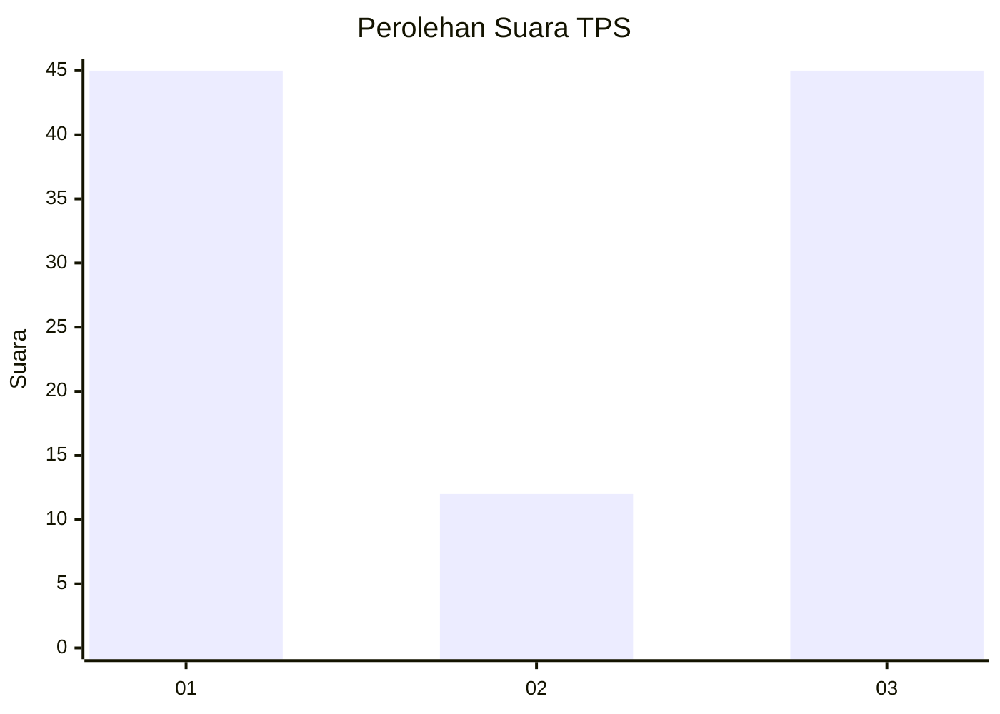
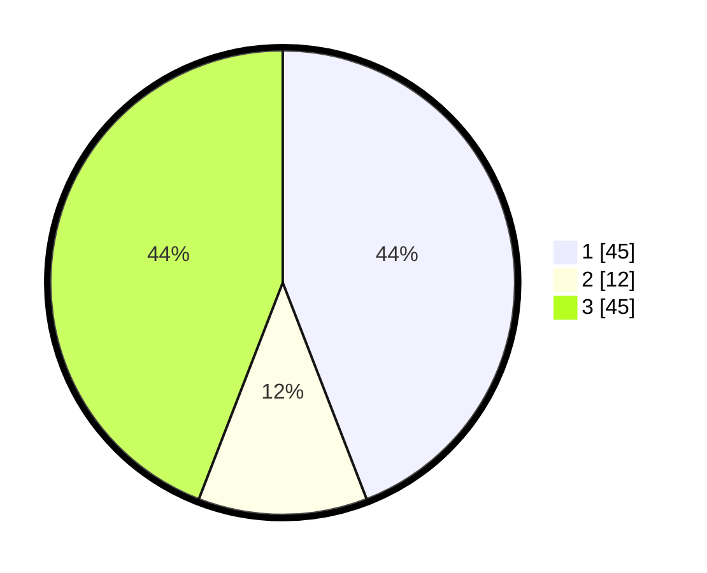

# Hasil

## Grafik

## Tabel

| No. | Nama Paslon    | Suara | Suara (raw) | Persentase |
|:--- |:-------------- | -----:| -----------:| ----------:|
| 1   | ANIES MUHAIMIN | 45    | [45][p-1]   | 44,12      |
| 2   | PRABOWO GIBRAN | 12    | [12][p-2]   | 11,76      |
| 3   | GANJAR MAHFUD  | 45    | [45][p-3]   | 44,12      |

[p-1]: https://github.com/gigit-pemilu/pemilu-2024/blob/main/pilpres/hitung-suara/sub/35-jawa-timur/sub/78-kota-surabaya/sub/03-rungkut/sub/1005-wonorejo/sub/015-tps/sub/paslon-1.txt
[p-2]: https://github.com/gigit-pemilu/pemilu-2024/blob/main/pilpres/hitung-suara/sub/35-jawa-timur/sub/78-kota-surabaya/sub/03-rungkut/sub/1005-wonorejo/sub/015-tps/sub/paslon-2.txt
[p-3]: https://github.com/gigit-pemilu/pemilu-2024/blob/main/pilpres/hitung-suara/sub/35-jawa-timur/sub/78-kota-surabaya/sub/03-rungkut/sub/1005-wonorejo/sub/015-tps/sub/paslon-3.txt

## Foto C Plano

https://sirekap-obj-formc.kpu.go.id/594f/pemilu/ppwp/35/78/03/10/05/3578031005015-20240214-220442--174ae48b-ed89-43c4-92ae-e909e31545c2.jpg

https://sirekap-obj-formc.kpu.go.id/594f/pemilu/ppwp/35/78/03/10/05/3578031005015-20240214-220544--ed95def7-379c-4020-9c3f-8fbdb0381d30.jpg

https://sirekap-obj-formc.kpu.go.id/594f/pemilu/ppwp/35/78/03/10/05/3578031005015-20240214-220556--0669b62a-fc23-4976-823e-357de5d54f72.jpg

## Metadata

| Key        | Value               |
| ---------- | ------------------- |
| Time Stamp | 2024-02-24 22:31:28 |

