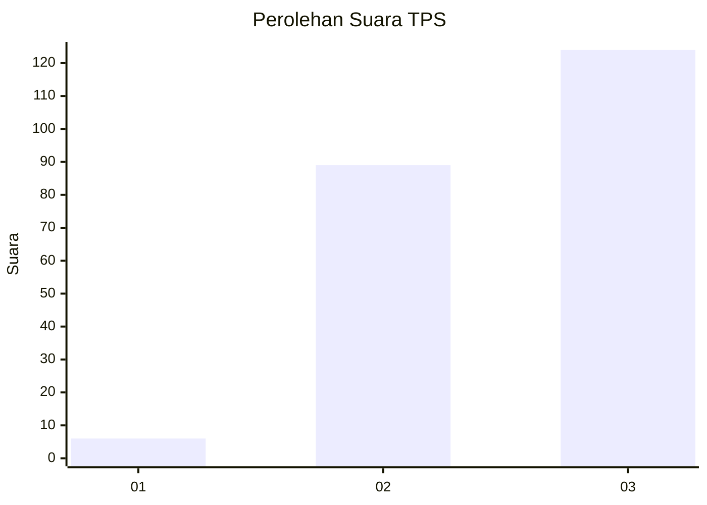
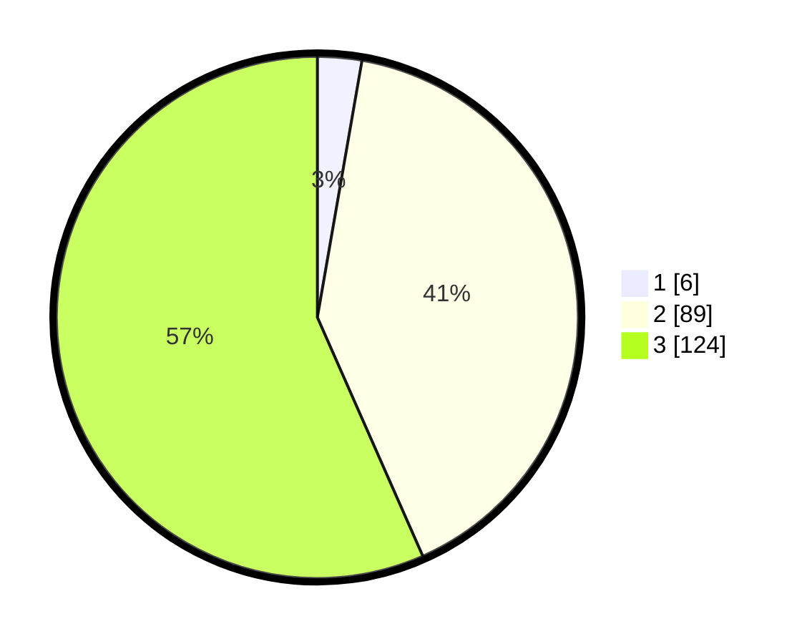

# Hasil

## Grafik

## Tabel

| No. | Nama Paslon    | Suara | Suara (raw) | Persentase |
|:--- |:-------------- | -----:| -----------:| ----------:|
| 1   | ANIES MUHAIMIN | 6     | [6][p-1]    | 2,74       |
| 2   | PRABOWO GIBRAN | 89    | [89][p-2]   | 40,64      |
| 3   | GANJAR MAHFUD  | 124   | [124][p-3]  | 56,62      |

[p-1]: https://github.com/gigit-pemilu/pemilu-2024-35-jawa-timur/blob/main/pilpres/hitung-suara/sub/35-jawa-timur/sub/78-kota-surabaya/sub/03-rungkut/sub/1005-wonorejo/sub/027-tps/sub/paslon-1.txt
[p-2]: https://github.com/gigit-pemilu/pemilu-2024-35-jawa-timur/blob/main/pilpres/hitung-suara/sub/35-jawa-timur/sub/78-kota-surabaya/sub/03-rungkut/sub/1005-wonorejo/sub/027-tps/sub/paslon-2.txt
[p-3]: https://github.com/gigit-pemilu/pemilu-2024-35-jawa-timur/blob/main/pilpres/hitung-suara/sub/35-jawa-timur/sub/78-kota-surabaya/sub/03-rungkut/sub/1005-wonorejo/sub/027-tps/sub/paslon-3.txt

## Foto C Plano

https://sirekap-obj-formc.kpu.go.id/549f/pemilu/ppwp/35/78/03/10/05/3578031005027-20240214-231340--065a3d05-21f2-4e60-bbb9-a59c7881c89d.jpg

https://sirekap-obj-formc.kpu.go.id/549f/pemilu/ppwp/35/78/03/10/05/3578031005027-20240214-231356--fb951009-0877-4d59-a87c-cdf2ce8d4d34.jpg

https://sirekap-obj-formc.kpu.go.id/549f/pemilu/ppwp/35/78/03/10/05/3578031005027-20240214-225401--2560fb28-a1d3-462a-a98d-c71c11171eb5.jpg

## Metadata

| Key        | Value               |
| ---------- | ------------------- |
| Time Stamp | 2024-02-16 13:30:32 |

