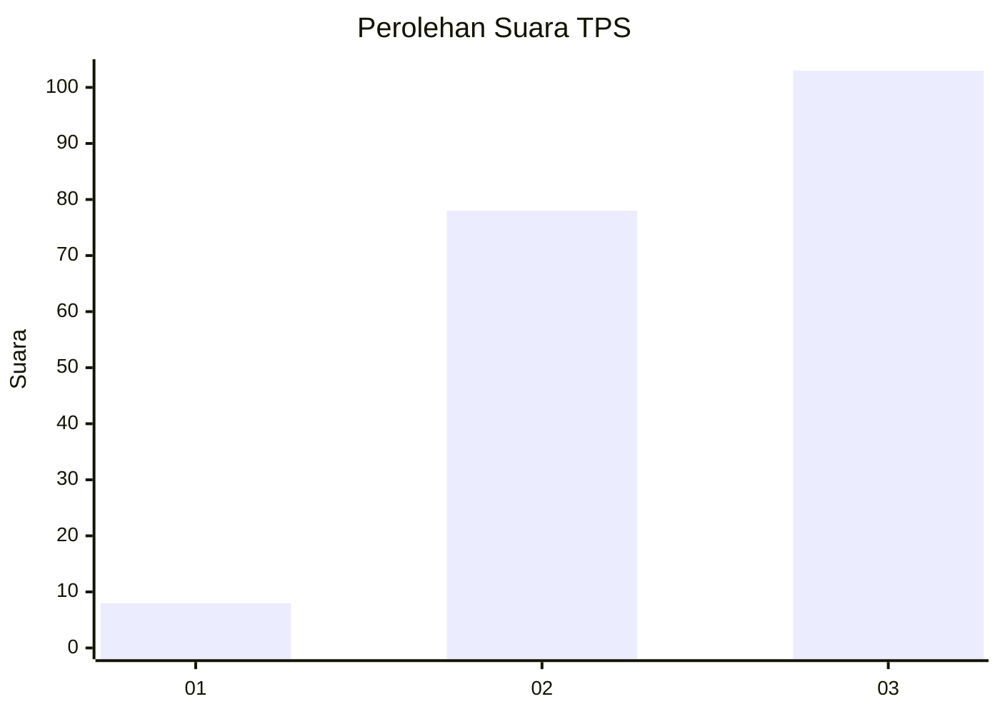
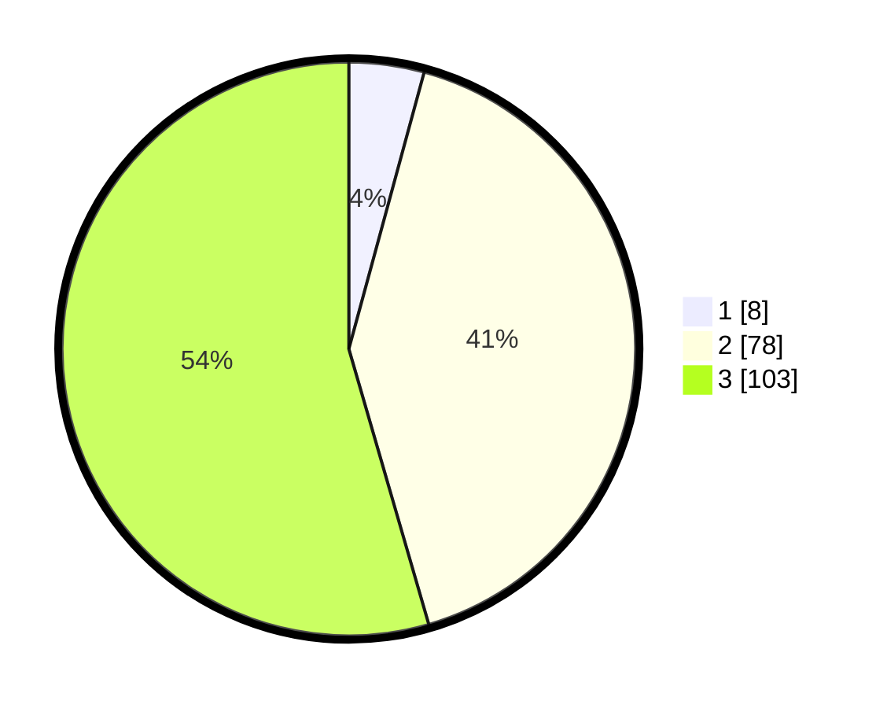

# Hasil

## Grafik

## Tabel

| No. | Nama Paslon    | Suara | Suara (raw) | Persentase |
|:--- |:-------------- | -----:| -----------:| ----------:|
| 1   | ANIES MUHAIMIN | 8     | [8][p-1]    | 4,23       |
| 2   | PRABOWO GIBRAN | 78    | [78][p-2]   | 41,27      |
| 3   | GANJAR MAHFUD  | 103   | [103][p-3]  | 54,50      |

[p-1]: https://github.com/gigit-pemilu/pemilu-2024/blob/main/pilpres/hitung-suara/sub/35-jawa-timur/sub/78-kota-surabaya/sub/03-rungkut/sub/1005-wonorejo/sub/028-tps/sub/paslon-1.txt
[p-2]: https://github.com/gigit-pemilu/pemilu-2024/blob/main/pilpres/hitung-suara/sub/35-jawa-timur/sub/78-kota-surabaya/sub/03-rungkut/sub/1005-wonorejo/sub/028-tps/sub/paslon-2.txt
[p-3]: https://github.com/gigit-pemilu/pemilu-2024/blob/main/pilpres/hitung-suara/sub/35-jawa-timur/sub/78-kota-surabaya/sub/03-rungkut/sub/1005-wonorejo/sub/028-tps/sub/paslon-3.txt

## Foto C Plano

https://sirekap-obj-formc.kpu.go.id/7115/pemilu/ppwp/35/78/03/10/05/3578031005028-20240214-204952--72c82098-2aba-4ff3-bcfe-1849cb874030.jpg

https://sirekap-obj-formc.kpu.go.id/7115/pemilu/ppwp/35/78/03/10/05/3578031005028-20240214-201848--7d3cf006-37ef-4860-8bb1-146e6314f461.jpg

https://sirekap-obj-formc.kpu.go.id/7115/pemilu/ppwp/35/78/03/10/05/3578031005028-20240214-201932--889e896d-6f52-4496-902c-3f53330d8144.jpg

## Metadata

| Key        | Value               |
| ---------- | ------------------- |
| Time Stamp | 2024-02-15 12:00:28 |

