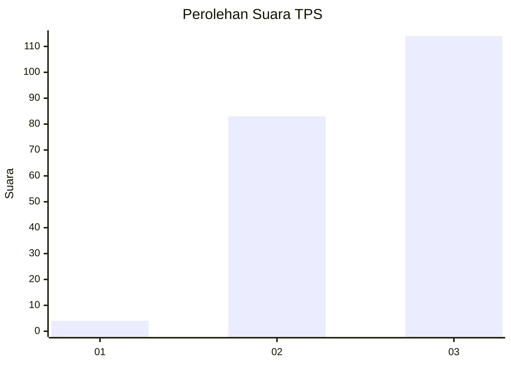
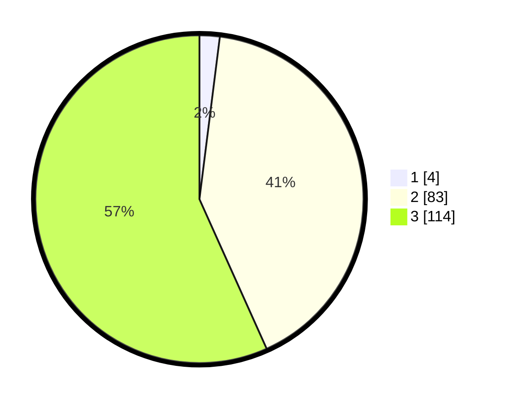

# Hasil

## Grafik

## Tabel

| No. | Nama Paslon    | Suara | Suara (raw) | Persentase |
|:--- |:-------------- | -----:| -----------:| ----------:|
| 1   | ANIES MUHAIMIN | 4     | [4][p-1]    | 1,99       |
| 2   | PRABOWO GIBRAN | 83    | [83][p-2]   | 41,29      |
| 3   | GANJAR MAHFUD  | 114   | [114][p-3]  | 56,72      |

[p-1]: https://github.com/gigit-pemilu/pemilu-2024/blob/main/pilpres/hitung-suara/sub/35-jawa-timur/sub/78-kota-surabaya/sub/03-rungkut/sub/1005-wonorejo/sub/031-tps/sub/paslon-1.txt
[p-2]: https://github.com/gigit-pemilu/pemilu-2024/blob/main/pilpres/hitung-suara/sub/35-jawa-timur/sub/78-kota-surabaya/sub/03-rungkut/sub/1005-wonorejo/sub/031-tps/sub/paslon-2.txt
[p-3]: https://github.com/gigit-pemilu/pemilu-2024/blob/main/pilpres/hitung-suara/sub/35-jawa-timur/sub/78-kota-surabaya/sub/03-rungkut/sub/1005-wonorejo/sub/031-tps/sub/paslon-3.txt

## Foto C Plano

https://sirekap-obj-formc.kpu.go.id/5648/pemilu/ppwp/35/78/03/10/05/3578031005031-20240214-204623--e8d76202-a07a-4986-b6dc-3b621f153d4c.jpg

https://sirekap-obj-formc.kpu.go.id/5648/pemilu/ppwp/35/78/03/10/05/3578031005031-20240214-192611--fea16d85-1f92-4413-8cb2-f8c0ca459d20.jpg

https://sirekap-obj-formc.kpu.go.id/5648/pemilu/ppwp/35/78/03/10/05/3578031005031-20240214-192627--6eb2701b-8bbc-49e0-9a78-58762a958313.jpg

## Metadata

| Key        | Value               |
| ---------- | ------------------- |
| Time Stamp | 2024-02-16 13:30:32 |

