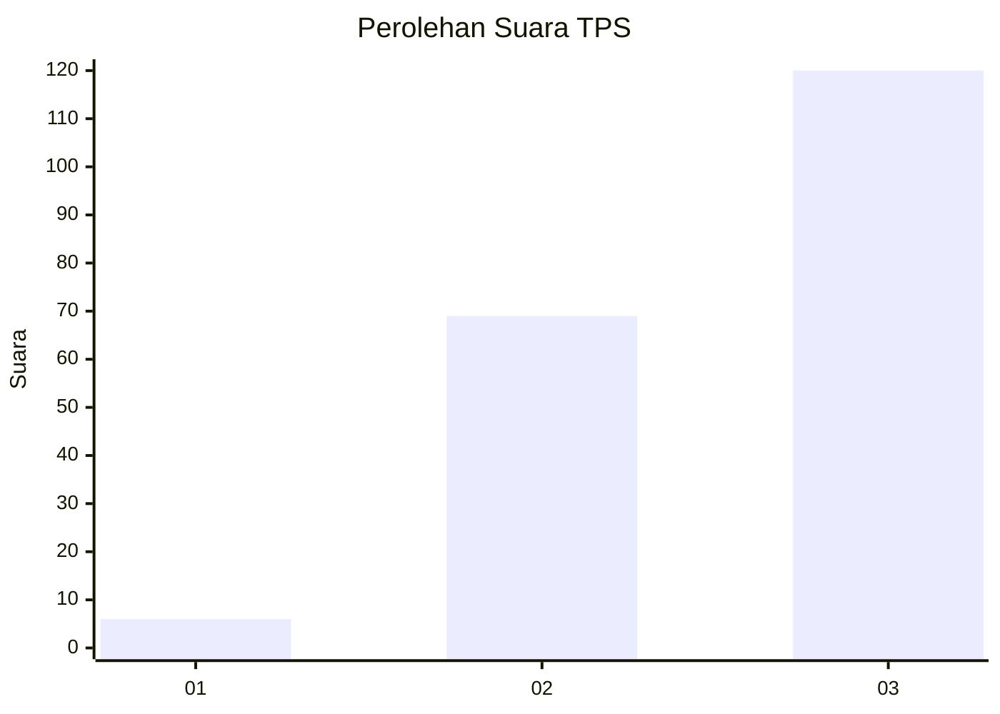
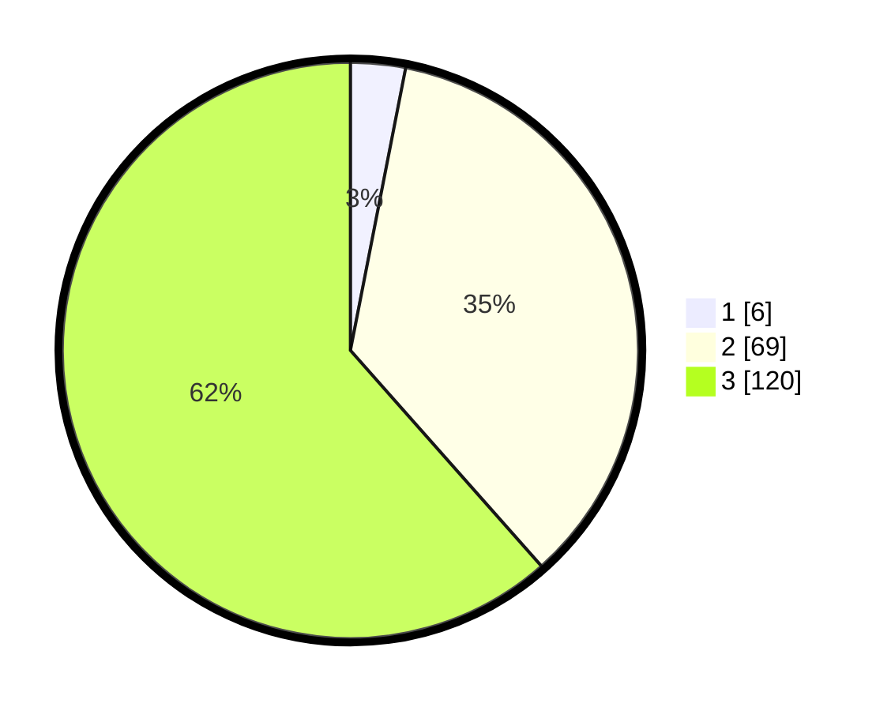

# Hasil

## Grafik

## Tabel

| No. | Nama Paslon    | Suara | Suara (raw) | Persentase |
|:--- |:-------------- | -----:| -----------:| ----------:|
| 1   | ANIES MUHAIMIN | 6     | [6][p-1]    | 3,08       |
| 2   | PRABOWO GIBRAN | 69    | [69][p-2]   | 35,38      |
| 3   | GANJAR MAHFUD  | 120   | [120][p-3]  | 61,54      |

[p-1]: https://github.com/gigit-pemilu/pemilu-2024-35-jawa-timur/blob/main/pilpres/hitung-suara/sub/35-jawa-timur/sub/78-kota-surabaya/sub/03-rungkut/sub/1005-wonorejo/sub/035-tps/sub/paslon-1.txt
[p-2]: https://github.com/gigit-pemilu/pemilu-2024-35-jawa-timur/blob/main/pilpres/hitung-suara/sub/35-jawa-timur/sub/78-kota-surabaya/sub/03-rungkut/sub/1005-wonorejo/sub/035-tps/sub/paslon-2.txt
[p-3]: https://github.com/gigit-pemilu/pemilu-2024-35-jawa-timur/blob/main/pilpres/hitung-suara/sub/35-jawa-timur/sub/78-kota-surabaya/sub/03-rungkut/sub/1005-wonorejo/sub/035-tps/sub/paslon-3.txt

## Foto C Plano

https://sirekap-obj-formc.kpu.go.id/22c9/pemilu/ppwp/35/78/03/10/05/3578031005035-20240214-225118--4b5e8933-3028-4d57-b67d-3bc0b2abd2b1.jpg

https://sirekap-obj-formc.kpu.go.id/22c9/pemilu/ppwp/35/78/03/10/05/3578031005035-20240214-225131--9c2b2d62-4236-4485-be54-1e4d7c558f41.jpg

https://sirekap-obj-formc.kpu.go.id/22c9/pemilu/ppwp/35/78/03/10/05/3578031005035-20240214-224933--2abbd0ae-0fcb-4564-a687-7e4095c3b060.jpg

## Metadata

| Key        | Value               |
| ---------- | ------------------- |
| Time Stamp | 2024-02-16 13:30:32 |

