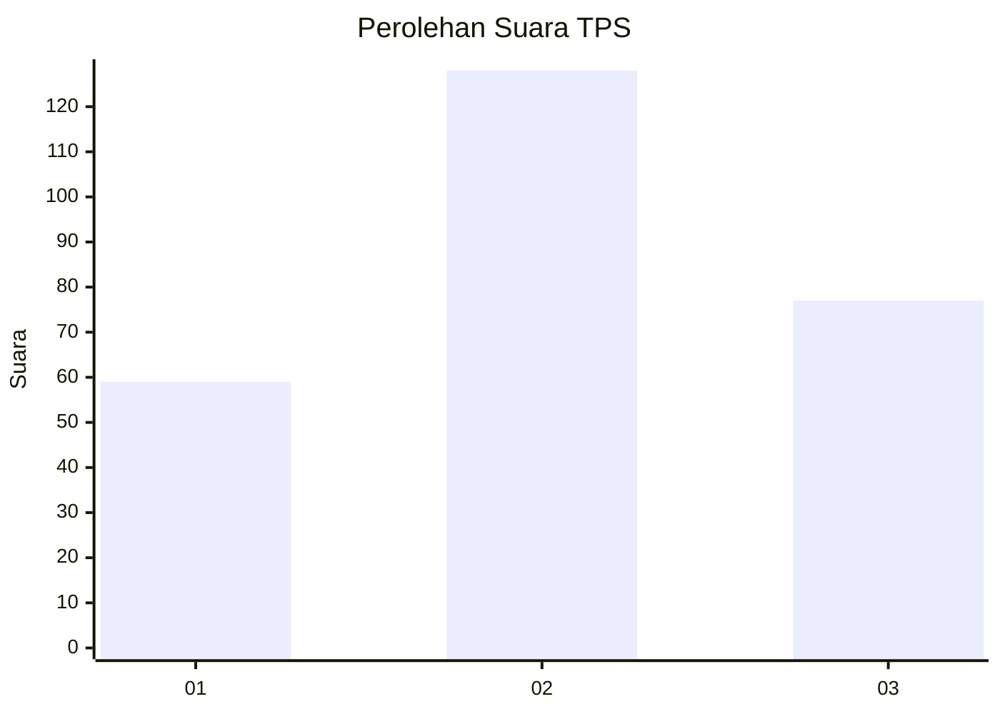
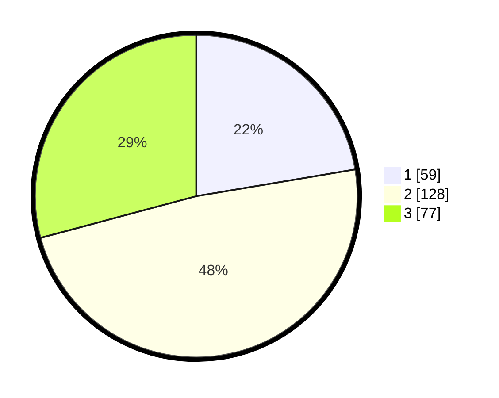

# Hasil

## Grafik

## Tabel

| No. | Nama Paslon    | Suara | Suara (raw) | Persentase |
|:--- |:-------------- | -----:| -----------:| ----------:|
| 1   | ANIES MUHAIMIN | 59    | [59][p-1]   | 22,35      |
| 2   | PRABOWO GIBRAN | 128   | [128][p-2]  | 48,48      |
| 3   | GANJAR MAHFUD  | 77    | [77][p-3]   | 29,17      |

[p-1]: https://github.com/gigit-pemilu/pemilu-2024/blob/main/pilpres/hitung-suara/sub/35-jawa-timur/sub/78-kota-surabaya/sub/03-rungkut/sub/1005-wonorejo/sub/048-tps/sub/paslon-1.txt
[p-2]: https://github.com/gigit-pemilu/pemilu-2024/blob/main/pilpres/hitung-suara/sub/35-jawa-timur/sub/78-kota-surabaya/sub/03-rungkut/sub/1005-wonorejo/sub/048-tps/sub/paslon-2.txt
[p-3]: https://github.com/gigit-pemilu/pemilu-2024/blob/main/pilpres/hitung-suara/sub/35-jawa-timur/sub/78-kota-surabaya/sub/03-rungkut/sub/1005-wonorejo/sub/048-tps/sub/paslon-3.txt

## Foto C Plano

https://sirekap-obj-formc.kpu.go.id/e38a/pemilu/ppwp/35/78/03/10/05/3578031005048-20240214-235051--022e11a0-da9e-4165-a89b-2e3b2d644829.jpg

https://sirekap-obj-formc.kpu.go.id/e38a/pemilu/ppwp/35/78/03/10/05/3578031005048-20240214-235436--7eb6c7e9-fc4f-47a3-82c2-0da264284dc4.jpg

https://sirekap-obj-formc.kpu.go.id/e38a/pemilu/ppwp/35/78/03/10/05/3578031005048-20240214-235408--221bcde5-bb7a-49d5-a431-2a46855cf21e.jpg

## Metadata

| Key        | Value               |
| ---------- | ------------------- |
| Time Stamp | 2024-02-24 22:31:28 |

