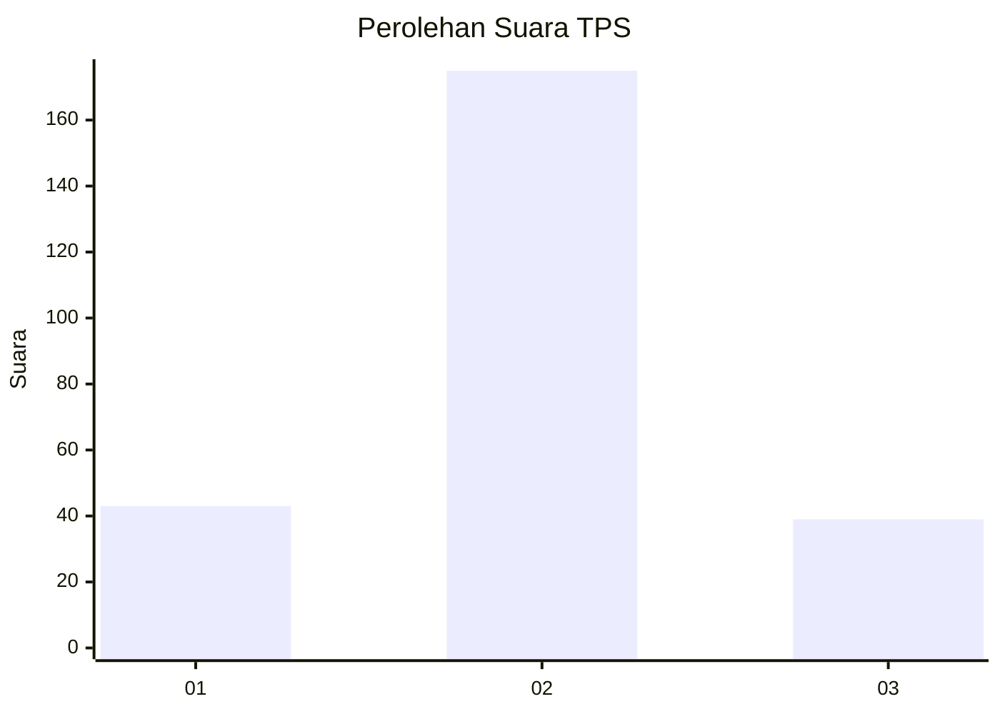
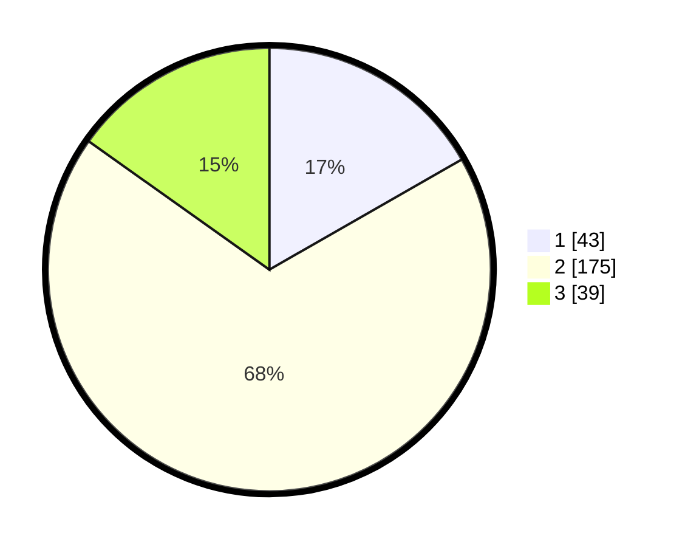

# Hasil

## Grafik

## Tabel

| No. | Nama Paslon    | Suara | Suara (raw) | Persentase |
|:--- |:-------------- | -----:| -----------:| ----------:|
| 1   | ANIES MUHAIMIN | 43    | [43][p-1]   | 16,73      |
| 2   | PRABOWO GIBRAN | 175   | [175][p-2]  | 68,09      |
| 3   | GANJAR MAHFUD  | 39    | [39][p-3]   | 15,18      |

[p-1]: https://github.com/gigit-pemilu/pemilu-2024-35-jawa-timur/blob/main/pilpres/hitung-suara/sub/35-jawa-timur/sub/78-kota-surabaya/sub/03-rungkut/sub/1006-medokan-ayu/sub/003-tps/sub/paslon-1.txt
[p-2]: https://github.com/gigit-pemilu/pemilu-2024-35-jawa-timur/blob/main/pilpres/hitung-suara/sub/35-jawa-timur/sub/78-kota-surabaya/sub/03-rungkut/sub/1006-medokan-ayu/sub/003-tps/sub/paslon-2.txt
[p-3]: https://github.com/gigit-pemilu/pemilu-2024-35-jawa-timur/blob/main/pilpres/hitung-suara/sub/35-jawa-timur/sub/78-kota-surabaya/sub/03-rungkut/sub/1006-medokan-ayu/sub/003-tps/sub/paslon-3.txt

## Foto C Plano

https://sirekap-obj-formc.kpu.go.id/5b34/pemilu/ppwp/35/78/03/10/06/3578031006003-20240214-215159--ffa7153e-c541-480a-b6c8-dbec3f8da0fb.jpg

https://sirekap-obj-formc.kpu.go.id/5b34/pemilu/ppwp/35/78/03/10/06/3578031006003-20240214-215252--bfb61a43-0fca-449f-a930-e51af15ce637.jpg

https://sirekap-obj-formc.kpu.go.id/5b34/pemilu/ppwp/35/78/03/10/06/3578031006003-20240214-215333--6ccb12bb-cef6-4bd6-bc83-65394de15dbc.jpg

## Metadata

| Key        | Value               |
| ---------- | ------------------- |
| Time Stamp | 2024-02-16 13:30:32 |

