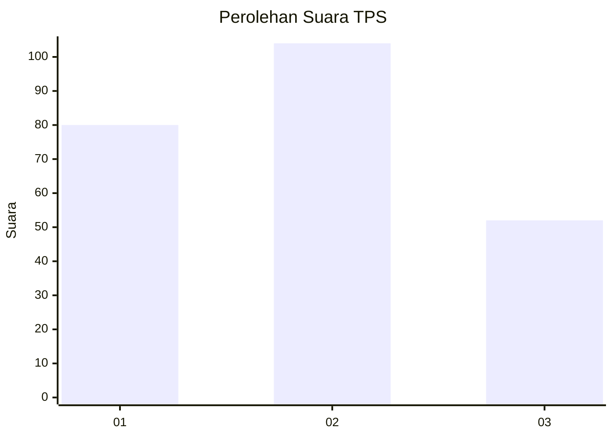
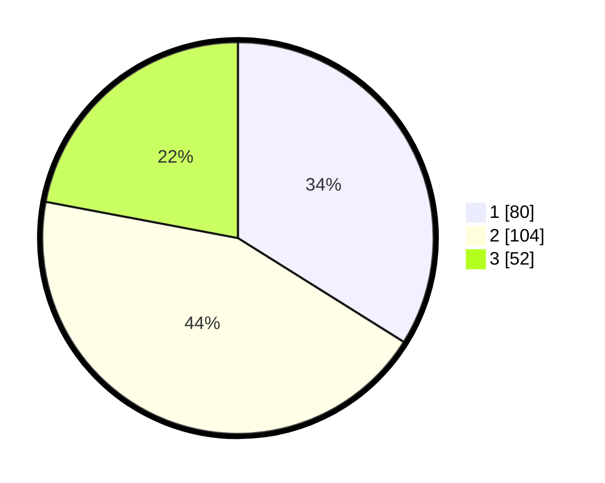

# Hasil

## Grafik

## Tabel

| No. | Nama Paslon    | Suara | Suara (raw) | Persentase |
|:--- |:-------------- | -----:| -----------:| ----------:|
| 1   | ANIES MUHAIMIN | 80    | [80][p-1]   | 33,90      |
| 2   | PRABOWO GIBRAN | 104   | [104][p-2]  | 44,07      |
| 3   | GANJAR MAHFUD  | 52    | [52][p-3]   | 22,03      |

[p-1]: https://github.com/gigit-pemilu/pemilu-2024/blob/main/pilpres/hitung-suara/sub/35-jawa-timur/sub/78-kota-surabaya/sub/03-rungkut/sub/1006-medokan-ayu/sub/055-tps/sub/paslon-1.txt
[p-2]: https://github.com/gigit-pemilu/pemilu-2024/blob/main/pilpres/hitung-suara/sub/35-jawa-timur/sub/78-kota-surabaya/sub/03-rungkut/sub/1006-medokan-ayu/sub/055-tps/sub/paslon-2.txt
[p-3]: https://github.com/gigit-pemilu/pemilu-2024/blob/main/pilpres/hitung-suara/sub/35-jawa-timur/sub/78-kota-surabaya/sub/03-rungkut/sub/1006-medokan-ayu/sub/055-tps/sub/paslon-3.txt

## Foto C Plano

https://sirekap-obj-formc.kpu.go.id/1c4c/pemilu/ppwp/35/78/03/10/06/3578031006055-20240215-011028--8639cfe5-4593-4d3a-a090-0d82a6a02c9b.jpg

https://sirekap-obj-formc.kpu.go.id/1c4c/pemilu/ppwp/35/78/03/10/06/3578031006055-20240215-010458--fc80cd8b-3e40-4f95-934a-4325ba331fb2.jpg

https://sirekap-obj-formc.kpu.go.id/1c4c/pemilu/ppwp/35/78/03/10/06/3578031006055-20240214-193255--601ef95e-761e-48a7-b700-e6d82ee88034.jpg

## Metadata

| Key        | Value               |
| ---------- | ------------------- |
| Time Stamp | 2024-02-16 13:30:32 |

